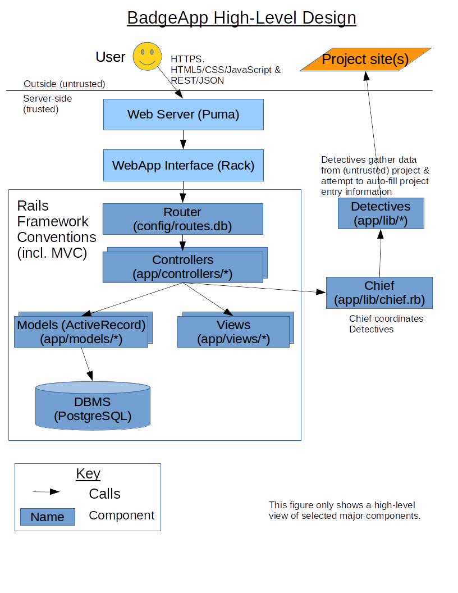

# Design

<!-- SPDX-License-Identifier: (MIT OR CC-BY-3.0+) -->

This document describes the design of the BadgeApp.

No single technology does everything well.
Instead, design is all about making good choices between
options that have different trade-offs, so that together
those choices will efficiently meet requirements.
As explained in [You Are Not Google](https://blog.bradfieldcs.com/you-are-not-google-84912cf44afb),
"if you're using a technology that originated at a large company,
but your use case is very different, it's unlikely that you arrived
there deliberately...
what's important is that you actually use the right tool for the job."
This document describes our key choices.

Our design is generally standard and straightforward.
If you're not familiar with how web applications are typically
designed, see introductory material such as
["Web Architecture 101" by Jonathan Fulton](https://engineering.videoblocks.com/web-architecture-101-a3224e126947).

## High-level architecture

The web application is itself OSS, and we intend for the
web application to meet its own criteria.
We have implemented it with Ruby on Rails; Rails is good for
simple web applications like this one,
particularly since it's easy to create, update, and maintain
with a small team.
The system stores the data in PostgreSQL (aka Postgres); the key
is that we don't lose data, and our throughput needs are easily met
by PostgreSQL, so selecting an RDBMS with a long track record of
reliability made sense.

### High-level design figure

The following figure shows a high-level design of the implementation:

### Traditional web app, not a single-page app (SPA)

There are at least two ways to develop a web application:

* a server-side ("traditional") web application where most user interactions
  (such as form submission) involve loading an entirely new web page.
* a [single-page application (SPA)](https://en.wikipedia.org/wiki/Single-page_application)
  interacts with the user by dynamically rewriting the current page
  (instead of loading new pages from a server).
  SPAs typically provide a more fluid user experience, but also
  incur a higher development and maintenance cost, and requires that the
  user have JavaScript enabled on the client.

We intentionally developed this application as a server-side web application,
not as an SPA, because minimizing
development and maintenance cost are very important to us.
We have limited resources to manage this site.
Indeed, the article
[SPAs Are Just Harder, and Always Will Be](http://wgross.net/essays/spas-are-harder)
argues that SPAs will *always* be harder to develop, even with
frameworks to help.
["Escaping the SPA rabbit hole with modern Rails" by Jorge Manrubia (2020-07-04)](https://medium.com/@jmanrubia/escaping-the-spa-rabbit-hole-with-turbolinks-903f942bf52c)
also discusses the trade-offs between SPAs and traditional web applications
built with Rails:
"Modern Rails lets you build apps that are fast enough and feel great [and]
For a vast variety of apps, Rails enables you to implement the same
functionality with a fraction of the code and complexity."
In addition, some security-conscious people disable JavaScript, and
one of our requirements is that the application work in those cases
(with some graceful degradation)... so we would still need to support
the server-side application anyway.

When the project started, our primary concerns were to determine the
criteria, and try to get broad buy-in that those criteria were sensible.

This approach can be revisited in the future, if it is decided
that the costs are worthwhile.

### Key components

The key components we use are:

- Ruby on Rails.
  This is our the primary programming language and web application framework.
  Ruby on Rails is specifically designed to be easy to use and thus
  is a good choice for simple web applications like this one.
  Its ease-of-use enables us to avoid needing a large amount
  of effort to develop or maintain the software.
  Ruby is not a fast language, but standard Rails performance techniques
  (such as fragment caching) make it fast enough.
  Ruby doesn't have static typing, so it cannot detect errors a
  statically-typed language can automatically detect; we use static tools
  and strong test coverage to detect errors instead.
  We also have some custom software written in client-side JavaScript.
- PostgreSQL (aka Postgres).
  This is a widely-used relational database system (RDBMS).
  Our experience (and those of others) is that it is extremely
  reliable, a key requirement for a DBMS.
  It also doesn't require a lot of maintenance and tuning to be useful.
- Bootstrap.  This is an extremely popular front-end component library.
  One major advantage of using Bootstrap is that our site looks like many
  other websites; as a result, our website is familiar and easy to use.
  We want users to focus on getting their tasks done, instead
  of trying to figure out how to use the site.
- jQuery (jquery-rails).
  This is a widely-used small JavaScript library to ease certain tasks
  such as HTML document traversal in a portable way.
- jQuery UI (jquery-ui-rails).
  jQuery UI is a curated set of user interface interactions, effects,
  widgets, and themes built on top of the jQuery JavaScript Library.
  We use jQuery UI solely to use "jquery-ui/autocomplete"
  as a polyfill for Safari.
  [Most browsers support datalist](https://caniuse.com/#feat=datalist),
  when entering data in a field, but Safari fails to support it.
  We use a datalist in the projects form to help fill in the
  implementation language and license.
- Imagesloaded.
  This is from <https://github.com/desandro/imagesloaded> - it's a JavaScript
  library to ensure images are loaded before displaying them.
- Puma.
  This is our webserver.
  We don't use webrick, because Puma can handle multiple
  processes and multiple threads.  See:
  <https://devcenter.heroku.com/articles/ruby-default-web-server>
- Minitest.
  Minitest is our basic test framework.
  Minitest is the default testing framework of Rails, however,
  many people use RSpec instead.
  Both are good frameworks used by many, and the most important thing
  is to pick one, but we had to pick one.
  We decided to use minitest because it is easier to pick up and use.
  Minitest is fundamentally Ruby with a few extras, instead of being a
  completely different DSL.
  Minitest is also a simple and straightforward framework in general.
  Minitest comes with Rails, so it's easier to get it started too.
  Basically, we were able to quickly and efficiently build up our
  tests with minitest.
  We're well aware that many people happily use RSpec, and RSpec can
  clearly do the job - but we have to pick one, and that's what we chose.

We use a number of supporting Ruby gems.
See the file "Gemfile" to see all the gem direct dependencies;
see the file "Gemfile.lock" to see all the gem dependencies (direct and not).

We do *not* use an authentication library such as
[Devise](https://github.com/plataformatec/devise).
At the time we started the project, the general advice was to
*not* reuse authentication libraries in Rails
(e.g., because the libraries were perceived by many as being
inflexible, immature, and/or hard to use).
We would probably use an authentication library if we restarted today.
That said, this hasn't been too bad, because the underlying Rails primitives
support implementation of authentication in relatively few lines of code,
and we use standard authentication approaches for Rails applications.
The effort to switch to such a library now would probably exceed the benefits.

### Key classes

The software is designed as a traditional model/view/controller (MVC)
architecture.  As is standard for Rails, under directory "app"
(application) are directories for "models", "views", and "controllers".

Central custom classes include:

* "Project" (defined in file "app/models/project.rb")
  defines the model that captures data about a project.
* "User" (defined in file "app/models/user.rb")
  defines the model that captures data about a user.
* "AdditionalRight" (defined in file "app/models/additional_right.rb")
  defines the model that captures the set of additional rights of users.

## Performance

The BadgeApp doesn't need to be the fastest in the world,
just fast enough for users to be happy.

### How we get good performance

Here is our approach to getting good performance:

* Badge images are cached and served primarily by our CDN, not our server.
* The Rails application uses fragment caching (including "Russian dolls")
  to cache previous requests.  This is key to making any Rails application
  work quickly.
* Static assets are precomputed by the usual Rails asset pipeline
  into /assets and served directly
  by the web server (not the underlying slower Rails application).
* Static assets are aggressively compressed.
* Images are resized to their display size, and we provide width and height.
* The web application HTML includes preloading commands to help
  web browsers request what they need relatively early.
* The RDBMS has indexes for all built-in searches
  (as is standard good practice).
* We use the "bullet" gem to detect N+1 queries (a common yet subtle
  performance killer in web applications)
* We use various tools, such as [webpagetest](https://www.webpagetest.org/),
  to detect performance problems.

### Turbolinks

At one time we used Turbolinks, and we've tried to re-enable it,
but we've currently disabled it.
Here's a discussion of why we would like to use Turbolinks but do not.

[Turbolinks](https://github.com/turbolinks/turbolinks)
is a performance enhancer designed to make
"navigating your web application faster".
Turbolinks is often used in Rails applications, because it's intended to provide
"the performance benefits of a single-page application without the added
complexity of a client-side JavaScript framework."
While our website works reasonably well without Turbolinks,
users *like* high-performing websites.
In August 2019 we found that some of our bigger pages dropped from 1100msec
without Turbolinks to 700msec with Turbolinks
(from request to completed paint).
Using Turbolinks supports security or privacy conscious users
who disable client-side JavaScript, while also providing
faster response for those users who have client-side JavaScript enabled.

In theory, enabling Turbolinks is easy:

* In `Gemfile` add `turbolinks` as a library
* In `app/assets/javascripts/application.js` add
  `//= require turbolinks`
* In `app/assets/javascripts/project-form.js` replace
  `$(document).ready(function() {` with
  `document.addEventListener('turbolinks:load', function() {`
  (our ready event resets everything and does
   not presume a clean pristine starting environment,
   so it works just fine with `turbolinks:load`).

A key challenge with using Turbolinks is that
you need to modify your application to work properly with turbolinks.
[Turbolinks breaks $(document).ready](http://guides.rubyonrails.org/working_with_javascript_in_rails.html#page-change-events)
(an extremely common construct)
and requires you to use a nonstandard on..."page:change" construct.
To use turbolinks properly we've determined that
you really need to read its documentation
carefully, and then modify your JavaScript to work with it.

But in our case this is not enough.

The biggest problem is
`app/views/project_stats/index.html.erb` viewed as `/project_stats`
Currently this uses Chartkick, which requires inline JavaScript
(the inline JavaScript code is generated server-side and sent to the client),
so we have to permit inline JavaScript on (just) this file.
We once used the gem `jquery-turbolinks` to work around this, but
in practice this setup was unreliable.
We can make it *run* with Turbolinks by adding this to the ERB file:

~~~~
    <% content_for :special_head_values do %>
       <meta name="turbolinks-visit-control" content="reload">
    <% end %>
~~~~

But that is not enough. Turbolinks works by merging all headings,
*including* CSP permissions.
So once a user views this page, the user's protection against inline
JavaScript is *disabled* - and that is unacceptable.
While we hope we have no XSS vulnerabilities, it always possible that
we have missed something; our CSP settings limit the damage that
can be caused if we have XSS vulnerabilities.

The best solution is to eliminate all inline JavaScript from `/project_stats`.
We could separately generate SVG, or modify the page so that
externally-defined JavaScript is used to generate the chart
(perhaps by calling ChartKick).
However, that is more effort and we have not done that.

Turbolinks also causes another problem: some pages require
form actions to be allowed to go to GitHub.
See `config/initializers/secure_headers.rb` which defines
`:allow_github_form_action`, which is used in a few pages.
Again, with Turbolinks, once these pages are seen the additional permission
is granted everywhere.
This isn't so bad; we could probably just allow GitHub form actions
everywhere.
Exploiting GitHub form actions would require an attacker to find a
vulnerability in our system
*and* a vulnerability in GitHub's form handling system.
That isn't impossible,
but it is less likely and we could probably live with that.

At the time of this writing Turbolinks does not support the performance
improvement "fetch on hover" aka "instantclick".
This is a recommended enhancement as described in
[Turbolinks issue #313](https://github.com/turbolinks/turbolinks/issues/313).
Ideally we would have both turbolinks and instantclick,
but there does not seem to be an easy way to have both.
If we must pick only one, it appears that Turbolinks is the better choice.
Turbolinks' speed improvement works on all systems with client-side JavaScript,
while fetch on hover does not work on normal touchscreens
(there is no "hover" to detect) and touchscreens (including
smartphones) are generally the systems that most need a speed boost.
In addition, Turbolinks may eventually add instantclick as well.
So we have chosen Turbolinks and hope that turbolinks will eventually add
support for instantclick.

### Not used: Rails Streaming

One trick for improving Rails performance is to invoke streaming.
[Streaming with Rails 4](https://www.sitepoint.com/streaming-with-rails-4/)
and
[ActionContoller:Streaming](http://api.rubyonrails.org/classes/ActionController/Streaming.html)
explains the basics for streaming HTML content.
[Streaming large data responses with Rails](https://coderwall.com/p/kad56a/streaming-large-data-responses-with-rails)
discusses how to do this with other formats (e.g., JSON).
The performance of this application is good enough
that there hasn't been much reason to investigate this further.

## Handling concurrency

The application is multi-user and multi-threaded.

### Multi-user

We use optimistic locking to prevent unexpected data loss from
multiple people editing the same project at the same time.

We use RDBMS transactions,
[invoked via ActiveRecord](http://api.rubyonrails.org/classes/ActiveRecord/Transactions/ClassMethods.html),
to counter problems that could happen without transactions.

### Multi-threaded

This is a multi-threaded application once it starts accepting web requests.
Different requests may be started in different threads.
Ruby supports multiple threads, but its default collection
data structures are *not* thread-safe
(this is true for many programming languages).
The usual C implementation of Ruby does have a GIL, but that does
not make code automatically thread-safe.

Rails handles multi-threading by using
a "shared-nothing architecture", that is, different threads
get different starting instances, which create their instances
of everything else.
For more information, see,
["How Do I Know Whether My Rails App Is Thread-safe or Not?" by Jakko](https://bearmetal.eu/theden/how-do-i-know-whether-my-rails-app-is-thread-safe-or-not/).

For the most part this is invisible, but be extremely careful if you
create situations where a possibly-modifiable
resource is *shared* between threads.
For example, don't memoize unless you do thread-safe memoization.
An alternative is to pre-create all the instances you need during
system initialization and then freeze them (sharing read-only data is fine).

This is one reason we enable frozen string literals.
Since frozen string literals cannot be mutated, a thread cannot
accidentally mutate one and affect a different thread.

The main mutable construct shared in Rails during execution is the
Rails ActiveSupport::Cache that we rely on for server-side caching.
We use MemoryStore as the cache back-end, and
[Rails ActiveSupport::Cache MemoryStore has been memory-safe since Rails 3.1](http://api.rubyonrails.org/v3.1.0/files/activesupport/CHANGELOG.html)
as implemented by this
[commit](https://github.com/rails/rails/commit/ee51b51b60f9e6cce9babed2c8a65a14d87790c8).
This is explained as follows:
"Make thread safe so that the default cache implementation used by Rails
is thread safe."

## Deployment

We have three publicly accessible tiers:

* master - an instance of the master branch
* staging
* production

These are currently executed on Heroku.
If you have write authorization to the GitHub repository,
the commands "rake deploy_staging" and "rake deploy_production"
will update the staging and production branches (respectively).
Those updates will trigger tests by CircleCI (via webhooks).
If those tests pass, that updated branch is then deployed to
its respective tier.

Most administrative actions require logging into the relevant Heroku tier
using the "heroku" command (this requires authorization).
The one exception: the BadgeApp web application does support an 'admin'
role for logged in users; admin users
are allowed to edit and delete any project entry.

## Terminology

This section describes key application-specific terminology.

The web application tracks data about many FLOSS *projects*,
as identified and entered by *users*.

We hope that projects will (eventually) *achieve* a *badge*.
A project must *satisfy* (or "pass") all *criteria*
(singular: criterion) *enough* to achieve a badge.

The *status* of each criterion, for a given project, can be one of:
'Met', 'Unmet', 'N/A' (not applicable, a status that only some
criteria can have), and '?' (unknown, the initial state of all
criteria for a project).
Every criterion can also have a *justification*.
For each project the system tracks the criteria status,
criteria justification, and a few other data fields such as
project name, project description, project home page URL, and
project repository (repo) URL.

Each criterion is in one of four *categories*:
'MUST', 'SHOULD', 'SUGGESTED', and 'FUTURE'.
In some cases, a criterion may require some justification
or a URL in the justification to be enough to satisfy the criterion for
a badge.  See the [criteria](./criteria.md) or
application form for the current exact rules.
A synonym for 'satifying' a criterion is 'passing' a criterion.

We have an 'autofill' system that fills in some data automatically.

In some cases the autofill data will *override* human-entered data
(this happens where we're either confident in the data, and/or
the data is not available using a common convention
that are enforcing for purposes of the badge).
The autofill system uses the metaphor of *Detectives* that need
some inputs, analyze them,
and produce outputs (including confidence levels).
Detectives are managed by a *Chief* of detectives.

## User interface design

Our visual design is based on Bootstrap.
We try to make it obvious what things do,
and avoid nonstandard visual elements if we can.

## Security

See the separate
[security](security.md) document for more about security.

## Application Programming Interface (API)

See [api](api.md) for the application programming interface (API),
including how to download data for analysis.

Its interface supports the following interfaces, which is enough
to programmatically create a new user, login and logout, create project
data, edit it, and delete it (subject to the authorization rules).
In particular, viewing with a web browser (which by default emits 'GET')
a URL with the absolute path "/projects/:id" (where :id is an id number)
will retrieve HTML that shows the status for project number id.
A URL with absolute path "/projects/:id.json"
will retrieve just the status data in JSON format (useful for further
programmatic processing).

## PostgreSQL Dependencies

As a policy, we minimize the number of dependencies on any particular
database implementation where we can.  Where possible, please
prefer portable constructs (such as ActiveRecord).

However, our current implementation requires PostgreSQL,
and we allow that (as discussed here).  Our internal
project search engine uses PostgreSQL specific commands.  Additionally,
we are using the PostgreSQL specific citext character string type to
store email addresses.  This allows us, within PostgreSQL, to store
case sensitive emails but have a case insensitive index on them.

We do this as we can foresee a case where a user's email requires case
sensitivity to be received (Microsoft Exchange allows this).  We do not,
however, want to allow for emails that are not case insensitive unique
since this could possibly allow for a number of duplicate users to be
created and the possibility of two users from the same domain having
emails which differ only in case is exceedingly rare.

Using these PostgreSQL-specific capabilities makes the software much
smaller.  Limiting these dependencies, and otherwise strongly preferring
portable constructs, makes it easier to port to a different RDBMS
in the future if necessary.
Since PostgreSQL is itself OSS, this isn't as dangerous as becoming
dependent on a single supplier whose product cannot be forked.

## See also

Project participation and interface:

* [CONTRIBUTING.md](../CONTRIBUTING.md) - How to contribute to this project
* [INSTALL.md](INSTALL.md) - How to install/quick start
* [governance.md](governance.md) - How the project is governed
* [roadmap.md](roadmap.md) - Overall direction of the project
* [background.md](background.md) - Background research
* [api](api.md) - Application Programming Interface (API), inc. data downloads

Criteria:

* [Criteria for passing badge](https://bestpractices.coreinfrastructure.org/criteria/0)
* [Criteria for all badge levels](https://bestpractices.coreinfrastructure.org/criteria)

Development processes and security:

* [requirements.md](requirements.md) - Requirements (what's it supposed to do?)
* [design.md](design.md) - Architectural design information
* [implementation.md](implementation.md) - Implementation notes
* [testing.md](testing.md) - Information on testing
* [security.md](security.md) - Why it's adequately secure (assurance case)
