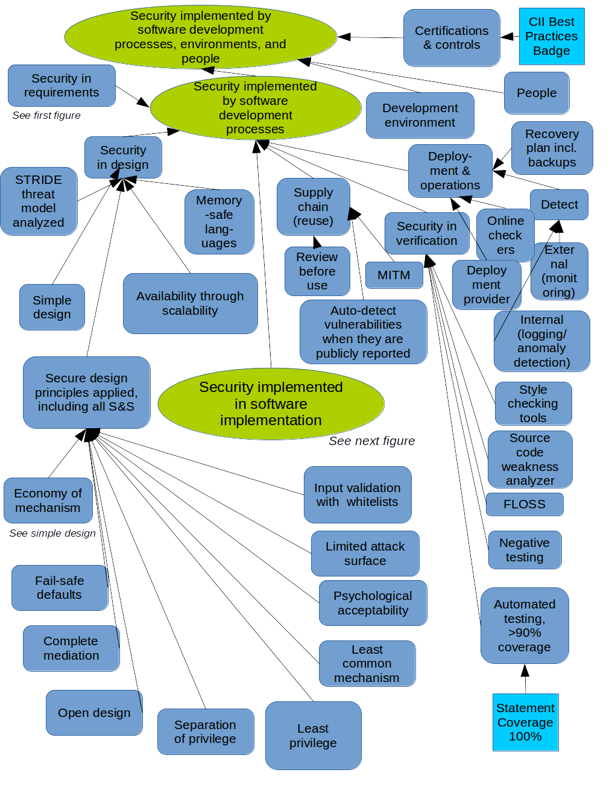
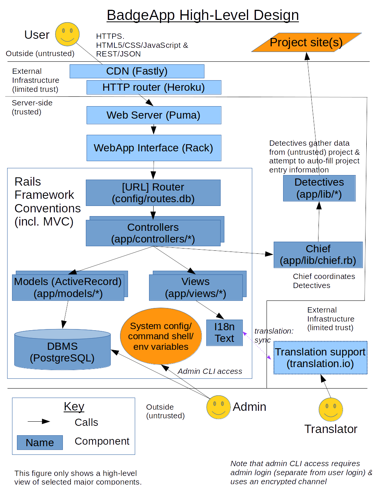

# BadgeApp Security: Its Assurance Case

<!-- SPDX-License-Identifier: (MIT OR CC-BY-3.0+) -->

Security is important and challenging.
This document describes why we think this software (the "BadgeApp")
is adequately secure.
In other words, this document is the "assurance case" for the BadgeApp.
This document is the result of continuous threat/attack modeling
while the system is developed and maintained, and it is modified
as the situation changes.
For simplicity, this document also serves as detailed documentation of
the security requirements, since in this case we found it
easier to put them all in one document.

Sadly, perfection is rare; we really want your help.
If you find a vulnerability, please see
[CONTRIBUTING.md#how_to_report_vulnerabilities](../CONTRIBUTING.md#how_to_report_vulnerabilities)
for how to submit a vulnerability report.
For more technical information on the implementation, see
[implementation.md](implementation.md).

You can see a video summarizing an older version of
this assurance case (as of September 2017),
along with some more general information about developing secure software:
["How to Develop Secure Applications: The BadgeApp Example" by David A. Wheeler, 2017-09-18](https://www.youtube.com/watch?v=5a5D4d6hcEY).
For more information on developing secure software, see
["Secure Programming HOWTO" by David A. Wheeler](http://www.dwheeler.com/secure-programs/).
[_A Sample Security Assurance Case Pattern_ by David A. Wheeler (2018)](https://www.ida.org/idamedia/Corporate/Files/Publications/IDA_Documents/ITSD/2019/P-9278.pdf)
shows how to create an assurance case for your project, using
a version of this assurance case as an example.

## Assurance case summary

The following figures summarize why we think this application
is adequately secure (more detail is provided in the rest of this document):
The figures are simply a summary; the text below provides the details.

Some of these figures are in SACM notation.
Other (older) ones are in
Claims, Arguments and Evidence (CAE) notation,
which is a simple notation often used for assurance cases.
Ovals are claims or sub-claims, while rounded rectangles are the supporting
arguments justifying the claims.
Evidence, where shown, are in rectangles.
We do not show most evidence in the figures, but provide the evidence in
the supporting text below instead, because large figures are time-consuming
to edit and for our purposes providing most evidence only in the supporting
test is adequate.

Our overall security approach is called
defense-in-breadth, that is, we consider
security (including security countermeasures) in all
our relevant software life cycle processes (including
requirements, design, implementation, and verification).
In each software life cycle process we
identify the specific issues that most need to be addressed,
and then address them.

We do *not* use a waterfall model for software development.
It's important to note that when we use the word *process* it
has a completely different meaning from a *stage* (aka *phase*).
Instead, we use the word "process" with its standard meaning in
software and systems engineering, that is,
a "process" is just a "set of interrelated or interacting activities
that transforms inputs into outputs" (ISO/IEC/IEEE 12207:2017).
In a waterfall model, these processes are done to completion
in a strict sequence of stages (where each stage occurs for some
period of time).
That is, you create all of the requirements in
one stage, then do all the design in the next stage, and so on.
Winston Royce's paper "Managing the Development of Large Software Systems"
(1970) notes that in software development this naive waterfall approach
"is risky and invites failure" - in practice
"design iterations are never confined to the successive steps".
We obviously *do* determine what the software will do differently
(requirements), as well as design, implement, and verify it, so we
certainly do have these processes.
However, as with almost all real software development projects,
we perform these processes in parallel, iterating and
feeding back as appropriate.
Trying to make decisions without feedback is extremely dangerous, e.g., see
[How Our Physics Envy Results In False Confidence In Our Organizations](https://www.younglingfeynman.com/essays/physicsenvy).
Each process is (notionally) run in parallel;
each receives inputs and produces outputs.

To help make sure that we "cover all important cases", most of
this assurance case is organized by the life cycle processes
as defined by ISO/IEC/IEEE 12207:2017,
<i>Systems and software engineering - Software life cycle processes</i>.
We consider every process, and include in the assurance case every
process important to it.
We don't claim that we conform to this standard, instead, we simply
use the 12207 structure to help ensure that we've considered
all of the lifecycle processes.

There are other ways to organize assurance cases, and we have taken
steps to ensure that issues that would covered by them are indeed covered.
An alternate way to view security issues is to discuss
"process, product, and people";
we evaluate the product in the verification process, and
the people in the human resources process.
It is important to secure the enabling environments, including the
development environments and test environment; it may not be obvious,
but that is covered by the infrastructure management process.
At the end we cover certifications and controls, which also help us
reduce the risk of failing to identify something important.

The following sections are organized following the assurance case figures:

* We begin with the overall security requirements.
  This includes not just the high-level requirements in terms
  of confidentiality, integrity, and availability, but also
  access control in terms of identification, authentication (login),
  and authorization.  Authentication
  is a cross-cutting and critical supporting security mechanism, so
  it's easier to describe it all in one place.
* This is followed in the software life cycle processes, focusing on
  the software lifecycle technical processes:
  design, implementation, integration and verification,
  transition (deployment) and operations, and maintenance.
  We omit requirements, since that was covered earlier.
  This is a merger of the second and third assurance case figures
  (implementation is shown in a separate figure because there is so much
  to it, but in the text we merge the contents of these two figures).
* We then discuss security implemented by other life cycle processes,
  broken into the main 12207 headings:
  agreement processes, organizational project-enabling processes, and
  technical management processes.
  Note that the organizational project-enabling processes include
  infrastructure management (where we discuss security of the
  development and test environment)
  and human resource management (where we discuss the knowledge of
  the key people involved in development).
* We close with a discussion of certifications and controls.
  Certification processes
  can help us find something we missed, as well as provide confidence
  that we haven't missed anything important).
  Note that the project receives its own badge
  (the CII best practices badge),
  which provides additional evidence that it applies best practices
  that can lead to more secure software.
  Similarly, selecting IA controls can help us review important issues
  to ensure that the system will be adequately secure in its intended
  environment (including any compensating controls added to its environment).
  We controls in the context of the
  [Center for Internet Security (CIS) Controls](https://www.cisecurity.org/controls/)
  (aka critical controls).

We conclude with a short discussion of residual risks,
describe the vulnerability report handling process, and make
a final appeal to report to us if you find a vulnerability.

In this assurance case we typically point to source code or tests as
evidence, and not the results of the tests themselves. We do not
ship to production unless tests pass, so there is usually no reason to
see the test results unless a test fails.
That said, the test results for the master branch
are available if desired at:
https://app.circleci.com/pipelines/github/coreinfrastructure/best-practices-badge?branch=master

(Note to editors: to edit the figures above, edit the .odg file, then
export to .png so that it can viewed on GitHub.)

## Structured Assurance Case Metamodel (SACM) Graphical Notation

This assurance case uses a subset of the
[Object Management Group (OMG) Structured Assurance Case Metamodel (SACM)](Structured Assurance Case Metamodel (SACM))
graphical notation.
The OMG specification, which is publicly available, defines SACM in detail.
In this section we'll explain the subset of SACM
graphical notation and conventions that we use.

Assurance cases typically use one of three graphical notations:
[Claims- Arguments- Evidence (CAE) notation](https://www.adelard.com/asce/choosing-asce/cae.html),
Goal Structuring Notation (GSN), or the SACM graphical notation.
The original BadgeApp assurance case used the
CAE notation because it is simple and the SACM graphical notation did not exist.
However, the SACM specification version 2.1 added in 2020
a graphical notation that has many advantages, so we have switched to SACM.
Later in this document we'll discuss the advantages of SACM.

### Explanation of SACM Notation Subset

Here is the subset of the SACM graphical notation that we use:

1. *Claim*.
   A claim is a statement that can be either true or false (not both).
   A claim is represented as a rectangle (we fill them with light blue 3),
   A claim that supports another claim is also called a subclaim.
   It is equivalent to the CAE Claim and GSN Goal.
2. *ArtifactReference*, which is used for  *evidence*.
   An ArtifactReference refers to some artifact (such as a piece of information),
   and is represented as a shadowed rectangle.
   When an ArtifactReference is used to support a claim,
   which is the only way we use them, they're also called evidence.
   The official SACM graphical notation includes an angled arrow in its icon,
   but our tools don't easily support that.
   As we use them this is equivalent to the CAE Evidence and GSN Solution.
3. *ArgumentReasoning* aka *argument*.
   An argument explains why the supporting claims and evidence justify
   the claim.
   It is represented as a half-open rectangle
   (we fill them with light magenta 4).
4. *AssertedInference* and *AssertedEvidence*, aka kinds of *relationships*.
   SACM terminology is that an AssertedInference shows that a claim supports
   another claim, and an AssertedEvidence shows that an ArtifactReference
   (evidence) supports a claim.
   But they have the same graphical representation, and
   we'll just call both relationships.
   They are shown as directed lines with a bigdot
   and an arrowhead pointing to the claim(s) or relationship being justified.
   SACM relationships (AssertRelationships) can do more,
   but we do not use the other forms.
5. *ArgumentPackage* aka *package*.
   An argument package is a grouping of argumention elements.
   This lets us break the information into multiple pages.
   We show this as a scroll; the official SACM graphical symbol is complicated
   and not supported by our drawing tool.
   It is equivalent to the GSN Module.
6. *asCited Claim*.
   An asCited Claim is a claim expanded elsewhere, that is, a cross-reference.
   Its description text shows its containing package, followed by the
   claim id in square brackets.
   This is represented as a bracketed rectangle.

The text shows an ID and colon (in bold), followed by whitespace and
its description.

The SACM graphical notation includes many other features (such as
contexts and other kinds of relationships) that we don't use.
In SACM these elements can have "notes" attached to them; the equivalent
to notes is the text in this document.
The notes may refer to added evidence and/or arguments.
We don't use many other constructs, such as SACM contexts.
The paper
"A Visual Notation for the Representation of Assurance Cases using SACM"
(2020) provides more information, but unfortunately that paper
is not publicly available.

In the rest of this document we will often use the term "argument"
for SACM’s ArgumentReasoning, and "evidence" for ArtifactReference,
because these are simpler terms.

### Conventions

Here are some conventions we use:

* Our convention is that the argument description completes the phrase
  "The claim is justified by these subclaims/evidence because (TEXT)".
* Where possible, the first or second word in the description
  is distinctive.  That makes it easier to see what is most important.
  We try to put phrases like "is secure" or "is countered" last;
  those aren't distinctive, since many
  claims are about security or about countering something.
* We structure this as primarily claims and subordinate subclaims,
  instead of as arguments and subordinate arguments, per 2020 feedback from
  MITRE. This is an improvement; since claims are each true/false statements,
  the relationship between them is usually much clearer doing it this way.

## Security Requirements

We believe the basic security requirements have been identified and met,
as described below.
The security requirements identified here were developed through our
requirements process, which merges
three related processes in ISO/IEC/IEEE 12207
(business or mission analysis, stakeholder needs and requirements definition,
and systems/software requirements definition).

Security requirements are often divided into three areas called the
"CIA triad": confidentiality, integrity, and availability.
We do the same here below, including a discussion of why we
believe those requirements are met.
These justifications depend on other processes
(e.g., that the design is sound, the implementation is not vulnerable,
verification is adequate), which we will justify later.
This is followed by a discussion of access control, and then
a discussion showing that the
the assets & threat actors have been identified & addressed.

See the design section for discussion about why we believe is not possible
to bypass the mechanisms discussed below.

### Confidentiality

#### User privacy maintained

One of our key requirements is to
"protect users and their privacy".
Here is a brief discussion on how we do that.

First, the basics.
We work hard to comply with the
EU General Data Protection Regulation (GDPR), which has many requirements
related to privacy.
We have a separate document that details how we
implement privacy in the CII Best Practices Badge site and comply with
the GDPR:
[Privacy in the CII Best Practices site, focusing on the GDPR](https://docs.google.com/document/d/1qarSkCJacjoMeu1k6p5JQXvPt-0xUqzKy3OW8zmGvpg).
As discussed later, non-public data is kept confidential
both at rest and in motion
(in particular, email addresses are protected).

Part of our privacy requirement is that we
"don't expose user activities to unrelated sites (including social media
sites) without that user's consent";
here is how we do that.

We must first define what we mean by an unrelated site.
A "related" site is a site that we are directly using to provide our service,
in particular our cloud provider (Heroku which runs on
Amazon's EC2 cloud-computing platform), CDN provider (Fastly),
authorization and avatar services provider (GitHub),
external avatar services (Gravatar),
and logging / intrusion detection service.
As a practical matter, related sites must (under various circumstances)
receive some information about the user (at least that the user
is trying to do something).
This is true for all websites, so it's true for our site as well.
In those cases we have selected partners we believe are trustworthy, and
we have some kind of relationship with them.

However, there is no reason unrelated sites
*must* see what our users are doing,
so we take many steps to prevent unrelated sites from
learning about our users' activities (and thus maintaining user privacy):

* We directly serve all our own assets ourselves,
  including JavaScript, images, and fonts.
  In particular, we do not have *any* embedded automatically-downloaded
  references (transclusions)
  in our web pages to external JavaScript or fonts.
  Since we serve these assets ourselves, and not via external
  third parties, external sites never receive any request from a user
  when they view our pages.
  As a result, user privacy is maintained: what a user views on our site
  is never revealed by our actions to unrelated sites.
  This also aids security; even if an attacker subverts some other site's
  JavaScript or font, that will not directly affect us because we do not embed
  references some other site's JavaScript or font in our web pages.
  Many sites don't do this and should probably consider it.
  This policy is enforced by our CSP policy.
* We do not serve ads and we plan to have no ads in the future.
  That said, if we ever did serve ads, we expect that we
  would also serve them from our site, just like any other asset, to
  ensure that third parties did not receive unauthorized information.
* We do not use any web analytics service that uses tracking codes or
  external assets.
  We log and store logs using only services we control or have a direct
  partnership with.
* The email we send is privacy-respecting.
  The email contents we send do not have img links (which might expose
  when an email is read). In some cases we have hyperlinks
  (e.g., to activate a local account), but those links go directly back
  to our site for that given purpose, and do not reveal information to
  anyone else.
  We use SendGrid to send email, but we have specifically configured the
  [SendGrid X-SMTPAPI header to disable all of its trackers we know of](https://sendgrid.com/docs/ui/account-and-settings/tracking/),
  which are clicktrack, ganalytics, subscriptiontrack, and opentrack.
  For example, we have never used ganalytics, but by expressly disabling it,
  it will stay disabled even if SendGrid decided to enable it by default
  in the future.
* We do have links to social media sites (e.g., from the home page), but we
  do this in a privacy-respecting manner.
  It would be easy to use techniques like embedding images
  from external (third party) social media sites,
  but we intentionally do not do that, because that would expose to an
  external unrelated site what our users are doing without their knowledge.
  We instead use the approach described in
  ["Responsible Social Share Links" by Jonathan Suh (March 26, 2015), specifically using share URLs](https://jonsuh.com/blog/social-share-links/#use-share-urls).
  In this approach, if a user does not press the link,
  the social media site never receives any information.
  Instead, a social media site
  *only* receives information when the user takes a direct action to
  request it (e.g., a click), and that site only receives information from
  the specific user who requested it.

Note that user avatar images are handled specially. We consider
the few avatar-serving domains that we use as related sites.
This issue may not be obvious, so here we'll explain it further.
A user can choose a representative avatar
(currently via GitHub or Gravatar).
Anyone who requests that user's information page will
receive an `img` reference to that user-selected avatar so that
the requestor can see it.
External avatar images are only shown from specific domains
('secure.gravatar.com' or 'avatars.githubusercontent.com'), they are
only included if the user has an avatar, and they are only shown to
others through this mechanism if that user's information was requested.
This functionality is useful, because these images can help others remember
who the user is.

We have considered ways to further limit information sharing with avatar
services even though they are related sites (and thus we do not *have*
to limit information sharing any further).
We have had some success, but current law and technology provide challenges.
We could download these images and re-serve them (such as via a proxy),
but copying or proxying the images
using our own site might be considered a copyright violation
and would also impose the need for significant extra resources.
Thus, since we do not serve avatars ourselves, we must direct requestors
to them, so at the very least the requestor's externally-visible IP address
must be visible to the external avatar service (so the image can be provided).
To provide additional privacy, we would like to also
limit requestor headers and third-party cookies when using third-party
avatar services
(since these are the primary mechanisms that reveal more information
about the requestor to the third party avatar service).
Here is our current state:

* We think we have a decent solution for limiting
  requestor headers from being sent to avatar services.
  We have added the `referrerpolicy="no-referrer"` attribute to the image
  as discussed in the
  [Mozilla img documentation](https://developer.mozilla.org/en-US/docs/Web/HTML/Element/img).
  While this attribute is technically experimental,
  [the referrerpolicy attribute on images is widely supported](https://developer.mozilla.org/en-US/docs/Web/API/HTMLImageElement/referrerPolicy),
  including by Chrome, Firefox, and Opera.
* Unfortunately, we have not found a *good* way to prevent
  third-party cookies from being sent to avatar services.
  [There are discussions on how to disable third party cookies for img tags](https://stackoverflow.com/questions/51549390/how-to-disable-third-party-cookie-for-img-tags),
  but currently-known mechanisms are very complex, require inline CSS
  invocations, and have dubious reliability.
  We hope that future web standards will add the ability to easily
  prevent the unnecessary revelation of third-party cookies.

Note that we consider that things are very different
when a user actively clicks on a hypertext link to go to a different web site.
In this case, the user has *actively* selected to visit that different web site,
and thus expressly consented to the usual actions that occur when visiting
a different web site.
The different web site must know the IP address of the user anyway
(to send the data), and any cookie communications with that site involve
that other site.
We do allow referrer information to be sent in this case.
When a user actively selects a hypertext link, it is normal web behavior
for the receiving site to be provided with information on the referrer
via the "referer" (sic) HTTP header as specified in
[RFC 1945 (HTTP 1.0) from May 1996](https://tools.ietf.org/html/rfc1945#page-44).
This referrer information reports where the user "came from".
This information is useful for many circumstances, including notifying
recipients that people are discovering their site using our site.
It would be *possible* for us to
[disable sending referrer information](https://geekthis.net/post/hide-http-referer-headers/)
(e.g., by using `rel="noreferrer"` in hypertext links or
by setting a referrer policy via HTTP or the meta tag), but this
would inhibit normal default web behavior.
However, when users expressly choose to click on a link from our site,
there is express consent to visit the other site,
so we do not see this an issue.
In addition, users who do not want to share referrer information can
configure their browser to omit referrer information; this would
be a much better choice for users who do not want referrer information
to be shared.
Information on how to disable referrer heading information is
available from multiple sources, e.g.,
["How to Change Referer Header Settings: Why It’s Useful" by John Anthony](https://www.addictivetips.com/vpn/change-referer-header-settings/),
["Turn Referrer Headers On or Off in Firefox" by Mitch Bartlet](https://www.technipages.com/firefox-enable-disable-referrer),
and
["Why Should you Change your Referer Header settings & How to do it" by Douglas Crawford](https://proprivacy.com/guides/change-referer-header-settings).

Of course, to access any site on the Internet
the user must use various services and
computers, and some of those could be privacy-exposing.
For example, the user must make a request to a DNS service to find our
service, and user requests must transit multiple Internet routers.
We cannot control the systems that users choose to use; instead, we ensure that
users can choose what services and computers they will trust.
The BadgeApp does not filter out any particular source
(other than temporary blocks if the source becomes a source of attack).
Therefore, users who do not want their activities monitored
could choose to use a network and computer they trust,
a Virtual Private Network (VPN), or an anonymity network such as Tor
to provide additional privacy when they interact with the BadgeApp.

#### Almost all data is not confidential

We try to store as little confidential information as we reasonably can,
as this limits the impact of any confidentiality breach.
Almost all data we collect is considered public, e.g., all project data,
who owns the project information, and GitHub user names.
Therefore, we don't need to keep those confidential.

For each user account we store some other data.
Some we present to the public, such as claimed user name,
creation time, and edit times; we present these as we consider that
public information.
We do not present the user's preferred locale to the public, under the
theory that we don't know of a reason someone else would
have a legitimate reason to know that.
However, all of this is not considered sensitive data and it is certainly
not identifying information, so we would not consider it a breach
if someone else got this information (such as the preferred locale).

Non-public data is kept confidential.
In our case, the non-public data that must be kept confidential
are the user passwords, the "remember me" token (login nonce)
if the user has enabled the remember me function, and user email addresses.
We *do* consider this data higher-value and protect them specially.

#### User passwords

User passwords for local accounts are only stored on the server as
iterated per-user salted hashes (using bcrypt), and thus cannot
be retrieved in an unencrypted form.

Any user password sent to the system is sent by the application router
to the "update" method of the user controller
(`app/controllers/users_controller.rb`).  The update method invokes the
"save" method of the user model (`app/models/user.rb`).
The user model includes the standards Rails
`has_secure_password` request, which tells the system to save
the password after it has been encrypted with bcrypt
(instead of storing it directly), and to later do comparisons using
only the bcrypted value.

Note that no normal request can later retrieve a password, because
it is immediately encrypted on change or check and the original
unencrypted password is discarded.
The unencrypted email address may remain for a while in server memory
until that memory is recycled, but we assume that the underlying
system will protect memory during the time before it is garbage-collected
and reused.

#### Remember me token

Users may choose to "remember me" to automatically re-login on
that specific browser if they use a local account.
This is done by enabling the "remember me" checkbox when logging in to
a session.
If a user does enable "remember me" we implement automatic
login when the user makes later requests.  This is implemented using a
cryptographically random nonce stored in the user's web browser
cookie store as a permanent cookie.
Note that this nonce does not include the user's original password.
On the server side this nonce is encrypted via bcrypt just like
user passwords are stored.

Here is how we do this: Any attempt to login is routed to the
"new" method of the sessions controller in
`app/controllers/sessions_controller.rb`, which calls method
`local_login`, and if login is successful it
calls `local_login_procedure`.
If the user selected `remember_me`, the
`local_login_procedure` will call the `remember` method in
the user model (in `app/models/user.rb`) to create and store the
`remember_token` in the user's cookie store and the corresponding
bcrypted value on the server.
The user may log out later (often by having their log in session time out).

Whenever the system needs to determine who the current user is,
it calls method `current_user` (in `app/helpers/sessions_helper.rb`).
If the user is not logged in, but has a `remember_me` token that
matches the hashed token on the server, this method automatically
logs the user back in.
See the section on authentication for more information.

The system does not have the unencrypted `remember_token` for any
given user (only its bcrypted form), so the system cannot later reveal the
`remember_token` to anyone else.

In file `test/integration/users_login_test.rb` we verify that the
password is not stored as cleartext in the user cookie.

#### Email addresses

Email addresses are only revealed to the owner of the email address and to
administrators.

We must store email addresses,
because we need those for various purposes.
In particular, we must be able to contact badge entry owners
to discuss badge issues (e.g., to ask for clarification).
We also user email addresses as the user id for "local" accounts.
Since we must store them,
we strive to not reveal user email addresses to others
(with the exception of administrators, who are trusted and thus
can see them).

Here are the only ways that user email addresses can be revealed
(use `grep -Ri 'user.*\.email' ./` to verify):

- Mailers (in `app/mailers/`).  The application sometimes sends email, and
  in all cases email is sent via mailers.  Unsurprisingly, we need destination
  email addresses to send email.  However, in all cases we only
  send emails to a single user, with possible "cc" or "bcc" to a
  (trusted) administrator.  That way, user email addresses cannot leak
  to other users via email.  This can be verified by examining the
  mailers in directory `app/mailers/` and their corresponding views in
  `app/views/*_mailer/`. Even the rake task `mass_email`
  (defined in file lib/tasks/default.rake),
  which can send a message such as "we have been breached" to
  all users, sends a separate email to each user using a mailer.
  A special case is when a user changes their email address: in that case,
  information is sent to both email addresses, but technically that is still
  an email to a single user, and this is only done when someone is logged
  in with authorization to change the user email address.
- The only *normal* way to display user email addresses is to invoke
  a view of a user or a list of users.  However, these invoke
  user views defined in `app/views/users/`, and all of these views only
  provide a user email address if the current user is the user
  being displayed
  or the current user is an administrator.  This is true for views in both
  HTML and JSON formats.
  In addition, while we directly display the email address when local users
  are editing it (we must, so that users can change it), when user
  records are shown (not edited) the email address is only available via
  a hypertext link, and not directly displayed on the screen, to reduce
  the risk of revealing an email address while using sharing a screen.
  The following automated tests verify that email addresses
  are not provided without authorization:
    - `should NOT show email address when not logged in`
    - `JSON should NOT show email address when not logged in`
    - `should NOT show email address when logged in as another user`
    - `JSON should NOT show email address when logged in as another user`
- The `reminders_summary` view in
  `app/views/projects/reminders_summary.html.erb`
  does display user email addresses, but this is only displayed when a
  request is routed to the `reminders_summary` method of the projects controller
  (`app/controllers/projects_controller.rb`), and this method only displays
  that view to administrators.
  This is verified by the automated test
  `Reminders path redirects for non-admin`.
- As a special case, a user email address is included as a hidden field in
  a local user password reset in `app/views/password_resets/edit.html.erb`.
  However, this is only displayed if the user is routed to the "edit"
  method of `app/controllers/password_resets_controller.rb` and successfully
  meets two criterion (configured using `before_action`):
  `require_valid_user` and `require_unexpired_reset`.
  The first criterion requires that the user be activated and provide the
  correct reset authentication token that was emailed to the user;
  anyone who can do this can already receive or intercept that user's email.
  The need for the correct authentication token
  is verified by the automated test `password resets`.

As documented in CONTRIBUTING.md, we forbid including email
addresses in server-side caches, so that accidentally sharing the
wrong cache won't reveal email addresses.
Most of the rest of this document describes the other
measures we take to prevent turning unintentional mistakes
into exposures of this data.

Note: As discussed further in the later section on "Encrypted email addresses",
we also encrypt the email addresses using AES with 256-bit keys in
GCM mode ('aes-256-gcm').  We also hash the email addresses, so they
can be indexed, using the hashed key algorithm PBKDF2-HMAC-SHA256.
These are strong, well-tested algorithms.
We encrypt email addresses, to provide protection for data at rest,
and never provide the keys to the database system
(so someone who can only see what the database handles, or can
get a copy of it, will not see sensitive data including
raw passwords and unencrypted email addresses).
These are considered additional hardening measures, and so are
discussed further in the section on hardening.

Password reset requests (for local users) trigger an email, but that
email is sent to the address as provided by the original account;
emails are *not* sent to whatever email address is provided by the
reset requestor (who might be an attacker).
These email addresses match in the sense of `find_by`, which is a
case-insensitive match, but since it is sometimes possible for an attacker
to create another email account that "matches" in a case-insensitive way
to an existing account, we always use the known-correct email address.
You can verify this by reviewing
`app/controllers/password_resets_controller.rb`.
This approach completely counters the attack described in
[Hacking GitHub with Unicode's dotless 'i'](https://eng.getwisdom.io/hacking-github-with-unicode-dotless-i/).

#### HTTPS

HTTPS (specifically the TLS protocol)
is used to encrypt all communications between users
and the application.
This protects the confidentiality and integrity of all data in motion,
and provides confidence to users that they are contacting the correct server.

We force the use of HTTPS by setting
`config.force_ssl` to `true` in the
`config/environments/production.rb` (the production configuration).
This enables a number of hardening mechanisms in Rails, including
TLS redirection (which redirects HTTP to HTTPS).
(There is a debug mode to disable this, `DISABLE_FORCE_SSL`,
but this is not normally set in production and can only be set by
a system administrators with deployment platform access.)

As discussed in the hardening section
"Force the use of HTTPS, including via HSTS" (below), we take a number of
additional steps to try to make users always use HTTPS.
We also use [online checkers](#online-checkers) (discussed below)
to verify that our TLS configuration is secure in production.

### Integrity

As noted above,
HTTPS is used to protect the integrity of all communications between
users and the application, as well as to authenticate the server
to the user.

#### Data modification requires authorization

Data modification requires authorization.

Here we describe how these authorization rules are enforced.
We first discuss how to modify data through the BadgeApp application,
and then note that data can also be modified by modifying it via the
underlying database and platform.
For more about the authorization rules themselves,
see the section on authorization.
Note that gaining authorization first requires logging in
(which in turn requires both identification and authentication).

The only kinds of data that can be modified involve a project or a user,
and this data can only be modified through the application as follows:

- Project:
  Any project edit or deletion request is routed to the appropriate
  method in the projects controller in
  `app/controllers/projects_controller.rb`.
  Users cannot invoke any other method to modify a project other than
  the four methods corresponding to the requests identified below, and
  these cannot be executed unless the appropriate authentication check
  has succeeded:
    - In the case of an `edit` or `update` request, there is a `before_action`
      that verifies that the request is authorized using the check method
      `can_edit_else_redirect`.
      (Note: technically only `update` needs authentication, since
      `edit` simply displays a form to fill out.  However, to reduce
      user confusion, we prevent *displaying* a form for editing data
      unless the user is authorized to later perform an update.)
      This inability to edit a project without authorization
      is verified by automated tests
      `should fail to update project if not logged in` and
      `should fail to update other users project`.
    - In the case of a `delete_form` or `destroy` request,
      there is a `before_action`
      that verifies that the request is authorized using the check method
      `can_control_else_redirect`.
      (Note: Again, technically only `destroy` needs authentication, but
      to reduce user confusion we will not even display the form for destroying
      a project unless the user is authorized to destroy it.)
      This inability to destroy a project without authorization
      is verified by automated tests
      `should not destroy project if no one is logged in` and
      `should not destroy project if logged in as different user`.
- User:
  Any user edit or deletion request is routed to the appropriate
  method in the user controller in
  `app/controllers/users_controller.rb`.
  These cannot be executed unless the appropriate authentication check
  has succeeded.
  In the case of an `edit` or `update` or `destroy` request,
  there is a `before_action`
  that verifies that the request is authorized using the check method
  `redir_unless_current_user_can_edit`.
  Users cannot invoke any other method to modify a user.
  This inability to edit or destroy a user without authorization
  is verified by these automated tests:
    - `should redirect edit when not logged in`
    - `should redirect edit when logged in as wrong user`
    - `should redirect update when not logged in`
    - `should redirect update when logged in as wrong user`
    - `should redirect destroy when not logged in`
    - `should redirect destroy when logged in as wrong non-admin user`

The `additional_rights` table, described below, is edited as
part of editing its corresponding project or deleting its
corresponding user, and so does not need to be discussed separately.
No other data can be modified by normal users.

It is also possible to directly modify the underlying database
that records the data.
However, only an administrator with deployment platform access
is authorized to do that, and few people have that privilege.
The deployment platform infrastructure verifies authentication and
authorization.

There is an odd special case involving the repository URL `repo_url`.
We are trying to counter subtle attacks where
a project tries to claim the good reputation or effort of another project
by constantly switching its `repo_url` to other projects and/or nonsense.
The underlying problem is that names/identities are hard; the `repo_url`
(when present) is the closest to an "identity" that we have for a project.
We have to allow it to change sometimes (because it sometimes does), but
it should be a rare "sticky" event.
There are various special cases, e.g., you can always set the `repo_url`
if it's nil, the setter is an admin, or if only the scheme is changed.
But otherwise normal users can't change the `repo_urls` in less than
`REPO_URL_CHANGE_DELAY` days (a constant set in the projects controller).
Allowing users to change `repo_urls`, but only
with large delays, reduces the administration effort required.
By doing this, we help protect the integrity of the overall database
from potentially-malicious authorized users.

#### Modification to official application requires authorization via GitHub

Modifications to the official BadgeApp application require
authorization via GitHub.
We use GitHub for managing the source code and issue tracker; it
has an authentication and authorization system for this purpose.

### Availability

As with any publicly-accessible website,
we cannot prevent an attacker with significant
resources from temporarily overwhelming the system through
a distributed denial-of-service (DDos) attacks.
So instead, we focus on various kinds of resilience against DDoS attacks,
and use other measures (such as backups) to maximize availability.
Thus, even if the system is taken down temporarily, we expect to be
able to reconstitute it (including its data).

#### Cloud & CDN deployment allow quick scale-up

We can quickly add more resources if more requests are made.
See the design section "availability through scaleability" below
for more about how we handle scaling up.

#### Timeout

All user requests have a timeout in production.
That way, the system is not permanently "stuck" on a request.
This is set by setting `Rack::Timeout.service_timeout`
in file `config/environments/production.rb`.

#### Can return to operation quickly after DDoS ended

The system can return to operation quickly after
a DDoS attack has ended.

#### Login disabled mode

We have implemented a "login disabled mode"
(aka `BADGEAPP_DENY_LOGIN` mode) that we can quickly enable.

This mode is an intentionally degraded mode of operation
that prevents any changes by users (daily statistics
creates are unaffected).
More specifically, if this mode is enabled
then no one can log in to the BadgeApp application,
no one can create a new account (sign up),
and no one can do anything that requires being logged in
(users are always treated as if they are not logged in).

This mode is intended to make some services available
if there is a serious exploitable
security vulnerability that can only be exploited by users who are
logged in or can appear to be logged in.  Unlike *completely* disabling the
site, this mode allows people to see current information
(such as badge status, project data, and public user data).
This mode is useful because it can stop many attacks, while still providing
some services.

This mode is enabled by setting the
environmental variable `BADGEAPP_DENY_LOGIN` to a
non-blank value (`true` is recommended).
Note that application administrators cannot log in, or use their privileges,
when this mode is enabled.
Only hosting site administrators can turn this mode
on or off (since they're the only ones who can set environment variables).

This mode is checked on application startup by
`config/initializers/deny_login.rb` which sets the boolean variable
`Rails.application.config.deny_login`.
Its effects can be verified by running
`grep -R 'Rails.application.config.deny_login' app/`;
they are as follows:

* Users are never considered logged in, even if they already logged in.
  This is enforced in the `current_user` method in
  `app/helpers/sessions_helper.rb` - this always returns null (not logged in)
  when this deny mode is enabled.
  This is verified by test
  `current_user returns nil when deny_login`.
* Attempts to login are rejected via the `create` method
  of the session controller, per `app/controllers/sessions_controller.rb`.
  Technically this isn't necessary, since being logged in is ignored,
  but this rejection will alert users who start trying to log in before
  this mode was enabled.
  This is verified by test `local login fails if deny_login`.
* Attempts to create a new user account are rejected
  via the `create` method of the user controller, per
  `app/controllers/users_controller.rb`.
  We do not want the user database to change while this mode is in effect.
  This is verified by test
  `cannot create local user if login disabled`

Some views are also changed when this view is enabled.
These changes are not security-critical.
Instead, these changes provide users immediate feedback
to help them understand that this special mode has been enabled.

#### Multiple backups

We routinely backup the database every day
and retain multiple versions of backups.
That way, if the project data is corrupted, we can restore the
database to a previous state.

#### See also

Later in this assurance case we'll note other
capabilities that also aid availability:

- As noted later in the hardening section, we also have rate limits on
  incoming requests, including the number of requests a
  client IP address can make in a given period.
  This provides a small amount of additional automated protection against
  being overwhelmed.
- As noted later in the "Recovery plan including backups",
  we have a recovery plan that builds on our multiple backups.

### Access Control

Many of the CIA triad requirements address "authorized" users,
and that requires knowing what "authorized" means.
Thus, like nearly all systems, we must address access control,
which we can divide into identification, authentication, and authorization.
Identity, authentication, and authorization are handled in a traditional
manner, as described below.

#### Identification

Normal users must must first identify themselves in one of two ways:
(1) as a GitHub user with their github account name, or
(2) as a custom "local" user with their email address.

The BadgeApp application runs on a deployment platform (Heroku),
which has its own login mechanisms.
Only those few administrators with deployment platform access have
authorization to log in there, and those are protected by the
deployment platform supplier (and thus we do not consider them further here).
The login credentials in these cases are protected.

#### Authentication

As with most systems, it's critically
important that authentication work correctly.
Therefore, in this section we'll go into some detail about how
authentication works within the BadgeApp application.

This system implements two kinds of users: local and remote.
Local users log in using a password, but
user passwords are only stored on the server as
iterated salted hashes (using bcrypt).
Remote users use a remote system (we currently only support GitHub)
using the widely-used OAUTH protocol.
At the time the application was written, the recommendation
was to *not* use libraries like Devise, because they were not mature at
the time. Such libraries have become much more mature, but as of yet
there hasn't been a good reason to change.

The key code for authentication is the "sessions" controller file
`app/controllers/sessions_controller.rb`.
In this section we only consider the login mechanism
built into the BadgeApp.  Heroku has its own login mechanisms, which must
be carefully controlled but are out of scope here.

A user who views "/login" will be routed to GET sessions#new, which returns
the login page.  From there:

* A local user login will POST that information to /login, which is
  routed to session#create along with parameters such as session[email]
  and session[password].  If the bcrypt'ed hash of the password matches
  the stored hash, the user is accepted.
  If password doesn't match, the login is rejected.
  This is verified with these tests:
    - `Can login and edit using custom account`
    - `Cannot login with local username and wrong password`
    - `Cannot login with local username and blank password`
* A remote user login (pushing the "log in with GitHub" button) will
  invoke GET "/auth/github".  The application then begin an omniauth
  login, by redirecting the user to "https://github.com/login?"
  with URL parameters of `client_id` and `return_to`.
  When the GitHub login completes, then per the omniauth spec there's a
  redirect back to our site to /auth/github/callback, which is
  routed to session#create along with values such as
  the parameter session[provider] set to 'GitHub', which we then check
  by using the omniauth-github gem (this is the "callback phase").
  If we confirm that GitHub asserts that the user is authenticated,
  then we accept GitHub's ruling for that github user and log them in.
  This interaction with GitHub uses `GITHUB_KEY` and `GITHUB_SECRET`.
  For more information, see the documentation on omniauth-github.
  Note that we trust GitHub to verify a GitHub account (as we must).
  This is verified as part of the test `Has link to GitHub Login`.

The first thing that session#create does is run `counter_fixation`;
this counters session fixation attacks
(it also saves the forwarding url, in case we want to return to it).

Local users may choose to "remember me" to automatically re-login on
that specific browser if they use a local account.
This is implemented using a
cryptographically random nonce called `remember_token` that is
stored in the user's cookie store as a permanent cookie.
It's cryptographically random because it is created by the user model
method `self.new_token` which calls `SecureRandom.urlsafe_base64`.
This `remember_token` acts like a password, which is verified against a
`remember_digest` value stored in the server
that is an iterated salted hash (using bcrypt).
This "remember me" functionality cannot reveal the user's
original password, and if the server's user database is
compromised an attacker cannot easily determine the nonce used to log in.
The nonce is protected in transit by HTTPS (discussed elsewhere).
The `user_id` stored by the user is signed by the server.

As with any "remember me" system, this functionality has a
weakness: if the user's system is compromised, others can copy the
`remember_token` value and then log in as that user using the token
if they use it before it expires.
But this weakness is fundamental to any "remember me"
functionality, and users must opt in to enable "remember me"
(by default users must enter their password on each login,
and the login becomes invalid when the user logs out or when
the user exits the entire browser, because the cookie for login
is only a session cookie).
The "remember me" box was originally implemented
in commit e79decec67.

A session is created for each user who successfully logs in.

#### Authorization

Users who have not authenticated themselves can only perform
actions allowed to anyone in the public (e.g., view the home page,
view the list of projects, and view the information about each project).
Once users are authenticated they are authorized to perform certain
additional actions depending on their permissions.

The permissions system is intentionally simple.
As noted above,
every user has an account, either a 'local' account or an external
system account (currently we support GitHub as an external account).
A user with role='admin' is an administrator;
few users are administrators, and only those with direct platform (Heroku)
access can set a user to be an administrator.

Anyone can create a normal user account.
Only that user, or an administrator, can edit or delete a user account.

A user can create as many project entries as desired.
Each project entry gets a new unique project id and is
owned by the user who created the project entry.

There are two kinds of rights over project data:
"control" rights and "edit" rights.

"Control" rights mean you can delete the project AND
change who else is allowed to edit (they control their projects'
entry in the `additional_rights` table). Anyone with control rights
also has edit rights.  The project owner has control
rights to the projects they own,
and admins have control rights over all projects.
This is determined by the method `can_control?`.

"Edit" rights mean you can edit the project entry. If you have
control rights over a project you also have edit rights.
In addition, fellow committers on GitHub for that project (if on GitHub),
and users in the `additional_rights` table
who have their `user_id` listed for that project, get edit rights
for that project.

If a GitHub user tries to edit a project on GitHub, and the user
is not the badge owner, we permit edits in the following cases:

1. The user is the repo owner. We can tell this because their login nickname
   matches the user name of the repo owner on GitHub.
2. GitHub reports that the user is allowed to edit the project.
   We determine this (as of 2020-04-16) by using the GitHub repos API
   https://api.github.com/:owner/:repo and checking the field "permissions".
   We consider a user with `push` permissions an editor of the project,
   and thus someone who can edit the badge entry.
   This request only lists the permissions for that one repo, so this works
   relatively quickly even if a GitHub user has many permissions.
   (At one time we asked for a list of all user permissions, but that
   times out if a user has many permissions, and we didn't really want
   most of that data anyway.)
   We trust GitHub to provide correct data if it provides this data,
   but asking for this data causes delay (as we wait for this response)
   and there's a small risk that GitHub might stop reporting this data
   (it is not well-documented).  We've countered those concerns with other
   steps. In particular, in most cases editors are either badge owners and/or
   the repo owner, and we check that first. This is faster, and in most
   cases editing will keep working even if GitHub stops reporting this
   data. In addition, the `additional_rights` table can always provide
   this functionality no matter what.

The `additional_rights` table adds support for groups so that they can
edit project entries in arbitrary cases
(e.g., when the project is not on GitHub or a user
is not on GitHub).
This is determined by the method `can_edit?`.

This means that
a project entry can only be edited (and deleted) by the entry creator,
an administrator, by others who can prove that they
can edit that GitHub repository (if it is on GitHub), and by those
authorized to edit via the `additional_rights` table.
Anyone can see the project entry results once they are saved.

We expressly include tests in our test suite
of our authorization system
to check that accounts cannot perform actions they are not authorized
to perform (e.g., edit a project that they do not have edit rights to,
or delete a project they do not control).
It's important to test that certain actions that *must* fail for
security reasons do indeed fail.
For more, see the earlier section justifying the claim that
"Data modification requires authorization".

### Assets & threat actors identified & addressed

#### Assets

As should be clear from the basic requirements above, our assets are:

*   User passwords, especially for confidentiality.
    Unencrypted user passwords are the most critical
    to protect. As noted above, we protect these with bcrypt;
    we never store user passwords in an unencrypted or recoverable form.
*   The "remember me" nonce if a user requests it - we protect
    its confidentiality on the server side.
*   User email addresses, especially for confidentiality.
*   Project data, primarily for integrity and availability.
    We back these up to support availability.

#### Threat Agents

We have few insiders, and they are fully trusted to *not*
perform intentionally-hostile actions.

Thus, the threat agents we're primarily concerned about are outsiders,
and the most concerning ones fit in one of these categories:

*  people who enjoy taking over systems (without monetary benefit)
*  criminal organizations who want to take emails and/or passwords
   as a way to take over others' accounts (to break confidentiality).
   Note that our one-way iterated salted hashes counter easy access
   to passwords, so the most sensitive data is more difficult to obtain.
*  criminal organizations who want destroy all our data and hold it for
   ransom (i.e., "ransomware" organizations).  Note that our backups
   help counter this.

Criminal organizations may try to DDoS us for money, but there's no
strong reason for us to pay the extortion fee.
We expect that people will be willing to come back to the site later
if it's down, and we have scaleability countermeasures to reduce their
effectiveness.  If the attack is ongoing, several of the services we use
would have a financial incentive to help us counter the attacks.
This makes the attacks themselves less likely
(since there would be no financial benefit to them).

Like many commercial sites,
we do not have the (substantial) resources necessary
to counter a state actor who decided to directly attack our site.
However, there's no reason a state actor would directly attack the site
(we don't store anything that valuable), so while many are very capable,
we do not expect them to be a threat to this site.

### Other Notes on Security Requirements

Here are a few other notes about the security requirements.

It is difficult to implement truly secure software.
One challenge is that BadgeApp must accept, store, and retrieve data from
untrusted (non-admin) users.
In addition, BadgeApp must also go out
to untrusted websites with untrusted contents,
using URLs provided by untrusted users,
to gather data about those projects (so it can automatically fill in data).
By "untrusted" we mean sites that might attempt to attack BadgeApp, e.g.,
by providing malicious data or by being unresponsive.
We have taken a number of steps to reduce the likelihood
of vulnerabilities, and to reduce the impact of vulnerabilities
where they exist.
In particular, retrieval of external information is subject to a timeout,
we use Ruby (a memory-safe language),
and exceptions halt automated processing for that entry (which merely
disables automated data gathering for that entry).

Here we have identified the key security requirements and why we believe
they've been met overall.  However, there is always the possibility that
a mistake could lead to failure to meet these requirements.
It is not possible to eliminate all possible risks; instead,
we focus on *managing* risks.
We manage our security risks by
implementing security in our software life cycle processes.
We also protect our development environment and choose people
who will help support this.
The following sections describe how we've managed our security-related risks.

## Security in Design

We emphasize security in the architectural design.

We first present a brief summary of the high-level design,
followed by the results of threat modeling that are based on the design
(this entire document is the result of threat modeling in the
broader sense).
The then discuss approaches we are using in the design
to improve security:
using a simple design,
applying secure design principles,
limiting memory-unsafe language use, and
increasing availability through scaleability.

The design, including the security-related items identified here,
were developed through our
design process, which merges
three related processes in ISO/IEC/IEEE 12207
(architecture definition process, design definition process, and
system analysis process).
In particular, the STRIDE analysis results (below) are the primary output
of our system analysis process.

### High-level Design

The following figure shows a high-level design of the implementation:

See the [implementation](./implementation.md) file to
see a more detailed discussion of the software design.

### Threat model focusing on design

There are many approaches for threat (attack) modeling, e.g., a
focus on attackers, assets, or the design.
We have already discussed attackers and assets; here we focus on the design.

Here we have decided to apply a simplified version of
Microsoft's STRIDE approach for threat modeling.
As explained in
[The STRIDE Threat Model](https://msdn.microsoft.com/en-us/library/ee823878%28v=cs.20%29.aspx), each major design component is examined for:

*   Spoofing identity. An example of identity spoofing is illegally accessing and then using another user's authentication information, such as username and password.
*   Tampering with data. Data tampering involves the malicious modification of data. Examples include unauthorized changes made to persistent data, such as that held in a database, and the alteration of data as it flows between two computers over an open network, such as the Internet.
*   Repudiation. Repudiation threats are associated with users who deny performing an action without other parties having any way to prove otherwise - for example, a user performs an illegal operation in a system that lacks the ability to trace the prohibited operations. Non-repudiation refers to the ability of a system to counter repudiation threats. For example, a user who purchases an item might have to sign for the item upon receipt. The vendor can then use the signed receipt as evidence that the user did receive the package.
*   Information disclosure. Information disclosure threats involve the exposure of information to individuals who are not supposed to have access to it-for example, the ability of users to read a file that they were not granted access to, or the ability of an intruder to read data in transit between two computers.
*   Denial of service. Denial of service (DoS) attacks deny service to valid users-for example, by making a Web server temporarily unavailable or unusable. You must protect against certain types of DoS threats simply to improve system availability and reliability.
*   Elevation of privilege. In this type of threat, an unprivileged user gains privileged access and thereby has sufficient access to compromise or destroy the entire system. Elevation of privilege threats include those situations in which an attacker has effectively penetrated all system defenses and become part of the trusted system itself, a dangerous situation indeed.

The diagram shown earlier is not a data flow diagram
(DFD), but it can be interpreted as one by interpreting
the arrows as two-way data flows.
This is frankly too detailed for such a simple system, so we will
group rectangles together into a smaller set of processes as shown below.

#### Web server, Web App Interface, and Router

The web server and webapp interface accept untrusted data and deliver
it to the appropriate controller.

*   Spoofing identity. N/A, identity is irrelevant because it's untrusted.
*   Tampering with data. Data is only accepted by the web server via HTTPS.
*   Repudiation. N/A.
*   Information disclosure. These simply deliver untrusted data to components
    we trust to handle it properly.
*   Denial of service. We use scaleability, caching, a CDN,
    and rapid recovery to help deal with denial of service attacks.
    Large denial of service attacks are hard to counter, and we don't claim
    to be able to prevent them.
*   Elevation of privilege. By itself these components provide no privilege.

#### Controllers, Models, Views

*   Spoofing identity. Identities are authenticated before they are used.
    Session values are sent back to the user, but stored in an encrypted
    container and only the server has the encryption key.
*   Tampering with data.
    User authorization is checked before changes are permitted.
*   Repudiation. N/A.
*   Information disclosure.  Sensitive data (passwords and email addresses)
    is not displayed in any view unless the user is an authorized admin.
    Our contributing documentation expressly forbids storing email addresses
    in the Rails cache; that way, if we accidentally display the wrong
    cache, no email address will be revealed.
*   Denial of service. See earlier comments on DoS.
*   Elevation of privilege.  These are written in a memory-safe language,
    and written defensively (since normal users are untrusted).
    There's no known way to use an existing
    privilege to gain more privileges.
    In addition, the application has no built-in mechanism
    for turning normal users into administrators; this must be done using
    the SQL interface that is only available to those who have admin rights
    to access the SQL database.  That's no guarantee of invulnerability,
    but it means that there's no pre-existing code that can be triggered
    to cause the change.

#### DBMS

There is no direct access for normal users to the DBMS;
in production, access requires special Heroku keys.

The DBMS does not know which user the BadgeApp
is operating on behalf of, and does not have separate privileges.
However, the BadgeApp uses ActiveRecord and prepared statements,
making it unlikely that an attacker can use SQL injections to
insert malicious queries.

*   Spoofing identity. N/A, the database doesn't track identities.
*   Tampering with data. The BadgeApp is trusted to make correct requests.
*   Repudiation. N/A.
*   Information disclosure.  The BadgeApp is trusted to make correct requests.
*   Denial of service. See earlier comments on DoS.
*   Elevation of privilege.  N/A, the DBMS doesn't separate privileges.

#### Chief and Detectives

*   Spoofing identity. N/A, these simply collect data.
*   Tampering with data. These use HTTPS when provided HTTPS URLs.
*   Repudiation. N/A.
*   Information disclosure.  These simply retrieve and summarize
    information that is publicly available, using URLs provided by users.
*   Denial of service.  Timeouts are in place so that if the project
    isn't responsive, eventually the system automatically recovers.
*   Elevation of privilege.  These are written in a memory-safe language,
    and written defensively (since the project sites are untrusted).

#### Admin CLI

There is a command line interface (CLI) for admins.
This is the Heroku CLI.
Admins must use their unique credentials to log in.
[The channel between the admin and the Heroku site is encrypted using TLS](https://github.com/heroku/cli/blob/master/http.go).

*   Spoofing identity. Every admin has a unique credential.
*   Tampering with data. The communication channel is encrypted.
*   Repudiation. Admins have unique credentials.
*   Information disclosure.  The channel is encrypted in motion.
*   Denial of service.  Heroku has a financial incentive to keep this
    available, and takes steps to do so.
*   Elevation of privilege.  N/A; anyone allowed to use this is privileged.

#### Translation service and I18n text

This software is internationalized.

All text used for display is in the directory "config/locales"; on the figure
this is shown as I18n (internationalized) text.
The source text specific to the application is in English
in file config/locales/en.yml.
The "rake translation:sync" command, which is executed within the
*development* environment, transmits the current version of en.yml
to the site translation.io, and loads the current text from translation.io into
the various config/locales files.
Only authorized translators are given edit rights to translations on
translation.io.

We consider translation.io and our translators as trusted.
That said, we impose a variety of security safeguards as if they were not
trusted.  That way, if something happens (e.g., someone's account is
subverted), then the damage that can be done is limited.

Here are the key security safeguards:

* During "translation:sync" synchronization,
  the "en.yml" file downloaded from translation.io is erased, and
  the original "en.yml" is restored.  Thus, translation.io *cannot* modify
  the English source text.
* After synchronization, and on every test run (including deployment to a tier),
  *every* text segment (including English) is checked, including to
  ensure that *only* an allowlisted set of HTML tags
  and attributes (at most) are
  included in every text.  The tests will fail, and the system will not be
  deployed, if any other tags or attributes are used.
  This set does not include dangerous tags such as &lt;script&gt;.
  The test details are in `test/models/translations_test.rb`.
  Thus, while a translation can be wrong or be defaced,
  what it can include in the HTML (and thus attack users) is very limited.
  Although not relevant to security, it's worth noting that these tests
  also check for many errors in translation.  For example, only Latin
  lowercase letters are allowed after "&lt;" and "&lt;/"; these protect
  against following these sequences with whitespace or a Cyrillic "a".
* Synchronization simply transfers the updated translations to the
  directory config/locales.  This is then reviewed by a committer before
  committing, and goes through tiers as usual.

We don't want the text defaced, and take a number of steps to prevent it.
That said, what's more important is ensuring that defaced text is unlikely
to turn into an attack on our users, so we take *extra* cautions
to prevent that.

Given these safeguards, here is how we deal with STRIDE:

*   Spoofing identity. Every translator has a unique credential.
*   Tampering with data. Translators other than admins are only given edit
    rights for a particular locale.  The damage is limited, because
    the text must pass through an HTML sanitizer.
*   Repudiation. Those authorized on translation.io have unique credentials.
*   Information disclosure.  The channel is encrypted in motion, and in
    any case other than passwords this is all public information.
*   Denial of service.  Translation.io has a financial incentive to keep its
    service available, and takes steps to do so.
    At run-time the system uses its internal text copy, so if
    translation.io stops working for a while, our site can continue working.
    If it stayed down, we could switch to another service or do it ourselves.
*   Elevation of privilege.  A translator cannot edit the source text files
    by this mechanism.  Sanitization checks limit the damage that can be done.

### Simple design

This web application has a simple design.
It is a standard Ruby on Rails design with models, views, and controllers.
In production it is accessed via a web server (Puma) and
builds on a relational database database system (PostgreSQL).
The software is multi-process and is intended to be multi-threaded
(see the [CONTRIBUTING.md](../CONTRIBUTING.md) file for more about this).
The database system itself is trusted, and the database managed
by the database system is not directly accessible by untrusted users.
The application runs on Linux kernel and uses some standard operating system
facilities and libraries (e.g., to provide TLS).
All interaction between the users and the web application go over
an encrypted channel using TLS.
There is some JavaScript served to the client,
but no security decisions depend on code that runs on the client.

The custom code has been kept as small as possible, in particular, we've
tried to keep it DRY (don't repeat yourself).

From a user's point of view,
users potentially create an id, then log in and enter data
about projects (as new or updated data).
Users can log in using a local account or by using their GitHub account.
Non-admin users are not trusted.
The entry of project data (and potentially periodically) triggers
an evaluation of data about the project, which automatically fills in
data about the project.
Projects that meet certain criteria earn a badge, which is displayed
by requesting a specific URL.
A "Chief" class and "Detective" classes attempt to get data about a project
and analyze that data; this project data is also untrusted
(in particular, filenames, file contents, issue tracker information and
contents, etc., are all untrusted).

### Secure design principles

Applying various secure design principles helps us avoid
security problems in the first place.
The most widely-used list of security design principles, and
one we build on, is the list developed by
[Saltzer and Schroeder](http://web.mit.edu/Saltzer/www/publications/protection/).

Here are a number of secure design principles and how we follow them,
including all 8 principles from
[Saltzer and Schroeder](http://web.mit.edu/Saltzer/www/publications/protection/):

* Economy of mechanism (keep the design as simple and small as practical,
  e.g., by adopting sweeping simplifications).
  We discuss this in more detail in the section
  "[simple design](#simple-design)".
* Fail-safe defaults (access decisions should deny by default):
  Access decisions are deny by default.
* Complete mediation (every access that might be limited must be
  checked for authority and be non-bypassable):
  Every access that might be limited is checked for authority and
  non-bypassable.  Security checks are in the controllers, not the router,
  because multiple routes can lead to the same controller
  (this is per Rails security guidelines).
  When entering data, JavaScript code on the client shows whether or not
  the badge has been achieved, but the client-side code is *not* the
  final authority (it's merely a convenience).  The final arbiter of
  badge acceptance is server-side code, which is not bypassable.
* Open design (security mechanisms should not depend on attacker
  ignorance of its design, but instead on more easily protected and
  changed information like keys and passwords):
  The entire program is open source software and subject to inspection.
  Keys are kept in separate files not included in the public repository.
* Separation of privilege (multi-factor authentication,
  such as requiring both a password and a hardware token,
  is stronger than single-factor authentication):
  We don't use multi-factor authentication because the risks from compromise
  are smaller compared to many other systems
  (it's almost entirely public data, and failures generally can be recovered
  through backups).
* Least privilege (processes should operate with the
  least privilege necessary): The application runs as a normal user,
  not a privileged user like "root".  It must have read/write access to
  its database, so it has that privilege.
* Least common mechanism (the design should minimize the mechanisms
  common to more than one user and depended on by all users,
  e.g., directories for temporary files):
  No shared temporary directory is used.  Each time a new request is made,
  new objects are instantiated; this makes the program generally thread-safe
  as well as minimizing mechanisms common to more than one user.
  The database is shared, but each table row has access control implemented
  which limits sharing to those authorized to share.
* Psychological acceptability
  (the human interface must be designed for ease of use,
  designing for "least astonishment" can help):
  The application presents a simple login and "fill in the form"
  interface, so it should be acceptable.
* Limited attack surface (the attack surface, the set of the different
  points where an attacker can try to enter or extract data, should be limited):
  The application has a limited attack surface.
  As with all Ruby on Rails applications, all access must go through the
  router to the controllers; the controllers then check for access permission.
  There are few routes, and few controller methods are publicly accessible.
  The underlying database is configured to *not* be publicly accessible.
  Many of the operations use numeric ids (e.g., which project), which are
  simply numbers (limiting the opportunity for attack because numbers are
  trivial to validate).
* Input validation with allowlists
  (inputs should typically be checked to determine if they are valid
  before they are accepted; this validation should use allowlists
  (which only accept known-good values),
  not denylists (which attempt to list known-bad values)):
  In data provided directly to the web application,
  input validation is done with allowlists through controllers and models.
  Parameters are first checked in the controllers using the Ruby on Rails
  "strong parameter" mechanism, which ensures that only an allowlisted set
  of parameters are accepted at all.
  Once the parameters are accepted, Ruby on Rails'
  [active record validations](http://guides.rubyonrails.org/active_record_validations.html)
  are used.
  All project parameters are checked by the model, in particular,
  status values (the key values used for badges) are checked against
  an allowlist of values allowed for that criterion.
  There are a number of freetext fields (name, license, and the
  justifications); since they are freetext these are the hardest
  to allowlist.
  That said, we even impose restrictions on freetext, in particular,
  they must be valid UTF-8, they must not include control characters
  (other than \\n and \\r), and they have maximum lengths.
  These checks by themselves cannot counter certain attacks;
  see the text on security in implementation for the discussion on
  how this application counters SQL injection, XSS, and CSRF attacks.
  URLs are also limited by length and an allowlisted regex, which counters
  some kinds of attacks.
  When project data (new or edited) is provided, all proposed status values
  are checked to ensure they are one of the legal criteria values for
  that criterion (Met, Unmet, ?, or N/A depending on the criterion).
  Once project data is received, the application tries to get some
  values from the project itself; this data may be malevolent, but the
  application is just looking for the presence or absence of certain
  data patterns, and never executes data from the project.

### Availability through scaleability

Availability is, as always, especially challenging.
Our primary approach is to ensure that the design scales.

As a Ruby on Rails application, it is designed so each request can
be processed separately on separate processes.
We use the 'puma' web server to serve multiple processes
(so attackers must have many multiple simultaneous requests to keep
them all busy),
and timeouts are used (once a request times out, the process is
automatically killed and the server can process a new request).
The system is designed to be easily scalable (just add more worker
processes), so we can quickly purchase additional computing resources
to handle requests if needed.

The system is currently deployed to Heroku, which imposes a hard
time limit for each request; thus, if a request gets stuck
(say during autofill by a malevolent actor who responds slowly),
eventually the timeout will cause the response to stop and the
system will become ready for another request.

We use a Content Delivery Network (CDN), specifically Fastly,
to provide cached values of badges.
These are the most resource-intense kind of request, simply because
they happen so often.
As long as the CDN is up, even if the application crashes the
then-current data will stay available until the system recovers.

The system is configured so all requests go through the CDN (Fastly),
then through Heroku; each provides us with some DDoS protections.
If the system starts up with Fastly configured, then the software
loads the set of valid Fastly IP addresses, and rejects any requests
from other IPs.  This prevents "cloud piercing".
This does use the value of the header X-Forwarded-For, which could
be provided by an attacker, but Heroku guarantees a particular order
so we only retrieve the value that we can trust (through Heroku).
This has been verified to work, because all of the following are rejected:

~~~~
curl https://master-bestpractices.herokuapp.com/
curl -H "X-Forwarded-For: 23.235.32.1" \
     https://master-bestpractices.herokuapp.com/
curl -H "X-Forwarded-For: 23.235.32.1,23.235.32.1" \
     https://master-bestpractices.herokuapp.com/
~~~~

[Systems that use CDNs can be vulnerable to the Cache Poisoned Denial of Service (CPDoS) family of vulnerabilities](https://cpdos.org/).
We do use a CDN (Fastly), but our brief research
suggests that this site is not vulnerable to CPDoS.
The resarchers of CPDoS posted what they found vulnerable, and their
"Fastly" column has empty rows for "Heroku" and "Rails".
Unfortunately they don't directly list Puma (our webserver),
but Puma is the recommended webserver by Heroku for Rails and
is the usual choice.

The system implements a variety of server-side caches, in particular,
it widely uses fragment caching.  This is primarily to improve performance,
but it also helps with availability against a DDoS, because
once a result has been cached it requires very little effort to
serve the same information again.

A determined attacker with significant resources could disable the
system through a distributed denial-of-service (DDoS) attack.
However, this site doesn't have any particular political agenda,
and taking it down is unlikely to provide monetary gain.
Thus, this site doesn't seem as likely a target for a long-term DDoS
attack, and there is not much else we can do to counter DDoS
by an attacker with significant resources without having
significant resources ourselves.

### Memory-safe languages

All the code we have written (aka the custom code)
is written in memory-safe languages
(Ruby and JavaScript), so the vulnerabilities of memory-unsafe
languages (such as C and C++) cannot occur in the custom code.
This also applies to most of the code in the directly depended libraries.

Some lower-level reused components (e.g., the operating system kernel,
database management system, encryption library, and some of the Ruby gems)
do have C/C++, but these are widely used components where we have
good reason to believe that developers are directly working to mitigate
the problems from memory-unsafe languages.
See the section below on supply chain (reuse) for more.

## Security in Implementation

Most implementation vulnerabilities are due to common types
of implementation errors or common misconfigurations,
so countering them greatly reduces security risks.

To reduce the risk of security vulnerabilities in implementation we
have focused on countering the OWASP Top 10,
both the
[OWASP Top 10 (2013)](https://www.owasp.org/index.php/Top_10_2013-Top_10)
and
[OWASP Top 10 (2017)](https://www.owasp.org/index.php/Top_10-2017_Top_10).
To counter common misconfigurations, we apply the
[Ruby on Rails Security Guide](http://guides.rubyonrails.org/security.html).
We have also taken steps to harden the application.
Finally, we try to stay vigilant when new kinds of vulnerabilities are
reported that apply to this application, and make adjustments.
Below is how we've done each, in turn.

### Common implementation vulnerability types countered (OWASP top 10)

The OWASP Top 10
([details](https://www.owasp.org/index.php/Category:OWASP_Top_Ten_Project))
represents "a broad consensus about what the most
critical web application security flaws are."
When this application was originally developed, the current version was
[OWASP Top 10 (2013)](https://www.owasp.org/index.php/Top_10_2013-Top_10).
Since that time the 2017 version, aka
[OWASP Top 10 (2017)](https://www.owasp.org/index.php/Top_10-2017_Top_10),
has become available.
We address all of the issues identified in both lists.
By ensuring that we address all of them,
we address all of the most critical and common flaws for
this we application.

Here are the OWASP top 10
and how we attempt to reduce their risks in BadgeApp.
We list them in order of the ten 2013 items, and then (starting at #11)
list the additional items added since 2013.

1. Injection.
   BadgeApp is implemented in Ruby on Rails, which has
   built-in protection against SQL injection.  SQL commands are not used
   directly, instead Rails includes Active Record, which implements an
   Object Relational Mapping (ORM) with parameterized commands.
   SQL commands are never issued directly by the custom code.
   The shell is not used to download or process file contents (e.g., from
   repositories), instead, various Ruby APIs acquire and process it directly.
2. Broken Authentication and Session Management.
   Sessions are created and destroyed through a common
   Rails mechanism, including an encrypted and signed cookie authentication
   value.
3. Cross-Site Scripting (XSS).
   We use Rails' built-in XSS
   countermeasures, in particular, its "safe" HTML mechanisms such
   as SafeBuffer.  By default, Rails always applies HTML escapes
   on strings displayed through views unless they are marked as safe.
   [SafeBuffers and Rails 3.0](http://yehudakatz.com/2010/02/01/safebuffers-and-rails-3-0/)
   discusses this in more detail.
   This greatly reduces the risk of mistakes leading to XSS vulnerabilities.
   In addition, we use a restrictive Content Security Policy (CSP).
   Our CSP, for example, tells web browsers to not execute any JavaScript
   included in HTML (JavaScript must be in separate JavaScript files).
   This makes limits damage even if an attacker gets something into
   the generated HTML.
4. Insecure Direct Object References.
   The only supported direct object references are for publicly available
   objects (stylesheets, etc.).
   All other requests go through routers and controllers,
   which determine what may be accessed.
5. Security Misconfiguration.
   See the section on [countering misconfiguration](#misconfiguration).
6. Sensitive Data Exposure.
   We generally do not store sensitive data; most of the data about projects
   is intended to be public.  We do store email addresses, and work to
   prevent them from exposure.
   The local passwords are potentially the most sensitive; stolen passwords
   allow others to masquerade as that user, possibly on other sites
   if the user reuses the password on other sites.
   Local passwords are encrypted with bcrypt
   (this is a well-known iterated salted hash algorithm) using a per-user salt.
   We don't store email addresses in the Rails cache, so if even if the
   wrong cache is used an email address won't be exposed.
   We use HTTPS to establish an encrypted link between the server and users,
   to prevent sensitive data (like passwords) from being disclosed in motion.
7. Missing Function Level Access Control.
   The system depends on server-side routers and controllers for
   access control.  There is some client-side JavaScript, but no
   access control depends on it.
8.  Cross-Site Request Forgery (CSRF or XSRF).
    We use the built-in Rails CSRF countermeasure, where csrf tokens
    are included in replies and checked on POST inputs.
    We also set cookies with SameSite=Lax, which automatically counters
    CSRF on supported browsers (such as Chrome).
    Our restrictive Content Security Policy (CSP) helps here, too.
    For more information, see the
    [Ruby on Rails Guide on Security (CSRF)](http://guides.rubyonrails.org/security.html#cross-site-request-forgery-csrf) and
    [ActionController request forgery protection](http://api.rubyonrails.org/classes/ActionController/RequestForgeryProtection.html).
    We can walk through various cases to show that this problem cannot occur
    with user Alice, attacker Mallory, and our server:
    * If Alice is not logged in, Alice has no currently-active
      privileges for CSRF to exploit.
    * We'll assume Alice knows that logging into Mallory's
      site is not the same as logging into our site,
      that our anti-spoofing ("frame busting") techniques work, and that
      TLS (with certificates) works correctly.
      Thus, Mallory can't just show a "login here" page that Alice will use.
      From here on, we'll assume that Alice is logged in normally through
      our website, and that Mallory will try to convince Alice to click
      on something on a website controlled by Mallory to create
      a CSRF attack (which tries to fool our site through Alice).
    * If Alice contacts Mallory's website, Alice won't send the session cookie
      (so Mallory can't directly spoof Alice's session).
      Mallory could create HTML (e.g., hyperlinks and forms) for Alice;
      if Alice selects something on Mallory's HTML,
      Alice will send a request to our server.
      That request from Alice using Mallory's data could be either a GET/HEAD
      or something else (such as POST).
      So now, let's consider those two sub-cases:
        * GET and HEAD are by design never dangerous requests;
          our server merely shows data that Alice is already allowed to see.
          So there is no problem in this case.
        * If the request is something else (such as POST),
          then there are two sub-sub-cases:
            - If the request is something else (such as POST),
              and Alice is using a browser with SameSite cookie support, Alice
              will not send the cookie data - and thus on this request it
              would be as if Alice was not logged in (which is safe).
            - If the request is something else (such as POST),
              and Alice is using
              a browser without SameSite=Lax support, our server will check to
              ensure that the form and cookie data provided by Alice match,
              and only allow actions if they match.
              In this final case, Mallory never got the cookie data,
              so Mallory cannot create a form to match it, foiling Mallory.
              Thus, our approach completely counters CSRF.
9. Using Components with Known Vulnerabilities.
   See the maintenance process.
10. Unvalidated Redirects and Forwards.
   Redirects and forwards are used sparingly, and they are validated.
11. XML External Entities (XXE). This was added in 2017 as "A4".
   Old versions of Rails were vulnerable to some XML external entity
   attacks, but the XML parameters parser was removed from core in Rails 4.0,
   and we do not re-add that optional feature.
   Since we do not accept XML input from untrusted sources, we
   cannot be vulnerable.
   We do *generate* XML (for the Atom feed), but that's different.
   One area where we may *appear* to be vulnerable, but we
   believe we are not, involves nokogiri, libxml2, and
   [CVE-2016-9318](https://cve.mitre.org/cgi-bin/cvename.cgi?name=CVE-2016-9318).
   The analysis of Nokogiri is further discussed below in the section
   on supply chain.
12. Insecure Deserialization. This was added in 2017 as "A8".
   This vulnerability would permit remote code execution or
   sensitive object manipulation on affected platforms.
   The application itself only accepts JSON and HTML fields (POST or GET).
   The JSON parser only deserializes to trusted standard objects
   which are never executed.
   A key component we use, Rails' Action Controller,
   [does implement hash and array parameters](http://guides.rubyonrails.org/action_controller_overview.html#hash-and-array-parameters),
   but these only generate hashes and arrays - there is no
   general deserializer that could lead to an insecurity.
13. Insufficient Logging and Monitoring. This was added in 2017 as "A10".
   We do logging and monitoring, as discussed elsewhere.

Broken Access Control was added in 2017 as "A5", but it's
really just a merge of the
2013's A4 (Insecure Direct Object References)
2013's A7 (Missing Function Level Access Control), which we've
covered as discussed above.
Thus, we don't list that separately.

We continue to cover the 2013 A8 (Cross-Site Request Forgery (CSRF))
and 2013 A10 (Unvalidated Redirects and Forwards), even thought they are
not listed in the 2017 edition of the OWASP top 10.

### Common misconfiguration errors countered: Ruby on Rails Security Guide

A common security problem with applications is misconfiguration;
here is how we reduce the risks from misconfiguration.

We take a number of steps to counter misconfiguration.
We have strived to enable secure defaults from the start.
We use a number of [external online checkers](#online-checkers)
to detect common HTTPS misconfiguration problems (see below).
We use Brakeman, which can detect
some misconfigurations in Rails applications.
We invoke a static analysis tool (Brakeman) as part of
our continuous integration pipeline.

However, our primary mechanism for countering misconfigurations is by
identifying and apply ing the most-relevant security guide available.

This entire application is built on Ruby on Rails.
The Ruby on Rails developers provide a
[Ruby on Rails Security Guide](http://guides.rubyonrails.org/security.html),
which identifies what they believe are the most important areas to
check for securing such applications.
Since this guide is focused on the infrastructure we use, we think this is
the most important guide for us to focus on.

We apply the entire guide.
Here is a discussion on how we apply the entire guide, per its chapters
as of 2015-12-14:

1. *Introduction.* N/A.
2. *Sessions.*
   We use sessions, and use session cookies to store them
   because of their wide support and efficiency.
   We use the default Rails CookieStore mechanism to store sessions;
   it is both simple and much faster than alternatives.
   Rails implements an automatic authentication mechanism (using a
   secret key) to ensure that clients cannot undetectably change
   these cookies; a changed value is thrown away.
   Logged-in users have their user id stored in this authenticated cookie
   (There is also a `session_id`, not currently used.)
   Session data is intentionally kept small, because of the limited
   amount of data available in a cookie.
   To counteract session hijacking, we configure the production
   environment to always communicate over an encrypted channel using TLS
   (see file `config/environments/production.rb` which sets
   `config.force_ssl` to true).
   The design allows users to drop cookies at any time
   (at worse they may have to re-login to get another session cookie).
   One complaint about Rails' traditional CookieStore is that if someone
   gets a copy of a session cookie, they can log in as that user, even
   if the cookie is years old and the user logged out.
   (e.g., because someone got a backup copied).
   Our countermeasure is to time out inactive sessions, by
   also storing a `time_last_used` in the session
   cookie (the UTC time the cookie was last used).
   Once the time expires, then even if someone else later gets an old
   cookie value, it cannot be used to log into the system.
3. *Cross-Site Request Forgery (CSRF).*
   We use the standard REST operations with their standard meanings
   (GET, POST, etc., with the standard Rails method workaround).
   We have a CSRF required security token implemented using
   `protect_from_forgery` built into the application-wide controller
   `app/controllers/application_controller.rb`
   (we do not use cookies.permanent or similar, a contra-indicator).
   Also, we set cookies with SameSite=Lax; this is a useful hardening
   countermeasure in browsers that support it.
4. *Redirection and Files.*
   The application uses relatively few redirects; those that do involve
   the "id", which only works if it can find the value corresponding to
   the id first (which is an allowlist).
   File uploads aren't directly supported; the application does
   temporarily load some files (as part of autofill), but those filenames
   and contents are not directly made available to any other user
   (indeed, they're thrown away once autofill completes; caching may
   keep them, but that simply allows re-reading of data already acquired).
   The files aren't put into a filesystem, so there's no
   opportunity for executable code to be put into the filesystem this way.
   There is no arbitrary file downloading capability, and private files
   (e.g., with keys) are not in the docroot.
5. *Intranet and Admin Security.*
   Some users have 'admin' privileges, but these additional privileges
   simply let them edit other project records.
   Any other direct access requires logging in to the production system
   through a separate log in (e.g., to use 'rails console').
   Indirect access (e.g., to update the code the site runs)
   requires separately logging into
   GitHub and performing a valid git push (this must also pass through the
   continuous integration test suite).
   It's possible to directly push to the Heroku sites to deploy software,
   but this requires the credentials for directly logging into the
   relevant tier (e.g., production), and only authorized system administrators
   have those credentials.
6. *User management.*
   Local passwords have a minimum length (8) and cannot be
   a member of a set of known-bad passwords.  We allow much longer passwords.
   This complies with draft NIST Special Publication 800-63B,
   "Digital Authentication Guideline: Authentication and Lifecycle Management"
   dated Thu, 24 Nov 2016 08:15:51 -0500 <https://pages.nist.gov/800-63-3/>.
   We expect users to
   protect their own passwords; we do not try to protect users from themselves.
   The system is not fast enough for a naive password-guesser to succeed
   guessing local passwords via network access (unless the password
   is really bad).
   The forgotten-password system for local accounts
   uses email; that has its weaknesses,
   but the data is sufficiently low value, and there aren't
   good alternatives for low value data like this.
   This isn't as bad as it might appear, because we prefer encrypted
   channels for transmitting all emails. Our application attempts to send
   messages to its MTA using TLS (using `enable_starttls_auto: true`),
   and that MTA (SendGrid) then attempts to transfer the email the rest
   of the way using TLS if the recipient's email system supports it
   (see <https://sendgrid.com/docs/Glossary/tls.html>).
   This is good protection against passive attacks, and is relatively decent
   protection against active attacks if the user chooses an email system
   that supports TLS (an active attacker has to get between the email
   MTAs, which is often not easy).
   If users don't like that, they can log in via GitHub and use GitHub's
   forgotten password system.
   The file `config/initializers/filter_parameter_logging.rb`
   intentionally filters passwords so that they are not included in the log.
   We require that local user passwords have a minimum length
   (see the User model), and this is validated by the server
   (in some cases the minimum length is also checked by the web client,
   but this is not depended on).
   Ruby's regular expression (regex) language oddly interprets "^" and "$",
   which can lead to defects (you're supposed to use \A and \Z instead).
   However, Ruby's format validator and the "Brakeman" tool both detect
   this common mistake with regexes, so this should be unlikely.
   Since the project data is public, manipulating the 'id' cannot reveal
   private public data.  We don't consider the list of valid users
   private either, so again, manipulating 'id' cannot reveal anything private.
7. *Injection.*
   We use allowlists to validate project data entered into the system.
   When acquiring data from projects during autofill, we do only for the
   presence or absence of patterns; the data is not stored (other than caching)
   and the data is not used in command interpreters (such as SQL or shell).
   SQL injection is countered by Rails' built-in database query mechanisms,
   we primarily use specialized routines like find() that counter
   SQL injection, but parameterized queries are also allowed
   (and also counter SQL injection).
   XSS, CSS injection, and Ajax injection are
   countered using Rails' HTML sanitization
   (by default strings are escaped when generating HTML).
   The program doesn't call out to the command line or use a routine
   that directly does so, e.g., there's no call
   to system()... so command injection won't work either.
   The software resists header injection including response splitting;
   headers are typically not dynamically generated, most redirections
   (using `redirect_to`) are to static locations, and the rest are based
   on filtered locations.
   We use a restrictive CSP setting to limit damage if all those fail.
8. *Unsafe Query Generation.*
   We use the default Rails behavior, in particular, we leave
   `deep_munge` at its default value
   (this default value counters a number of vulnerabilities).
9. *Default Headers.*
   We use at least the default security HTTP headers,
   which help counter some attacks.
   We harden the headers further, in particular via the
   [`secure_headers`](https://github.com/twitter/secureheaders) gem.
   For example, we use a restrictive Content Security Policy (CSP) header.
   For more information, see the hardening section.

The
[Ruby on Rails Security Guide](http://guides.rubyonrails.org/security.html)
is the official Rails guide, so it is the primary guide we consult.
That said, we do look for other sources for recommendations,
and consider them where they make sense.

In particular, the
[`ankane/secure_rails`](https://github.com/ankane/secure_rails) guide
has some interesting tips.
Most of them were were already doing, but an especially interesting
tip was to
"Prevent host header injection -
add the following to config/environments/production.rb":

~~~~ruby
config.action_controller.default_url_options = {host: "www.yoursite.com"}
config.action_controller.asset_host = "www.yoursite.com"
~~~~

We already did the first one, but we also added the second.

In many Rails configurations this is a critically-required configuration,
and failing to follow these steps could lead in part
to a potential compromise.
In our particular configuration the host value is set
by a trusted entity (Heroku), so we were never vulnerable,
but there is no reason to depend on the value Heroku provides.
We know the correct values, so we forcibly set them.
This ensures that even if a user provides a "host" value,
and for some reason Heroku allows it to pass through or we
switch to a different computation engine provider,
we will not use this value; we will instead use a preset trusted value.

### Hardening

We also use various mechanisms to harden the system against attack.
These attempt to thwart or slow attack even if the system has a vulnerability
not countered by the main approaches described elsewhere in this document.

#### Force the use of HTTPS, including via HSTS

We take a number of steps to force the use of HTTPS instead of HTTP.

The "coreinfrastructure.org" domain is included in
[Chrome's HTTP Strict Transport Security (HSTS) preload list](https://hstspreload.org/?domain=coreinfrastructure.org).
This is a list of sites that are hardcoded into Chrome as being HTTPS only
(some other browsers also use this list), so in many cases browsers
will automatically use HTTPS (even if HTTP is requested).

If the web browser uses HTTP anyway,
our CDN (Fastly) is configured to redirect HTTP to HTTPS.
If our CDN is misconfigured or skipped for some reason, the application
will also redirect the user from HTTP to HTTPS if queried directly.
This is because in production `config.force_ssl` is set to true,
which enables a number of hardening mechanisms in Rails, including
TLS redirection (which redirects HTTP to HTTPS), secure cookies,
and HTTP Strict Transport Security (HSTS).
HSTS tells browsers to always use HTTPS in the future for this site,
so once the user contacts the site once, it will use HTTPS in the future.
See
["Rails, Secure Cookies, HSTS and friends" by Ilija Eftimov (2015-12-14)](http://eftimov.net/rails-tls-hsts-cookies)
for more about the impact of `force_ssl`.

#### Hardened outgoing HTTP headers, including restrictive CSP

We harden the outgoing HTTP headers, in particular, we use a
restrictive Content Security Policy (CSP) header with just
"normal sources" (`normal_src`).  We do send a
Cross-Origin Resource Sharing (CORS) header when an origin is specified,
but the CORS header does *not* share credentials.

CSP is perhaps one of the most important hardening items,
since it prevents execution of injected JavaScript).
The HTTP headers are hardened via the
[`secure_headers`](https://github.com/twitter/secureheaders) gem,
developed by Twitter to enable a number of HTTP headers for hardening.
We check that the HTTP headers are hardened in the test file
`test/integration/project_get_test.rb`; that way, when we upgrade
the `secure_headers` gem, we can be confident that the headers continue to
be restrictive.
The test checks for the HTTP header values when loading a project entry,
since that is the one most at risk from user-provided data.
That said, the hardening HTTP headers are basically the same for all
pages except for `/project_stats`, and that page doesn't display
any user-provided data.
We have separately checked the CSP values we use with
<https://csp-evaluator.withgoogle.com/>;
the only warning it mentioned is that the our "default-src" allows 'self',
and it notes that
"'self' can be problematic if you host JSONP, Angular
or user uploaded files."  That is true, but irrelevant, because we don't
host any of them.

The HTTP headers *do* include a
Cross-Origin Resource Sharing (CORS) header when an origin is specified.
We do this so that client-side JavaScript served by other systems can
acquire data directly from our site (e.g., to download JSON data to
extract and display).
CORS disables the usual shared-origin policy, which is always a concern.
However, the CORS header expressly does *not* share credentials, and
our automated tests verify this (both when an origin is sent, and when
one is not).  The CORS header *only* allows GET; while an attacker *could*
set the method= attribute, that wouldn't have any useful effect, because
the attacker won't have credentials (except for themselves, and
attackers can always change the data they legitimately have rights to
on the BadgeApp).
A CORS header does make it *slightly* easier to perform
a DDoS attack (since JavaScript clients can make excessive data demands),
but a DDoS attack can be performed without it, and our usual DDoS
protection measures (including caching and scaling) still apply.

#### Cookie limits

Cookies have various restrictions (also via the
[`secure_headers`](https://github.com/twitter/secureheaders) gem).
They have httponly=true (which counters many JavaScript-based attacks),
secure=true (which is irrelevant because we always use HTTPS but it
can't hurt), and SameSite=Lax (which counters CSRF attacks on
web browsers that support it).

We also use the Rails 5.2 default setting which embeds
the expiry information in encrypted or signed cookies value to
improve security.
Embedding and checking expiration data
makes it harder to exploit these cookies.
See
[expiry in signed or encrypted cookie is now embedded in the cookies values](https://edgeguides.rubyonrails.org/upgrading_ruby_on_rails.html#expiry-in-signed-or-encrypted-cookie-is-now-embedded-in-the-cookies-values).

#### CSRF token hardening

We use two additional CSRF token hardening techniques
to further harden the system against CSRF attacks.
Both of these techniques are Rails 5 additions:

* We enable per-form CSRF tokens
  (`Rails.application.config.action_controller.` `per_form_csrf_tokens`).
* We enable origin-checking CSRF mitigation
  (`Rails.application.config.action_controller.`
  `forgery_protection_origin_check`).

These help counter CSRF, in addition to our other measures.

#### Incoming rate limits

Rate limits provide an automated partial
countermeasure against denial-of-service and password-guessing attacks.
These are implemented by Rack::Attack and have two parts, a
"LIMIT" (maximum count) and a "PERIOD" (length of period of time,
in seconds, where that limit is not to be exceeded).
If unspecified they have the default values specified in
`config/initializers/rack_attack.rb`.  These settings are
(where "IP" or "ip" means "client IP address", and "req" means "requests"):

- req/ip
- logins/ip
- logins/email
- signup/ip

We also have a set of simple FAIL2BAN settings that temporarily
bans an IP address if it makes too many "suspicious" requests.
The exact production settings are not documented here, since we
don't want to tell attackers what we look for.
This isn't the same thing as having a *real*
web application firewall, but it's simple and counters some
trivial attacks.

To determine the remote client IP address (for our purposes) we use the
the next-to-last value of the comma-space-separated value
`HTTP_X_FORWARDED_FOR` (from the HTTP header X-Forwarded-For).
That's because the last value of `HTTP_X_FORWARDED_FOR`
is always our CDN (which intercepts it first), and the previous
value is set by our CDN to whatever IP address the CDN got.
The web server is configured so it will only accept connections from the
CDN - this prevents web piercing, and means that we can trust that the
client IP value we receive is only from the CDN (which we trust for
this purpose).
A client can always set X-Forwarded-For and try to spoof something,
but those entries are always earlier in the list
(so we can easily ignore them).

#### Outgoing email rate limit

We enable rate limits on outgoing reminder emails.
We send reminder emails to projects that have not updated their
badge entry in a long time. The detailed algorithm that prioritizes projects
is in `app/models/project.rb` class method `self.projects_to_remind`.
It sorts by reminder date, so we always cycle through before returning to
a previously-reminded project.

We have a hard rate limit on the number of emails we will send out each
time; this keeps us from looking like a spammer.

#### Encrypted email addresses

We encrypt email addresses within the database, and never
send the decryption or index keys to the database system.
This provides protection of this data at rest, and also means that
even if an attacker can view the data within the database, that attacker
will not receive sensitive information.
Email addresses are encrypted as described here, and almost all other
data is considered public or at least not sensitive
(the exception are passwords, which are
specially encrypted as described above).

A little context may be useful here.
We work hard to comply with various privacy-related regulations,
including the European General Data Protection Regulation (GDPR).
We do not believe that encrypting email addresses is strictly
required by the GDPR.
Still, we want to not just meet requirements, we want to exceed them.
Encrypting email addresses makes it even harder for attackers to get this
information, because it's encrypted at rest and not available by extracting
data from the database system.

First, it is useful to note why we encrypt just email addresses
(and passwords), and not all data.
Most obviously, almost all data we manage is public anyway.
In addition,
the easy ways to encrypt data aren't available to us. Transparent Data
Encryption (TDE) is not a capability of PostgreSQL. Whole-database
encryption can be done with other tricks but it is extremely expensive
on Heroku.
Therefore, we encrypt data that is more sensitive, instead of
encrypting everything.

We encrypt email addresses using the Rails-specific approach outlined in
["Securing User Emails in Rails" by Andrew Kane (May 14, 2018)](https://shorts.dokkuapp.com/securing-user-emails-in-rails/).
We use the gem `attr_encrypted` to encrypt email addresses, and
gem `blind_index` to index encrypted email addresses.
This approach builds on standard general-purpose approaches for
encrypting data and indexing the data, e.g., see
["How to Search on Securely Encrypted Database Fields" by Scott Arciszewski](https://www.sitepoint.com/how-to-search-on-securely-encrypted-database-fields/).
The important aspect here is that we encrypt the data (so it cannot be
revealed by those without the encryption key),
and we also create cryptographic keyed hashes of the data (so
we can search on the data if we have the hash key).
The latter value is called a "blind index".

We encrypt the email addresses using AES with 256-bit keys in
GCM mode ('aes-256-gcm').  AES is a well-accepted widely-used
encryption algorithm.  A 256-bit key is especially strong.
The GCM mode is a widely-used strong encryption mode; it provides
an integrity ("authentication") mechanism.
Each separate encryption uses a separate long initialization vector (IV)
created using a cryptographically-strong random number generator.

We also hash the email addresses, so they can be indexed.
Indexing is necessary so that we can quickly find matching email addresses
(e.g., for local user login).
We hash them using the hashed key algorithm PBKDF2-HMAC-SHA256.
SHA-256 is a widely-used cryptographic hash algorithm (in the SHA-2 family),
and unlike SHA-1 it is not broken.
Using sha256 directly would be vulnerable to a length extension attack.
A length extension attack is probably irrelevant in this circumstance,
but just in case, we counter that anyway.
We counter the length extension problem by using HMAC and PBKDF2.
HMAC is defined in RFC 2104, which is the algorithm
H(K XOR opad, H(K XOR ipad, text)).
This enables us to use a private key on the hash, counters length
extension, and is very well-studied.
We also use PBKDF2 for key extension.  This is another well-studied
and widely-accepted algorithm.
For our purposes we believe PBKDF2-HMAC-SHA256 is
far stronger than needed, and thus is quite sufficient
to protect the information.
The hashes are of email addresses after they've been downcased;
this supports case-insensitive searching for email addresses.

The two keys used for email encryption are
`EMAIL_ENCRYPTION_KEY` and `EMAIL_BLIND_INDEX_KEY`.
Both are 256 bits long (aka 64 hexadecimal digits long).
The production values for both keys were independently created as
cryptographically random values using `rails secret`.

Implementation note: the indexes created by `blind_index` always
end in a newline.  That doesn't matter for security, but it can cause
debugging problems if you weren't expecting that.

Note that `attr_encrypted` depends on the gem `encryptor`.
Encryptor version 2.0.0 had a
[major security bug when using AES-\*-GCM algorithms](https://github.com/attr-encrypted/encryptor/pull/22).
We do not use that version, but instead use
a newer version that does not have that vulnerability.
Some old documentation recommends using
`attr_encryptor` instead because of this vulnerability, but the
vulnerability has since been fixed and
`attr_encryptor` is no longer maintained.
Vulnerabilities are never a great sign, but we do take it as a good sign
that the developers of encryptor were willing to make a breaking change
to fix a security vulnerabilities.

We could easily claim this as a way to support confidentiality,
instead of simply as a hardening measure.
We only claim email encryption
as a hardening measure because we must still support
two-way encryption and decryption, and the keys must remain available
to the application.
As a result, email encryption only counters some specific attack methods.
That said, we believe this encryption adds an additional layer of defense
to protect email addresses from being revealed.

#### Gravatar restricted

We use gravatar to provide user icons for local (custom) accounts.
Many users have created gravatar icons, and those who have
created those icons have clearly consented to their use for them.

However, accessing gravatar icons requires the MD5 cryptographic
hash of downcased email addresses.
Users who have created gravatar icons have already consented to
this, but we want to hide even the MD5 cryptographic hashes of
those who have not so consented.

Therefore, we track for each user whether or not they should
use a gravatar icon, as the boolean field `use_gravatar`.
Currently this is can only be true for
local users (for GitHub users we use their GitHub icon).
Whenever a new local user account is created or changed,
we check if there is an active gravatar icon, and set use_gravatar
accordingly.  We also intend to occasionally iterate through
local users to reset this (so that users won't need to remember
to manipulate their BadgeApp user account).
We will then only use the gravatar MD5 when there is an
actual gravatar icon to refer to; otherwise, we use a bogus
MD5 value.
Thus, local users who do not have a gravatar account will not
even have the MD5 of their email address revealed.

This is almost certainly not required by regulations such as the GDPR,
since without this measure we would only expose MD5s of email addresses,
and only in certain cases.  But we want to exceed expectations,
and this is one way we do that.

### Making adjustments

We want to counter all common vulnerabilities, not just those
listed in the OWASP top 10 or those mentioned in the configuration guide.
Therefore, we monitor information to learn about new types of vulnerabilities,
and make adjustments as necessary.

For example, a common vulnerability not reported in the 2013 OWASP top 10
is the use of `target=` in the "a" tag that does not have `_self`
as its value.
This is discussed in, for example,
["Target="\_blank" - the most underestimated vulnerability ever" by Alex Yumashev, May 4, 2016](https://www.jitbit.com/alexblog/256-targetblank---the-most-underestimated-vulnerability-ever/).
This was not noted in the OWASP top 10 of 2013,
which is unsurprising, since the problem with target=
was not widely known until 2016.
Note that no one had to report the vulnerability about this particular
application; we noticed it on our own.

Today we discourage the use of target=, because removing target= completely
eliminates the vulnerability.  When target= is used,
which is sometimes valuable to avoid the risk of user data loss,
we require that `rel="noopener"` always be used with `target=`
(this is the standard mitigation for `target=`).

We learned about this type of vulnerability after the application was
originally developed, through our monitoring of sites that discuss
general vulnerabilities.
To address the `target=` vulnerability, we:

* modified the application to counter the vulnerability,
* documented in CONTRIBUTING.md that it's not acceptable to have bare target=
  values (we discourage their use, and when they need to be used, they
  must be used with rel="noopener")
* modified the translation:sync routine to automatically insert the
  `rel="noopener"` mitigations for all target= values when they aren't
  already present
* modified the test suite to try to detect unmitigated uses of target=
  in key pages (the home page, project index, and single project page)
* modified the test suit to examine all text managed by config/locales
  (this is nearly all text) to detect use of target= with an immediate
  termination (this is the common failure mode, since rel=... should
  instead follow it).

While this doesn't *guarantee* there is no vulnerability, this certainly
reduces the risks.

### Securely reuse (supply chain)

Like all modern software, we reuse components developed by others.
We can't eliminate all risks, and
if we rewrote all the software (instead of reusing software)
we would risk creating vulnerabilities in own code.
See [CONTRIBUTING.md](../CONTRIBUTING.md) for more about how we
reduce the risks of reused code.

#### Review before use

We consider the code we reuse
(e.g., libraries and frameworks) before adding them, to reduce
the risk of unintentional and intentional vulnerabilities from them.
In particular:

* We look at the website of any component we intend to add to our
  direct dependencies to see if it appears to be relatively low risk
  (does it have clear documentation, is there evidence of serious
  security concerns, does it have multiple developers, who is the lead, etc.).
* We prefer the use of popular components (where problems
  are more likely to be identified and addressed).
* We prefer software that self-proclaims a version number of 1.0 or higher.
* We strongly prefer software that does not bring in a large number
  of new dependencies (as determined by bundler).
  If it is a large number, we consider even more carefully
  and/or suggest that the developer reduce their dependencies
  (often the dependencies are only for development and test).
* In some cases we review the code ourselves.  This primarily happens
  when there are concerns raised by one of the previous steps.

We require that all components that are *required* for use
have FLOSS licenses.  This enables review by us and by others.
We prefer common FLOSS licenses.
A FLOSS component with a rarely-used license, particularly a
GPL-incompatible one, is less likely to be reviewed by others because
in most cases fewer people will contribute to it.
We use `license_finder` to ensure that the licenses are what we expect,
and that the licenses do not change to an unusual license
in later versions.

### Get authentic version

We work to ensure that we are getting the authentic version of the software.
We counter man-in-the-middle (MITM) attacks when downloading gems
because the Gemfile configuration uses an HTTPS source to the
standard place for loading gems (<https://rubygems.org>).
We double-check names before we add them to the Gemfile to counter
typosquatting attacks.

### Use package manager

We use package managers, primarily bundler, to download and track
software with the correct version numbers.
This makes it much easier to maintain the software later
(see the maintenance process discussion).

### Special analysis

Sometimes tools or reports suggest we may have vulnerabilities
in how we reuse components.
We are grateful for those tools and reports that help us identify
places to us to examine further!
Below are specialized analysis justifying why we believe we do not
have vulnerabilities in these areas.

#### XXE from Nokogiri / libxml2

One area where we may *appear* to be vulnerable, but we
believe we are not, involves nokogiri, libxml2, and
[CVE-2016-9318](https://cve.mitre.org/cgi-bin/cvename.cgi?name=CVE-2016-9318).
This was identified as a potential issue in an
[analysis by Snyk](https://snyk.io/test/github/coreinfrastructure/best-practices-badge?severity=high&severity=medium&severity=low).
Here is our analysis justifying why we believe our use of
nokogiri and libxml2 are not a vulnerability in our application.

The Nokogiri gem is able to do analysis on HTML and XML documents.
As noted in
[Nokogiri #1582](https://github.com/sparklemotion/nokogiri/issues/1582),
"applications using Nokogiri 1.5.4 (circa June 2012) and later
are not vulnerable to this CVE (CVE-2016-9318)
unless opting into the DTDLOAD option and opting out of the NONET option.
Note that by default, Nokogiri turns off both DTD loading and
network access, treating all docs as untrusted docs. This behavior
is independent of the version of libxml2 used."

Like practically all Rails applications, we use
rails-html-sanitizer, which uses loofah, which uses nokogiri,
which uses libxml.
So we *do* use Nokogiri in production to process untrusted data.
However, we do *not* use Nokogiri in production to process incoming XML,
which is the only way this vulnerability can occur.
In addition, loofah version 2.1.1 has been checked and it never opts
into DTDLOAD nor does it opt out of NONET
(as confirmed using "grep -Ri NONET" and "grep -Ri DTDLOAD" on
the loofah source directory), so nokogiri is never configured in
production in a way that could be vulnerable anyway.

All other uses of nokogiri (as confirmed by checking Gemfile.lock)
are only for the automated test suite
(capybara, chromedriver-helper, rails-dom-testing, and xpath which in
turn is only used by capybara).
Nokogiri is extensively used by our automated testing system,
but in that case we provide the test data to ourselves (so it is trusted).

#### XSS from erubis / pronto-rails_best_practices

The "erubis" module was identified as potentially vulnerable to
cross-site scripting (XSS) as introduced through
`pronto-rails_best_practices`.
This was identified as a potential issue in an
[analysis by Snyk](https://snyk.io/test/github/coreinfrastructure/best-practices-badge?severity=high&severity=medium&severity=low).

However, rails_best_practices is only run in development and test,
where the environment and input data are trusted,
so we believe this is not a real vulnerability.

#### Information Exposure from actioncable

The "actioncable" module was identified as potentially vulnerable to
information exposure.
This module is introduced by rails and traceroute.
This was identified as a potential issue in an
[analysis by Snyk](https://snyk.io/test/github/coreinfrastructure/best-practices-badge?severity=high&severity=medium&severity=low).

Actioncable structures channels over a single WebSocket connection,
however, there is
[no way to filter out any sensitive data from the logs](https://github.com/rails/rails/issues/25088).

We don't currently use actioncable, and since we don't use it, there's
no sensitive data going over it to worry about.

We could remove actioncable as a dependency, but that turns out to be
annoying.
The solution would be to replace the "rails" dependency with a large set
of its transitive dependencies and then removing actioncable.
Traceroute could be requested in the development group, and then
the development group could re-require rails.
This would make later maintenance a little more difficult, with no
obvious gain, so we have not done this.

## Security in integration and verification

When software is modified, it is reviewed by the
'rake' process, which performs a number of checks and tests.
Modifications integrated into the master branch
are further automatically checked.
See [CONTRIBUTING.md](../CONTRIBUTING.md) for more information.

The following is a brief summary of part of our verification process,
and how it helps make the software more secure:

* Style checking tools.
  We intentionally make the code relatively short and clean to ease review
  by both humans and other tools.
  We use rubocop (a Ruby code style checker), rails_best_practices
  (a style checker specific to Rails), and ESLint
  (a style checker for JavaScript).
  We work to have no warnings in the code,
  typically by fixing the problem, though in some cases we will annotate
  in the code that we're allowing an exception.
  These style tools help us avoid more problematic constructs (in some cases
  avoiding defects that might lead to vulnerabilities), and
  also make the code easier to review
  (by both humans and other programs).
  Our style checking tools detect misleading indentation;
  <a href="http://www.dwheeler.com/essays/apple-goto-fail.html#indentation">this
  counters the mistake in the Apple goto fail vulnerability</a>.
* Source code weakness analyzer (for finding vulnerabilities in custom code).
  A source code weakness analyzer, also known as a security vulnerability
  scanner, examines the source code to identify vulnerabilities.
  This is one of many kinds of "static analysis" tools, that is, a tool
  that doesn't run the code (and thus is not limited to examining only the
  cases of specific inputs).
  We use Brakeman, a source code weakness analyzer that focuses
  on finding security issues in Ruby on Rails applications.
  Note that this is separate from the automatic detection of
  third-party components with publicly-known vulnerabilities;
  see the [supply chain](#supply-chain) section for how we counter those.
* FLOSS.  Reviewability is important for security.
  All the required reused components are FLOSS, and our
  custom software is released as Free/Libre and open source software (FLOSS)
  using a well-known FLOSS license (MIT).
* Negative testing.
  The test suite specifically includes tests that should fail for
  security reasons, an approach sometimes called "negative testing".
  A widespread mistake in test suites is to only test "things that should
  succeed", and neglecting to test "things that should fail".
  This is especially important in security, since for security it's
  often more important to ensure that certain requests *fail* than to ensure
  that certain requests *succeed*.
  For an example of the need for negative testing, see
  ["The Apple goto fail vulnerability: lessons learned" by David A. Wheeler](https://www.dwheeler.com/essays/apple-goto-fail.html).
  Missing negative tests are also problematic because
  statement and branch coverage test coverage requirements
  cannot detect *missing* code, and "failure to fail" is often caused
  by *missing* code (this wasn't the case for "goto fail", but it does happen
  in other cases).
  We do positive testing too, of course, but that's not usually forgotten.
  For negative testing, we focus on ensuring that incorrect logins will
  fail, that timeouts cause timeouts, that projects and users cannot be
  edited by those unauthorized to do so, and that email addresses are not
  revealed to unauthorized individuals.
  Here are important examples of our negative testing:
    - local logins with wrong or unfilled passwords will lead to login failure
      (see `test/features/login_test.rb`).
    - projects cannot be edited ("patched") by a timed-out session
      or a session lacking a signed timeout value
      (see `test/controllers/projects_controller_test.rb`)
    - projects cannot be edited if the user is not logged in, or
      by logged-in normal users
      if they aren't authorized to edit that project
      (see `test/controllers/projects_controller_test.rb`)
    - projects can't be destroyed (deleted) if the user isn't logged in,
      or is logged as a user who does not control the project
      (see `test/controllers/projects_controller_test.rb`)
    - user data cannot be edited ("patched") if the user isn't logged in,
      or is logged in as another non-admin user
      (see `test/controllers/users_controller_test.rb`)
    - users can't be destroyed if the user isn't logged in, or is logged
      in as another non-admin user
      (see `test/controllers/users_controller_test.rb`)
    - a request to show the edit user page is redirected away
      if the user isn't logged in, or is logged as another non-admin user -
      this prevents any information leak from the edit page
      (see `test/controllers/users_controller_test.rb`)
    - a user page does not display its email address when the user is
      either (1) not logged in or (2) is logged in but not as an admin.
      (see `test/controllers/users_controller_test.rb`)
    - a user page does not display if the user is an admin if
      the user isn't logged in, or is logged in as a non-admin user
      (see `test/controllers/users_controller_test.rb`).
      This makes it slightly harder for attackers to figure out
      the individuals to target (they have additional privileges), while
      still allowing *administrators* to easily see if a user has
      administrator privileges.
* The software has a strong test suite; our policy requires
  at least 90% statement coverage.
  In practice our autoamted test suite coverage is much higher; it has achieved
  100% statement coverage for a long time.
  You can verify this by looking at the "CodeCov" value at the
  [BadgeApp repository](https://github.com/coreinfrastructure/best-practices-badge).
  This strong test suite
  makes it easier to update components (e.g., if a third-party component
  has a publicly disclosed vulnerability).
  The test suite also makes it easier to make other fixes (e.g., to harden
  something) and have fairly high
  confidence that the change did not break functionality.
  It can also counter some vulnerabilities, e.g.,
  <a href="http://www.dwheeler.com/essays/apple-goto-fail.html#coverage">Apple's
  goto fail vulnerability would have been detected had they
  checked statement coverage</a>.

We have briefly experimented with using the "dawnscanner" security scanner.
We have decided to *not* add dawnscanner to the set of scanners that we
routinely use, because it doesn't really add any value in our particular
situation.
See the [dawnscanner.md](./dawnscanner.md) file for more information.

These steps cannot *guarantee* that there are no vulnerabilities,
but we think they greatly reduce the risks.

## Transition and operation

To be secure, the software has to be secure as actually transitioned
(deployed) and operated securely.

Our transition process has software normally go through
three tiers: master, staging, and production.
The "master" tier runs the software at the HEAD of the master branch.
Software that runs fine there is promoted to staging; software that
runs find there is promoted to production (the "real" system).
In an emergency we can skip tiers or promote to them in parallel, but
doing that is rare.

Our operations process has a number of security measures.
Our deployment provider and CDN provider take steps to be secure.
Online checkers of our deployed site suggest that we have
a secure site.
In addition, we have detection and recovery processes
that help us limit damage.

### Deployment provider

We deploy via a cloud provider who takes a number of steps
to keep our system secure.
We currently use Heroku for deployment; see the
[Heroku security policy](https://www.heroku.com/policy/security)
for some information on how they manage security
(including physical security and environmental safeguards).
Normal users cannot directly access the database management system (DBMS),
which on the production system is Postgres.
Anyone can create a Heroku application and run it on Heroku, however,
at that point we trust the Postgres developers and the Heroku administrators
to keep the databases separate.

People can log in via GitHub accounts; in those cases we depend
on GitHub to correctly authenticate users.
[GitHub takes steps to keep itself secure](https://help.github.com/articles/github-security/).

### Online checkers

Various online checkers give us an overall clean bill of health.
Most of the checkers test our HTTPS (TLS) configuration and
if common hardening mechanisms are enabled.

For the main bestpractices.coreinfrastructure.org site we have:

* An "A+" rating from the
  <a href="https://www.ssllabs.com/ssltest/analyze.html?d=bestpractices.coreinfrastructure.org">Qualys SSL labs check of our TLS configuration</a>
  on 2017-01-14.
* An "A+" rating from the
  <a href="https://securityheaders.io/?q=https%3A%2F%2Fbestpractices.coreinfrastructure.org">securityheaders.io check of our HTTP security headers</a>
  on 2018-01-25.
  Back in 2017-01-14 securityheaders.io
  gave us a slightly lower score ("A") because we do not include
  "Public-Key-Pins".  This simply notes that
  we are do not implement HTTP Public Key Pinning (HPKP).
  HPKP counters rogue certificate authorities (CAs), but it also has risks.
  HPKP makes it harder to switch CAs *and* any error in its configuration,
  at any time, risks serious access problems that are unfixable -
  making HPKP somewhat dangerous to use.
  Many others have come to the same conclusion, and securityheaders.io
  has stopped using HPKP as a grading criterion.
* An all-pass report from the
  <a href="https://www.sslshopper.com/ssl-checker.html#hostname=bestpractices.coreinfrastructure.org">SSLShopper SSL checker</a>
  on 2017-01-14.
* An "A+" rating from the [Mozilla Observatory](https://observatory.mozilla.org/analyze.html?host=bestpractices.coreinfrastructure.org) scan summary
  on 2017-01-14.
* A 96% result from <a href="https://www.wormly.com/test_ssl/h/bestpractices.coreinfrastructure.org/i/157.52.75.7/p/443">Wormly</a>.
  The only item not passed was the "SSL Handshake Size" test; the live site
  provides 5667 bytes, and they consider values beyond 4K (with unclear
  units) to be large. This is not a security issue, at most this will
  result in a slower initial connection.  Thus, we don't plan to worry
  about the missing test.

### Detection

We have various detection mechanisms to detect problems.
There are two approaches to detection:

* internal (which has access to our internal information, such as logs)
* external (which does not have access to internal information)

We use *both* detection approaches.
We tend to focus on the internal approach, which has more information
available to it.
The external approaches do not have access
to as much information, but they see the site as a "typical" user
would, so combining these approaches has its advantages.

#### Internal

This is a [12 factor app](https://12factor.net/); as such,
events are streamed to standard out for logging.
We use the "rails_12factor" to ensure that all Rails logs go to
standard out, and then use standard Heroku logging mechanisms.
The logs then go out to other components for further analysis.

System logs are expressly *not* publicly available.
They are only shared with a small number of people authorized by the
Linux Foundation, and are protected information.
You must have administrator access to our Heroku site or our
logging management system to gain access to the logs.
That is because our system logs must include detailed information so that we
can identify and fix problems (including attacks).
For example, log entries record the IP address of the requestor,
email addresses when we send email,
and the user id (uid) making a request (if the user is logged in).
We record this information so we can keep the system running properly.
We also need to keep it for a period of time so we can identify trends,
including slow-moving attacks.
For more information, see the
[Linux Foundation privacy policy](https://www.linuxfoundation.org/privacy).

As an additional protection measure, we take steps to *not* include
passwords in logs.
That's because people sometimes reuse passwords, so we try to be
especially careful with passwords.
File `config/initializers/filter_parameter_logging` expressly
filters out the "password" field.

We intentionally omit here, in this public document, details about
how logs are stored and how anomaly detection is done to
detect and counter things.

#### External

We are also alerted if the website goes down.

One of those mechanisms is uptime robot:
<https://uptimerobot.com/dashboard>

### Recovery plan including backups

Once we detect that there is a problem, we have plans
and mechanisms in place to help us recover,
including backups.

Once we determine that there is a problem, we must
determine to a first order the scale of the problem,
what to do immediately, and what to do over time.

If there is an ongoing security issue, we have a few immediate options
(other than just leaving the system running).
We can shut down the system,
disable internet access to it, or enable the
application's `BADGEAPP_DENY_LOGIN` mode.
The `BADGEAPP_DENY_LOGIN` mode is a special degraded mode
we have pre-positioned that enables key functionality while
countering some attacks.

We will work with the LF data controller to determine if there has been
a personal data breach, and help the data controller alert the
supervisory authority where appropriate.
The General Data Protection Regulation (GDPR) section 33 requires that
in the case of a personal data breach, the controller shall
"without undue delay, and, where feasible, not later than 72 hours
after having become aware of it, notify the personal data breach to the
supervisory authority... unless the personal data breach is unlikely to
result in a risk to the rights and freedoms of natural persons."

Once we have determined the cause, we would work to quickly determine
how to fix the software and/or change the configuration to
address the attack (at least to ensure that integrity and confidentiality
are maintained).
As shown elsewhere, we have a variety of tools and tests that help us
rapidly update the software with confidence.

Once the system is fixed, we might need to alert users.
We have a pre-created rake task `mass_email` that lets us quickly
send email to the users (or a subset) if it strictly necessary.

We might also need to re-encrypt the email addresses with a new key.
We have pre-created a rake task "rekey" that performs rekeying of
email addresses should that be necessary.

Finally, we might need to restore from backups.
We use the standard Rails and PostgreSQL mechanisms for loading backups.
We backup the database daily, and archive many versions so
we can restore from them.
See the [Heroku site](https://devcenter.heroku.com/articles/heroku-postgres-backups#scheduled-backups-retention-limits) for retention times.

The update process to the "staging" site backs up the production site
to the staging site.  This provides an additional backup, and also
serves as a check to make sure the backup and restore processes are working.

## Maintenance

What many call the "maintenance" or "sustainment" process is simply
continuous execution of all our processes.

However, there is a special case related to security:
detecting when publicly known vulnerabilities are reported in the
components we use (in our direct or indirect dependencies),
and then speedily fixing that (usually by updating the component).
A component could have no publicly-known vulnerabilities when we selected it,
yet one could be found later.

We use a variety of techniques to detect vulnerabilities that have
been newly reported to the public, and have a process for
rapidly responding to them, as described below.
In some cases a reused component might appear vulnerable but is not;
for more discussion, including specific examples, see the
section on [reuse](#reuse).

### Auto-detect vulnerabilities

We use multiple processes for automatically detecting when the components we
use have publicly known vulnerabilities.
We specifically focus on detecting all components with any publicly known
vulnerability, both in our direct and indirect dependencies.

We detect components with publicly known vulnerabilities
using 2 different mechanisms: bundle-audit and GitHub.
Each approach has its advantages, and using multiple mechanisms
increases the likelihood that we will be alerted quickly.
These both use the `Gemfile*` files and the
National Vulnerability Database aka NVD (the NVD is
a widely-used database of known vulnerabilities):

* bundle-audit compares the entire set of gems (libraries),
  both direct and indirect dependencies, to a database
  of versions with known vulnerabilities.
  The default 'rake' task invokes bundle-audit, so every time we run
  "rake" (as part of our build or deploy process)
  we are alerted about publicly known vulnerabilities in the
  components we depend on (directly or not).
  In particular, this is part of our continuous integration test suite.
* GitHub sends alerts to us for known security vulnerabilities found in
  dependencies.  This is a GitHub configuration setting
  (under settings, options, data services).
  This provides us with an immediate warning of a vulnerability,
  even if we are not currently modifying the system.
  This analyzes both Gemfile (direct) and Gemfile.lock
  (indirect) dependencies in Ruby.
  GitHub also includes dependabot, a service that automatically
  creates pull requests to fix vulnerable dependencies.
  These automatically-generated pull requests go through our CI pipeline,
  as would any pull request, so the pull requests go through many checks
  (including our test suite). Presuming they pass, we can accept the
  pull request, speeding our response to any vulnerabilities in components
  we use.
  For more information, see the
  [GitHub page About Security Alerts for Vulnerable Dependencies](https://help.github.com/en/github/managing-security-vulnerabilities/about-security-alerts-for-vulnerable-dependencies).

At one time we also used Gemnasium, but the service we used
closed in May 2018.  We have two other services, so that loss did not
substantively impact us.

This approach has a complicated false positive with `omniauth`
which we've had to specially handle.
Library `omniauth` has a publicly-known vulnerability CVE-2015-9284.
We have chosen to counter vulnerability CVE-2015-9284 by installing a
third-party countermeasure, `omniauth-rails_csrf_protection` and ensuring
that our configuation counters the problem.
This is the
[recommended approach on the omniauth wiki](https://github.com/omniauth/omniauth/wiki/Resolving-CVE-2015-9284)
given discussion on
[pull request 809](https://github.com/omniauth/omniauth/pull/809).
The omniauth developers have been reluctant to fix this within the
component they develop because it's (1) a
breaking (interface) change and (2) code available to fix it is Rails-specific,
yet their library can be used in other situations.
We reviewed the third-party countermeasure's code and it looks okay.
See our commit `ccdd0e007ee7d6aa` for details.
This is not ideal, but it's a real-world situation, and we believe
this approach completely counters the vulnerability.

### Rapid update

We also have a process for quickly responding to alerts
of publicly known vulnerabilities, so that we can quickly update,
automatically test, and ship to production once we've been
alerted to a problem.  If a component we use has a known vulnerability
we normally simply update and deploy quickly, instead of trying to determine
if the vulnerability is exploitable in our system, because determining
exploitability usually takes more effort than
simply using our highly-automated update process.

The list of libraries we use (transitively) is managed by bundler, so
updating libraries or sets of libraries can be done quickly.
Bundler is a Ruby package manager, and it uses the Node Package Manager (NPM)
to manage JavaScript libraries.
As noted earlier, our strong automated test suite makes it easy to test this
updated set, so we can rapidly update libraries, test the result, and
deploy it.

We have also optimized the component update process through
using the package manager (bundler) and high test coverage.
The files Gemfile and Gemfile.lock
identify the current versions of Ruby gems (Gemfile identifies direct
dependencies; Gemfile.lock includes all transitive dependencies and
the exact version numbers).  We can rapidly update libraries by
updating those files, running "bundle install", and then using "rake"
to run various automated checks including a robust test suite.
Once those pass, we can immediately field the results.

This approach is known to work.
Commit fdb83380aa71352
on 2015-11-26 updated nokogiri, in response to a bundle-audit
report on advisory CVE-2015-1819, "Nokogiri gem contains
several vulnerabilities in libxml2 and libxslt".
When it was publicly reported we were alerted.
In less than an hour from the time the vulnerability
was publicly reported we were alerted,
updated the library, ran the full test suite, and deployed the fixed version
to our production site.

This automatic detection and remediation
process does *not* cover the underlying execution
platform (e.g., kernel, system packages such as the C and Ruby runtime,
and the database system (PostgreSQL)).
We depend on the underlying platform provider (Heroku)
to update those components and restart as necessary when
a vulnerability in those components is discovered
(that service is one of the key reasons we pay them!).

## Acquisition process

The system depends on a deployment provider (Heroku) and
content distribution network (CDN) (Fastly).
We have contracts with them, which provide us with some leverage
should they fail to do what they say and/or don't quickly fix
security-related problems.

## Infrastructure management

### Security of the development environment

Subversion of the development environment can easily lead to
a compromise of the resulting system.
The key developers use development environments
specifically configured to be secure.

Anyone who has direct commit rights to the repository
*must not* allow other untrusted local users on the same (virtual) machine.
This counters local vulnerabilities.
E.g., the Rubocop vulnerability
CVE-2017-8418 is /tmp file vulnerability, in which
"Malicious local users could exploit this to tamper
with cache files belonging to other users."
Since we do not allow other untrusted local users on the (virtual) machine
that has commit rights, a vulnerability cannot be easily exploited
this way.  If someone without commit rights submits a proposal, we can
separately review that change.

As noted earlier, we are cautious about the components we use.
The source code is managed on GitHub;
[GitHub takes steps to keep itself secure](https://help.github.com/articles/github-security/).

The installation process, as described in the INSTALL.md file,
includes a few steps to counter some attacks.
In particular,
we use the git integrity recommendations from Eric Myhre that check all
git objects transferred from an external site into our development environment.
This sets "fsckObjects = true" for transfer (thus also for fetch and receive).

### Test environment lacks protected data

The continuous integration (CI) test environment runs on CircleCI,
and does *not* have direct access to the real-world data.
Thus, if someone can see the data available on the test environment,
that does *not* mean that they will have access to the protected data.

## Human resource management  (people)

ISO/IEC/IEEE 12207 has a "human resource management" process;
this is the process that focuses on the people involved.
Of course, it's important to have developers who know how to develop software,
with at least someone in the group who knows how to develop secure software.

The lead software developer,
[David A. Wheeler](http://www.dwheeler.com/), is an expert in the area
of developing secure software.
He has a PhD in Information Technology, a Master's degree in Computer Science,
a certificate in Software Engineering, a certificate in
Information Systems Security, and a BS in Electronics Engineering,
all from George Mason University (GMU).
He wrote the book
[Secure Programming HOWTO](http://www.dwheeler.com/secure-programs/)
and teaches a graduate course at George Mason University (GMU) on
how to design and implement secure software.
Dr. Wheeler's doctoral dissertation,
[Fully Countering Trusting Trust through Diverse Double-Compiling](http://www.dwheeler.com/trusting-trust/),
discusses how to counter malicious compilers.

Sam Khakimov was greatly involved in its earlier development.
He has been developing software for a number of years,
in a variety of languages.
He has a Bachelor of Business Admin in Finance and Mathematics
(CUNY Baruch College Summa Cum Laude Double Major) and a
Master of Science in Mathematics (New York University) with
additional coursework in Cyber Security.

[Dan Kohn](http://www.dankohn.com/bio.html)
received a bachelor's degree in Economics and Computer Science
from the Honors program of Swarthmore College.
He has long expertise in Ruby on Rails.

Jason Dossett has a PhD in Physics from The University of Texas at Dallas,
and has been involved in software development for many years.
He has reviewed and is familiar with the security assurance case
provided here.

## Project planning

We plan development, and always consider security as we develop new plans.

## Risk management

The primary risk we're concerned about is security, so we have developed
the assurance case here to determine how to counter that risk.

## Quality assurance

We continously review our processes and their results to see if there
are systemic problems, and if so, try to address them.
In particular, we try to maximize automation, including automated tests
and automated security analysis, to reduce the risk that the deployed
system will produce incorrect results or will be insecure.

## Configuration management

See the [governance](./governance.md) document
for information on how the project is governed, including
how important changes are controlled.

For version control we use git, a widely-used
distributed version control system.

As noted in the requirements section,
modifications to the official BadgeApp application require
authentication via GitHub.
We use GitHub for managing the source code and issue tracker; it
has an authentication system for this purpose.

## Certifications and Controls

### Certifications (receive CII best practices badge)

One way to increase confidence in an application is to pass
relevant certifcations.  In our case, the BadgeApp is the result
of an OSS project, so a useful measure is to receive our own
CII best practices badge.

The CII best practices badging project was established to identify
best practices that can lead to more secure software.
The BadgeApp application achieves its own badge.
This is evidence that the BadgeApp application is
applying practices expected in a well-run FLOSS project.

You can see the
[CII Best Practices Badge entry for the BadgeApp](https://bestpractices.coreinfrastructure.org/en/projects/1/0).
Note that we achieve a gold badge.

### Organizational Controls

The
[Center for Internet Security (CIS) Controls](https://www.cisecurity.org/controls/)
are a "prioritized set of actions to protect your organization and data
from known cyber attack vectors."
They are used and supported in many places, e.g.,
[SANS Supports the CIS Critical Security Controls](https://www.sans.org/critical-security-controls)
through a number of resources and information security courses.

Here we compare the CIS controls to the deployed BadgeApp application.
The CIS controls are intended for an entire organization,
while we are focusing on deployment of a single application,
so many controls don't make sense in our context.
Still, it's still useful to go through a set of
controls to make sure we are covering what's important.

For now we only examine the "first 5 CIS controls", as these
"eliminate the vast majority of your organization's vulnerabilities".

Here are the top CIS controls:

1. Inventory of Authorized and Unauthorized Devices.
   The application is deployed on Heroku, who perform the task to
   actively manage (inventory, track, and correct)
   all hardware devices on the network.
2. Inventory of Authorized and Unauthorized Software.
   The deployed system only has one main authorized program, and only
   authorized administrators can deploy or change software on the system.
   The operating system (including kernel and utilities) and
   database system are managed by Heroku.
   We manage the application; its subcomponents are managed by
   package managers.
   We do not use an allowlisting mechanism because it would be pointless;
   at no time does the running system download software to run
   (not even JavaScript), and only administrators can install software on it.
3. Secure Configurations for Hardware and Software on
   Mobile Devices, Laptops, Workstations, and Servers.
   The hardware and the operating system (including kernel and utilities)
   by Heroku; see [Heroku security](https://www.heroku.com/policy/security).
   For the rest we follow strict configuration management processes;
   images (builds) are created using CircleCI and deployed to Heroku
   over an authenticated and encrypted channel.
   These configurations are extensively hardened as described above, and we
   use package management systems to rigorously manage and control updates.
4. Continuous Vulnerability Assessment and Remediation.
   We use automated vulnerability scanning tools to
   alert us to publicly-known vulnerabilities in third-party
   components via multiple mechanisms, as described above.
   We remediate and minimize the opportunity for attack by using
   package managers to rapidly perform controlled updates, combined
   with a large automated test suite to rapidly check that the system
   continues to work.
   These scans focus on the reused software components in our application.
   CIS recommends that you use a
   [SCAP-validated vulnerability scanner](https://nvd.nist.gov/scap/validated-tools)
   that looks for both code-based vulnerabilities (such as those described by
   Common Vulnerabilities and Exposures entries) and configuration-based
   vulnerabilities (as enumerated by the Common Configuration Enumeration
   Project).  Our system runs on the widely-used Ubuntu OS,
   and [Open SCAP](https://www.open-scap.org) is the only OSS scanner
   of that kind that we know of - and it is only SCAP-validated
   for Red Hat.  In addition, we do not control the operating system
   (Heroku does), so it's not clear that such scanners would do us much good.
   However, in the future, we may attempt to try to use Open SCAP
   as an additional tool.
5. Controlled Use of Administrative Privileges.
   We minimize administrative privileges and only use administrative
   accounts when they are required.
   Administrative privileges are strictly limited to a very few
   people who are authorized to do so.
   We do not have "root" privileges on Heroku (Heroku handles that),
   so we cannot give those privileges away, and that greatly reduces the
   need to "implement focused auditing on the use of
   administrative privileged functions and monitor for anomalous behavior."
   We do not use automated tools to inventory all administrative
   accounts and validate each person.
   We have a single production system, with only a few administrators,
   so automation is not useful in this situation.

## Residual risks

It is not possible to eliminate all risks.
Here are a few of the more-prominent residual risks, and why we
believe they are acceptable:

*   *External service dependencies.*
    We depend on several external services, and if they are subverted
    (externally or by an insider) then our service might be subverted as well.
    The most obvious services we depend on are GitHub, Heroku, and
    Amazon Web Services.
    We use GitHub to maintain the code, and we depend on GitHub to
    authenticate GitHub users.  The website itself runs on Heroku, and
    Heroku in turn depends on Amazon Web Services.
    However, these services have generally good reputations, are
    professionally-managed, and have a history of careful monitoring and
    rapid response to any issue.  It's not obvious that we would do
    better if we did it ourselves.
*   *Third party components.*
    As discussed earlier, like all real systems we depend on a large number
    of third party components we did not develop.  These components
    could have unintentional or even intentional vulnerabilities.
    However, recreating them would cost far more time, and since we can make
    mistakes too it's unlikely that the result would be better. Instead,
    as discussed above, we apply a variety of techniques to manage our risks.
    For example, we check any direct dependency we might add before adding it,
    we auto-detect vulnerabilities (that have become publicly known), and
    have a process that supports rapid update.
*   *DDoS.*
    We use a variety of techniques to reduce the impact of DDoS attacks.
    These include using a scaleable cloud service,
    using a Content Delivery Network (CDN), and requiring
    the system to return to operation quickly after
    a DDoS attack has ended.
    For more information, see the discussion on availability
    in the requirements section (above).
    However, DDoS attacks are fundamentally resource-on-resource attacks,
    so if an attack is powerful enough, we can only counter it by also
    pouring in lots of resources (which is expensive).
    The same is true for almost any other website.
*   *Keys are stored in environment variables and processed by the application.*
    We use the very common approach of storing keys
    (such as encryption keys) in environment variables, and use
    the application software to apply them.
    This means that an attacker who subverts the entire application or
    underlying system could acquire copies of the keys.
    This includes an attacker who could get a raw copy of a memory dump -
    in such a case, the attacker could see the keys.
    A stronger countermeasure would be to store keys in hardware devices,
    or at least completely separate isolated applications, and then do
    processing with keys in that separate execution environment.
    However, this is more complex to deal with, and we've decided it
    just isn't necessary in our circumstance.  We do partly counter this
    by making it easy for us to change keys.
*   *A vulnerability we missed.*
    Perfection is hard to achieve.
    We have considered security throughout system development,
    analyzed it for security issues, and documented what we've determined
    in this assurance case.
    That said, we could still have missed a vulnerability.
    We have released the information so that others can review it,
    and published a vulnerability report handling process so that
    security analysts can report findings to us.
    We believe we've addressed security enough to deploy the system.

## Vulnerability report handling process

As noted in CONTRIBUTING.md, if anyone finds a
significant vulnerability, or evidence of one, we ask that they
send that information to at least one of the security contacts.
The CONTRIBUTING.md file explains how to report a vulnerability;
below we describe what happens once vulnerability is reported.

Whoever receives that report will share that information with the
other security contacts, and one of them will analyze it:

* If is not valid, one of the security contacts will reply back to
  the reporter to explain that (if this is a misunderstanding,
  the reporter can reply and start the process again).
* If it is a bug but not security vulnerability, the security contact
  will create an issue as usual for repair.
* If it is a security vulnerability, one of the security contacts will
  fix it in a *local* git repository and *not* share it with the world
  until the fix is ready.  An issue will *not* be filed, since those
  are public.  If it needs review, the review will not be public.
  Discussions will be held, as much as practical, using encrypted
  channels (e.g., using email systems that support hop-to-hop encryption).
  Once the fix is ready, it will be quickly moved through all tiers.
  The goal is to minimize the risk of attackers exploiting the problem
  before it is fixed.  Our goal is to fix any real vulnerability within
  two calendar weeks of a report (and do it faster if practical);
  the actual time will depend on the difficulty of repair.

Once the fix is in the final production system, credit will be
publicly given to the vulnerability reporter (unless the reporter
requested otherwise).

## Why are we using SACM graphical notation?

Historically we used
[Claims- Arguments- Evidence (CAE) notation](https://www.adelard.com/asce/choosing-asce/cae.html),
CAE notation is wonderfully simple:
Claims (including subclaims) are ovals,
arguments are rounded rectangles, and evidence (references) are rectangles.
The GSN alternative was too complex (it uses many more symbols) and confusing
to non-experts (e.g., it uses terms like "Strategy" for an argument).
In addition, when we started the SACM graphical notation did not exist
(it was not released until 2020).

Historically the
[Object Management Group (OMG) Structured Assurance Case Metamodel (SACM) specification](https://www.omg.org/spec/SACM/About-SACM/)
specification has focused on defining a standard interchange
format for assurance case data.
[Mappings are available between other notations and the SACM data structures](https://www.adelard.com/asce/choosing-asce/standardisation.html),
However, we currently aren’t trying to exchange with other systems.
So while we didn't know of anything intrinsically wrong with SACM,
historically the SACM specification wasn’t
focused on solving any problems we’re trying to solve.
In addition, we don’t know of any mature OSS tools that directly
support the SACM data format.
By policy, any tools we *depend* on must be OSS, and when we modify the
code or configuration we must be able to update the assurance case.

However, in 2020 version 2.1 of SACM added a new graphical notation.
Claims (including subclaims) are rectangles, ArgumentReasoning (aka
arguments) are open rectangles, ArtifactCitations (used for evidence)
are shadowed rectangles, and a connection showing an AssertedRelationship
use intermediate symbols such as "big dots".

After comparing the notations, we have found that the SACM
graphical notation has many advantages over CAE graphical notation:

1. CAE Claim vs. SACM Claim. CAE uses ovals, while SACM uses
   rectangles. SACM has a *BIG* win here: Rectangles use MUCH less
   space, so complex diagrams are much easier to create & easier to
   understand.
2. CAE Argument vs. SACM ArgumentReasoning. CAE uses rounded
   rectangles, while SACM uses a shape I’ll call an "open rectangle”.
   CAE’s rounded rectangles are not very distinct from its evidence
   rectangles, which is a minor negative for the CAE notation. SACM
   initially presented some challenges when using our drawing tool
   (LIbreOffice Draw), but I overcame them:
  - SACM’s half-rectangle initially presented me with a problem:
    that is *NOT* a built-in shape for the drawing tool I’m using
    (LIbreOffice Draw). I suspect it’s not a built-in symbol in many
    tools. I was able to work around this by creating a polygon (many
    drawing tools support this, and this is a very easy polygon to
    make). It took a little tweaking, but I managed to create a simple
    polygon with embedded text. In the longer term, the SACM community
    should work to get this easy icon into other drawing tools, to
    simplify its use.
  - SACM’s half-rectangle is VERY hard to visually distinguish
    if both it & claims are filled with color. I use color fills
    to help the eye notice type differences. My solution was simple:
    color fill everything *except* the half-rectangle; this makes
    them all visually distinct.
3. CAE Evidence vs. SACM ArtifactReference.
   In CAE this is a simple rectangle. In SACM this is a shadowed
   rectangle with an arrow; the arrow is hard to add with simple
   drawing tools, but the shadow is trivial to add with a “shadow”
   property in LibreOffice (and many other drawing tools), and I
   think just the shadow is adequate. The shadow adds slightly more
   space (but MUCH less than ovals), and it takes a moment to draw
   by hand, but I think that’s a reasonable trade-off to ensure
   that they are visually distinct. In addition: I tend to record
   evidence / ArtifactReferences in *only* text, not in the diagrams,
   because diagrams are time-consuming to maintain. So making
   *claims* simple to draw, and making evidence/ArtifactReferences
   slightly more complex to draw, is exactly the right tradeoff.
4. Visual distinctiveness. In *general* the CAE icons
   for Claim/Argument/Evidence are not as visually distinct as
   SACM’s Claim/ArgumentReasoning/ArtifactReference, especially
   when they get shaped to the text contents. That’s an overall
   advantage for the SACM graphical notation.
5. SACM’s “bigdot”.
   The bigdot, e.g., in AssertedInference, make the diagrams simpler
   by making it easy to move an argument / ArgumentReasoning icon
   away from the flow from supporting claims/evidence to a higher
   claim. It also makes the arrows clearer (you merge flows earlier)
   and that merging makes combinations easier to follow.
   You could also informally do that with CAE, but it’s clearly a part of SACM.
6. It has an asCited notation that a claim in one location is described
   elsewhere, a rectangle in another (an asCited Claim). I've been using "See..."
   as text instead.

In our SACM diagrams we've sometimes omitted the bigdot when there is a
single connection from one element to antoher.
This is not strictly compliant.
One advantage of using “bigdot” even in these
cases would be that it would make it much easier to add
an ArgumentReasoning later.
However, adding the bigdot in those cases is nontrivial
extra work when using our basic drawing tools (because we must draw
the bigdot, two connectors, and connect them all up,
instead of using a simple direct connection).

We don't have an easy way to display SACM's ArgumentPackage and related
symbols. We just use a "scroll" icon in that case to indicate
each diagram package.

At first it appeared that there was a problem with
SACM’s ArgumentReasoning symbol, rectangle open on one side.
While it’s easy to connect on the
left/top/bottom, it’s somewhat unclear when trying to connect from
its bare right-hand-side in its presented orientation
(because the lines are not visibly connected to another symbol).
My thanks to Scott Ankrum for pointing this out!
This not an unusual problem; in data flow diagrams, the "data store"
symbol is open on both the left and right edges
(resulting in the same problem).
One solution, without changing anything, is to prefer to put
this icon on the right-hand-side of what it connects to.
Another solution would have been to use another symbol, e.g., an
an uneven pentagon (“pointer”) or callout symbol (with the little tail).
However, the paper
"A Visual Notation for the Representation of Assurance Cases using SACM"
suggests a simpler solution was intended: horizontally flip the
rectangle open on one side.

## Future work

["Evaluating and Mitigating Software Supply Chain Security Risks" by Ellison et al, May 2020](https://resources.sei.cmu.edu/asset_files/TechnicalNote/2010_004_001_15176.pdf) has an assurance case focusing on
supply chain security risks, as well as other information.
We intend to review it for future ideas.

## Your help is welcome!

Security is hard; we welcome your help.
We welcome hardening in general, particularly pull requests
that actually do the work of hardening.
We thank many, including Reg Meeson, for reviewing and providing feedback
on this assurance case.

Please report potential vulnerabilities you find; see
[CONTRIBUTING.md](../CONTRIBUTING.md) for how to submit a vulnerability report.

## See also

Project participation and interface:

* [CONTRIBUTING.md](../CONTRIBUTING.md) - How to contribute to this project
* [INSTALL.md](INSTALL.md) - How to install/quick start
* [governance.md](governance.md) - How the project is governed
* [roadmap.md](roadmap.md) - Overall direction of the project
* [background.md](background.md) - Background research
* [api](api.md) - Application Programming Interface (API), inc. data downloads

Criteria:

* [Criteria for passing badge](https://bestpractices.coreinfrastructure.org/criteria/0)
* [Criteria for all badge levels](https://bestpractices.coreinfrastructure.org/criteria)

Development processes and security:

* [requirements.md](requirements.md) - Requirements (what's it supposed to do?)
* [design.md](design.md) - Architectural design information
* [implementation.md](implementation.md) - Implementation notes
* [testing.md](testing.md) - Information on testing
* [security.md](security.md) - Why it's adequately secure (assurance case)
