# SACM in mermaid

This document explains our approach to implementing the
[Structured Assurance Case Metamodel (SACM)](https://www.omg.org/spec/SACM)
graphical notation in mermaid (as best we can on GitHub).

## Introduction

The Object Management Group (OMG) has defined
[Structured Assurance Case Metamodel (SACM)](https://www.omg.org/spec/SACM),
version 2.3 at time of writing.
SACM "defines a metamodel for representing structured assurance cases. An
Assurance Case is a set of auditable claims, arguments, and evidence
created to support the claim that a defined system/service will satisfy
the particular requirements [and] facilitates information exchange
between various system stakeholder[s]...".

However, sometimes you don't need a metamodel for an assurance case;
you simply need to provide a simple editable assurance case for others
to read and edit. In our case, we also don't need to exchange between tools.
It's more important that the information be easily edited and
displayed with open source software tools.

Thankfully, newer versions of SACM also include a recommended graphical
notation defined in Annex C
("Concrete Syntax (Graphical Notations) for the Argumentation Metamodel").

In the best practices badge project we have traditionally used diagrams
edited with LibreOffice, connected together and provided detail in
markdown format. However, while this is flexible and LibreOffice is
quite capable, this approach creates significant effort
when editing the graphics, and it doesn't integrate well with version control.

More recent markdown implementations, including GitHub's, include
support for mermaid diagrams (such as mermaid flowcharts).
Mermaid, especially its older subset,
cannot exactly implement the SACM graphical notation.
Indeed, Mermaid is *much* less capable, graphically, than what LibreOffice
can generate, and it doesn't let you "place" symbols.

Nevertheless, the ability to *easily* integrate diagrams into the
markdown format is alluring, and SACM's graphical notation is on the
whole nice and well-designed.
A mermaid representation
doesn't need to be *exactly* like the spec - it simply needs to be adequate
to be clear to readers.

## Mermaid

Mermaid's syntax is described in
[its reference](https://mermaid.ai/open-source/intro/syntax-reference.html).

GitHub's markdown implementation is even more limited.
For example, through testing
we've determined that it currently doesn't
support expanded node shapes in Mermaid flowcharts (available in v11.3.0+).
For our purposes we must stick to what GitHub supports.

## Mapping

For each graphical element identified in Annex C, here is our
recommended Mermaid representation.

### Layout and direction

Use `flowchart BT` (bottom-to-top) as the recommended layout.
In this layout sub-claims and evidence appear at the bottom,
the top-level claim appears at the top,
and edges point upward from supporting elements to the claim they support.
This matches the SACM arrow direction and produces an intuitive hierarchy.

**Alternative**: `flowchart TD` (top-down) with edges reversed so
the parent claim points down to its sub-claims.
This is common in many argument-tree tools and reads as decomposition,
but reverses the SACM arrow semantics.
`flowchart LR` is a further alternative for wide diagrams.

Whichever direction is chosen, document the convention explicitly
in the diagram or accompanying text.

### Name and description

Each SACM element has a **name** (short identifier) and a
**statement** or **description** (the substantive content).
Mermaid node labels combine these into a single string.

**Recommended**: Use the Mermaid node identifier as the SACM name
and repeat the name in the displayed label, separated by a colon:

```
C1["C1: The system meets all safety requirements"]
```

**Alternative A** — name on its own line above the statement:

```
C1["C1<br/>The system meets all safety requirements"]
```

**Alternative B** — omit name from label, rely on node ID only:

```
C1["The system meets all safety requirements"]
```

Alternative A gives the clearest visual separation between name and
statement but is more verbose. Alternative B produces the cleanest
labels but requires readers to know that node IDs correspond to SACM
names, which may not be obvious in rendered diagrams.

### C.1 ArgumentPackage

**Spec**: A bordered rectangular container with a tab header and a
side panel — a named grouping of argument elements.

**Mermaid**: Use `subgraph`:

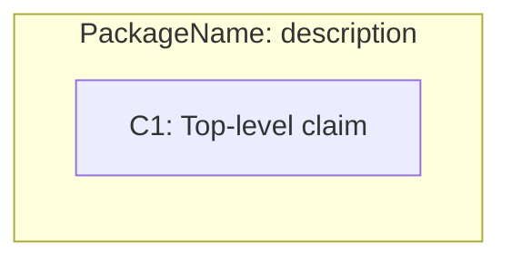

No close alternative — `subgraph` is Mermaid's only grouping construct.

### C.2 ArgumentPackageInterface

**Spec**: Like ArgumentPackage but with a lollipop (○—) symbol
in the side panel, indicating an interface through which the package
exposes elements to other packages.

**Mermaid**: Use `subgraph` with a `⊙` prefix in the label
to suggest the lollipop symbol:

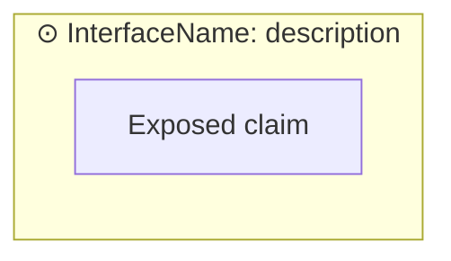

**Alternative**: When showing the interface only as an external
connection point (not its contents), use a standalone circle node:
`pi1(("InterfaceName"))`.

### C.3 ArgumentPackageBinding

**Spec**: Like ArgumentPackage but with two overlapping circles
in the side panel, indicating a binding between two packages.

**Mermaid**: Use `subgraph` with a `⊗` prefix
(or `⊕`, or another compound-circle character):

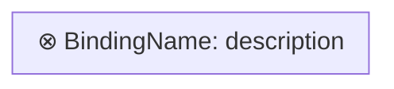

**Alternative**: When the binding is better expressed as an explicit
connection between two packages, connect two subgraphs with a labeled
edge: `pkg1 -- "binds" --- pkg2`.

### C.4 ArtifactReference

**Spec**: A dog-eared document shape (rectangle with folded
upper-right corner) with an upward-right arrow (↗) in the fold,
indicating a reference to an external artifact or evidence.

**Mermaid**: No document shape is available in GitHub's Mermaid
renderer. Use a stadium/pill shape `([...])` with `↗` appended
to the name, preserving the "external reference" cue:

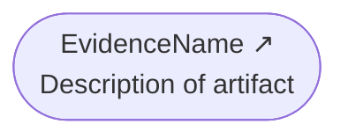

**Alternative A** — plain rectangle with `↗`:

```
AR1["EvidenceName ↗<br/>Description"]
```

Less visually distinct from a Claim but simpler.

**Alternative B** — circle `(("EvidenceName ↗"))`:
maximally distinct from Claims, but harder to fit multi-line text.

### C.5 +metaClaim reference

**Spec**: A horizontal line with an open left-pointing arrowhead
(`——<`), used to attach a Claim that comments on an Assertion
(e.g., expressing confidence in the assertion itself).

**Mermaid**: A dashed labeled edge, visually distinct from
regular inference arrows:

```
MetaClaim -. "+metaClaim" .-> Assertion1
```

### C.6 Claim

**Spec**: A rectangle. Seven assertion-state variants are indicated
by decorations (bracket feet, dots, double lines, X, dashes, corner
notches) that Mermaid cannot render.
Use text and shape conventions to distinguish them instead.

#### Asserted (default)

The normal, fully-supported state. Plain rectangle:

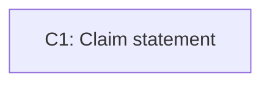

#### Assumed

Declared without any supporting evidence or argumentation.

**Recommended** — rounded rectangle to signal the softer status:

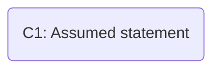

**Alternative** — rectangle with a leading `~`:

```
C1["~C1: Assumed statement"]
```

#### NeedsSupport

Declared as requiring further evidence or argumentation.
Append `⋯` to signal incompleteness, echoing the three dots
shown below the rectangle in the spec:

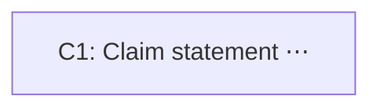

#### Axiomatic

Intentionally declared as axiomatically true; no further
support needed or expected.

**Recommended** — subroutine shape `[[...]]` (double vertical bars)
to suggest the spec's double bottom line:

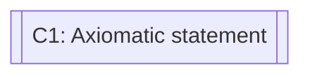

**Alternative** — rectangle with a `═══` suffix on a separate line:

```
C1["C1: Axiomatic statement<br/>═══"]
```

#### Defeated

Defeated by counter-evidence. Prefix with `✗`
(Mermaid cannot render the spec's crossed-out rectangle):

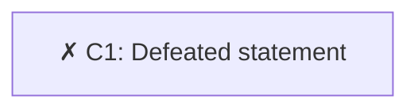

#### AsCited

Cites a claim from another package. Include the citation in the
label, mirroring the spec's "Cited Pkg [Cited name]" notation:

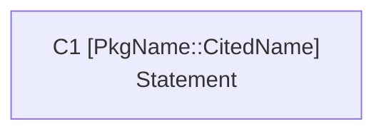

#### Abstract

Part of a pattern or template, not a concrete instance.
The spec uses a dashed rectangle (not available in Mermaid).
Use angle brackets around the name:

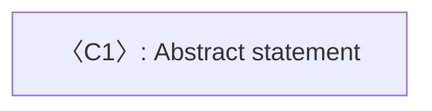

**Alternative** — `{abstract}` prefix:

```
C1["{abstract} C1: Statement"]
```

### C.7 ArgumentReasoning

**Spec**: An open-left-bracket shape — only the right vertical side
and two short horizontal lines are drawn, forming a `]` bracket —
containing name and statement. Analogous to a "Strategy" node in GSN.

**Mermaid**: The parallelogram `[/..../]` is the closest available
shape — visually non-rectangular and conventionally used for
strategy/reasoning in GSN-influenced notations:

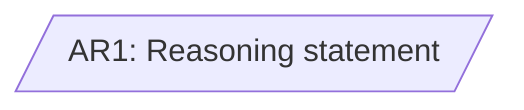

**Alternative** — trapezoid `[/....\]` for a slightly different
silhouette:

```
AR1[/"AR1: Reasoning statement"\]
```

### Assertion states for relationships (C.8–C.12)

Sections C.8–C.12 each define a relationship type with eight
assertion-state variants. The spec encodes the state in the
decoration on the target end of the arrow. Use this table:

| Assertion state | Mermaid edge | Notes |
|---|---|---|
| asserted (default) | `A --> B` | Solid arrow; no annotation needed |
| assumed | `A -. "assumed" .-> B` | Dashed with label |
| needsSupport | `A -- "..." --> B` | Labeled solid arrow |
| axiomatic | `A ==> B` | Thick arrow |
| defeated | `A --x B` | X at target end |
| asCited | `A -- "cited" --> B` | Add citation details in label |
| abstract | `A -.-> B` | Dashed arrow, no label |
| counter | `A --x B` | X at target; add `"counter"` label |

When both "defeated" and "counter" appear in the same diagram,
add a label on `--x` to disambiguate them.

**Note on reification**: The spec's relationships are reified — a dot
represents the relationship instance itself, with one edge to its
source and a separate decorated edge to its target. This is dropped in
our mapping; we use a single direct edge instead. In the rare case
where the relationship instance itself must be referenced (e.g., to
attach a +metaClaim to it), represent it as an explicit tiny node:

```
Src --- Dot((" ")) --> Tgt
```

### C.8 AssertedInference

**Spec**: Reified relationship. Source is a Claim or
ArgumentReasoning; target is a Claim.

**Mermaid**: Direct arrow from source to target (reification dropped).
In `flowchart BT`, sub-claims and ArgumentReasoning nodes appear
below the Claim they support, with arrows pointing upward:

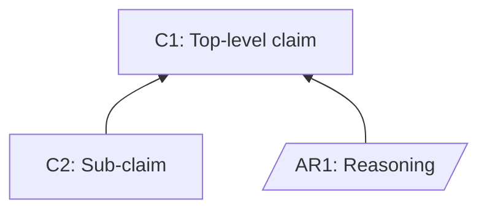

| Assertion state | Mermaid | Notes |
|---|---|---|
| asserted (default) | `Src --> Tgt` | Solid arrow; no label needed |
| assumed | `Src -. "assumed" .-> Tgt` | Dashed with label |
| needsSupport | `Src -- "..." --> Tgt` | Label signals incompleteness |
| axiomatic | `Src ==> Tgt` | Thick arrow |
| defeated | `Src -- "defeated" --x Tgt` | Label distinguishes from counter |
| asCited | `Src -- "cited: Pkg::Name" --> Tgt` | Include citation in label |
| abstract | `Src -.-> Tgt` | Dashed, no label |
| counter | `Src -- "counter" --x Tgt` | Label distinguishes from defeated |

### C.9 AssertedEvidence

**Spec**: Same reified notation as AssertedInference,
but the source is an ArtifactReference and the target is a Claim.

**Mermaid**: Same arrow style as C.8. The relationship type is implied
by the source node's shape (stadium + ↗):

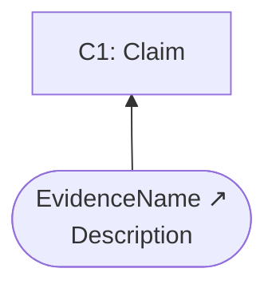

| Assertion state | Mermaid | Notes |
|---|---|---|
| asserted (default) | `ArtRef --> Tgt` | Source must be ArtifactReference shape |
| assumed | `ArtRef -. "assumed" .-> Tgt` | Dashed with label |
| needsSupport | `ArtRef -- "..." --> Tgt` | Label signals incompleteness |
| axiomatic | `ArtRef ==> Tgt` | Thick arrow |
| defeated | `ArtRef -- "defeated" --x Tgt` | Label distinguishes from counter |
| asCited | `ArtRef -- "cited: Pkg::Name" --> Tgt` | Include citation in label |
| abstract | `ArtRef -.-> Tgt` | Dashed, no label |
| counter | `ArtRef -- "counter" --x Tgt` | Label distinguishes from defeated |

### C.10 AssertedContext

**Spec**: Same reified notation but the target endpoint is a filled
square (■) rather than a filled arrowhead, indicating the source
provides context to the target rather than inferential support.
The counter variant uses an open square (□).

**Mermaid**: Use `--o` (circle at target end) as the closest
approximation to the spec's filled-square endpoint:

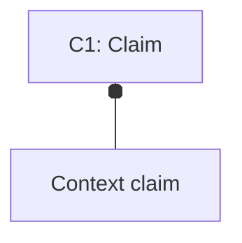

Dashed-line-with-circle is not supported in GitHub's Mermaid, so
`assumed` and `abstract` variants fall back to dashed arrows with
a `ctx` label to preserve the context meaning.

| Assertion state | Mermaid | Notes |
|---|---|---|
| asserted (default) | `Src --o Tgt` | Circle (○) approximates spec's filled square (■) |
| assumed | `Src -. "assumed ctx" .-> Tgt` | Dashed+circle unsupported; use dashed+label |
| needsSupport | `Src -- "... ctx" --o Tgt` | Labeled circle end |
| axiomatic | `Src == "axiomatic ctx" ==> Tgt` | Labeled thick arrow |
| defeated | `Src -- "defeated ctx" --x Tgt` | Add `ctx` to distinguish from inference |
| asCited | `Src -- "cited ctx: Pkg::Name" --o Tgt` | Labeled circle end |
| abstract | `Src -. "ctx" .-> Tgt` | Dashed+circle unsupported; use dashed+label |
| counter | `Src -- "counter ctx" --x Tgt` | Open square (□) → X end; add `ctx` label |

### C.11 AssertedArtifactSupport

**Spec**: Same reified notation as AssertedInference,
but the target is an ArtifactReference
(a Claim or ArgumentReasoning supports an artifact).

**Mermaid**: Same arrow style as C.8, distinguished from
AssertedInference by the target node's shape (stadium + ↗):

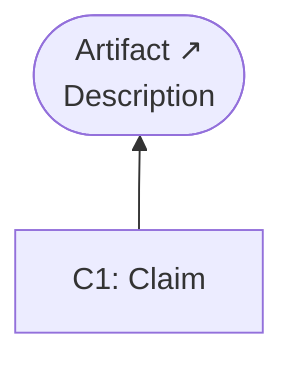

| Assertion state | Mermaid | Notes |
|---|---|---|
| asserted (default) | `Src --> ArtRef` | Target must be ArtifactReference shape |
| assumed | `Src -. "assumed" .-> ArtRef` | Dashed with label |
| needsSupport | `Src -- "..." --> ArtRef` | Label signals incompleteness |
| axiomatic | `Src ==> ArtRef` | Thick arrow |
| defeated | `Src -- "defeated" --x ArtRef` | Label distinguishes from counter |
| asCited | `Src -- "cited: Pkg::Name" --> ArtRef` | Include citation in label |
| abstract | `Src -.-> ArtRef` | Dashed, no label |
| counter | `Src -- "counter" --x ArtRef` | Label distinguishes from defeated |

### C.12 AssertedArtifactContext

**Spec**: Same reified notation as AssertedContext,
but the target is an ArtifactReference.

**Mermaid**: Same `--o` base style as C.10, distinguished from
AssertedContext by the target node's shape (stadium + ↗):

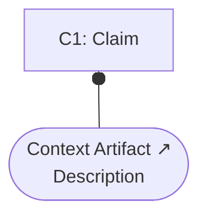

| Assertion state | Mermaid | Notes |
|---|---|---|
| asserted (default) | `Src --o ArtRef` | Target must be ArtifactReference shape |
| assumed | `Src -. "assumed ctx" .-> ArtRef` | Dashed+circle unsupported; use dashed+label |
| needsSupport | `Src -- "... ctx" --o ArtRef` | Labeled circle end |
| axiomatic | `Src == "axiomatic ctx" ==> ArtRef` | Labeled thick arrow |
| defeated | `Src -- "defeated ctx" --x ArtRef` | Add `ctx` to distinguish from inference |
| asCited | `Src -- "cited ctx: Pkg::Name" --o ArtRef` | Labeled circle end |
| abstract | `Src -. "ctx" .-> ArtRef` | Dashed+circle unsupported; use dashed+label |
| counter | `Src -- "counter ctx" --x ArtRef` | Open square (□) → X end; add `ctx` label |

## Justification for mapping

The SACM Annex C graphical constructs are:

* Node types (shapes): ArgumentPackage, ArgumentPackageInterface,
  ArgumentPackageBinding, ArtifactReference (dog-eared document), and Claim with
  7 variants (asserted=plain rect, assumed=bracket feet, needsSupport=dots
  below, axiomatic=double bottom line, defeated=crossed-out, asCited=corner
  notches, abstract=dashed rect), plus ArgumentReasoning (open-left bracket
  shape).
* Edge types: AssertedInference, AssertedEvidence, AssertedContext,
  AssertedArtifactSupport, AssertedArtifactContext — each with the same 7
  assertion-state variants. The key visual distinction: these are reified
  relationships — a dot in the middle with a plain line to source and a
  decorated arrow to target. The decoration on the target end encodes assertion
  state (filled arrowhead=asserted, open arrowhead=counter, filled
  square=context, X=defeated, three dots=needsSupport, etc.).

Among the mermaid diagram types, "flowchart TD" is the only viable choice.
It supports many shapes, edge styles, edge labels, and subgraphs.

Among the alternatives:

* classDiagram - its only shapes are UML class boxes, its only edges
  are UML relation types
* mindmap - only a few fixed shapes, parent-child edges only
* stateDiagram-v2 - only state box shapes, only edge transitions
* erDiagram - only entity box shapes, with ER relation styles

The three decisive reasons flowchart wins are:

1. Shape variety: It has the most node shapes GitHub supports — rectangle [],
   parallelogram [//], circle (()), rounded rectangle (), asymmetric >] — enough
   to meaningfully distinguish Claim, ArgumentReasoning, and ArtifactReference
   from each other.

2. Edge variety: --> (solid), -.-> (dashed), ==> (thick), --o (circle
   endpoint), --x (X endpoint), plus labeled edges — enough to encode assertion
   states and distinguish inference from context from counter relationships.

3. Subgraphs: subgraph blocks naturally represent ArgumentPackage grouping.

One challenge is that SACM's relationships are reified, in particular,
the dot in the middle is a first-class element.
Mermaid can't express that directly.
The practical workaround is to represent the relationship instance
as a tiny node (e.g., a circle) with two edges or to drop the
reification and use a direct labeled edge. The latter loses fidelity but stays
readable.

There is an exception: classDiagram is worth considering only for
package-structure diagrams. Its built-in lollipop interface notation happens
to visually echo the ArgumentPackageInterface lollipop symbol (C.2), and its
compartmented class boxes vaguely resemble the ArgumentPackage shape. But for
actual argument diagrams with Claims, reasoning, and evidence, classDiagram is
a poor fit.

## Source documents

* OMG, [Structured Assurance Case Metamodel (SACM)](https://www.omg.org/spec/SACM) version 2.3.
* [Mermaid Flowchart syntax](https://mermaid.ai/open-source/syntax/flowchart.html)
* GitHub, [Creating Diagrams (Creating Mermaid Diagrams)](https://docs.github.com/en/get-started/writing-on-github/working-with-advanced-formatting/creating-diagrams#creating-mermaid-diagrams)
