# SACM in mermaid

This document explains our approach to implementing the
[Structured Assurance Case Metamodel (SACM)](https://www.omg.org/spec/SACM)
graphical notation in mermaid as it is currently implemented by GitHub.

## Introduction

The Object Management Group (OMG) has defined
[Structured Assurance Case Metamodel (SACM)](https://www.omg.org/spec/SACM),
version 2.3 at time of writing.
SACM "defines a metamodel for representing structured assurance cases. An
Assurance Case is a set of auditable claims, arguments, and evidence
created to support the claim that a defined system/service will satisfy
the particular requirements [and] facilitates information exchange
between various system stakeholder[s]...".
In particular, it defines an XML-based scheme for exchanging detailed
data between tools specialized to support an assurance case.

We instead wanted to be able to edit and view a simple editable document
describing an assurance case
using simple widely-available and widely-used open source software tools.
The OMG SACM document was not designed for this use case.

Thankfully, newer versions of SACM also include a recommended graphical
notation defined in Annex C
("Concrete Syntax (Graphical Notations) for the Argumentation Metamodel").

In the best practices badge project we have traditionally used diagrams
edited with LibreOffice, connected together and provided detail in
markdown format. This is flexible, and LibreOffice is
quite capable. The resulting images look quite close to annex C.
However, this approach creates significant effort
when editing the graphics, because of the manual placement and regeneration
of images after editing it requires.
It also doesn't integrate well with version control.

More recent markdown implementations, including GitHub's, include
support for mermaid diagrams (such as mermaid flowcharts).
Mermaid, especially its older subset,
cannot exactly implement the SACM graphical notation.
Indeed, Mermaid is *much* less capable, graphically, than what LibreOffice
can generate, and it doesn't let you "place" symbols.

Nevertheless, the ability to *easily* integrate SACM diagrams into the
markdown format is compelling.
This would let us easily edit markdown files to update both the
text and graphical representation.
A mermaid representation doesn't need to be *exactly* like the SACM spec -
it simply needs to be adequate to be clear to stakeholder readers.

## Mermaid

We presume the document is overall in Commonmark markdown (.md) format,
interspersed with mermaid diagrams.

Mermaid's syntax is described in
[its reference](https://mermaid.ai/open-source/intro/syntax-reference.html).

GitHub's markdown implementation is even more limited than the
current version of mermaid.
For example, through testing
we've determined that GitHub's implementation currently doesn't
support expanded node shapes in Mermaid flowcharts (available in v11.3.0+).
For our purposes we must stick to what GitHub supports.

### Mermaid Frontmatter

To indicate a mermaid diagram begin its
first line with <tt>&#96;&#96;&#96;mermaid</tt>
and the following line should just have `---` to indicate
the start of frontmatter. Use this frontmatter:

~~~~yaml
config:
  theme: neutral
  flowchart:
    curve: linear
    htmlLabels: true
    rankSpacing: 60
    nodeSpacing: 45
    padding: 15
~~~~

Reasons:

* theme: neutral: This removes the vibrant colors of the "default" theme and uses a grayscale/white-and-black palette that matches more formal safety case documentation.
* curve: linear: Use (more) straight lines; they don't exactly match the SACM conventions but they're close.
* htmlLabels: true: This allows you to use standard HTML inside your nodes.
* rankSpacing: Assurance cases can get "crowded." Increasing rank spacing helps prevent the nodes from overlapping vertically and keeps the hierarchical levels distinct.
* nodeSpacing: Assurance cases can get "crowded." This helps us have slightly more horizontal nodes.
* padding: Reducing padding inside a node gives a little more space for multiple nodes on a line.

After the front matter have another line with `---`, then the
diagram, then a final <tt>&#96;&#96;&#96</tt> to end the diagram.

## Mapping

For each SACM graphical element identified in Annex C, here is our
recommended Mermaid representation.

### Layout and direction

Use `flowchart BT` (bottom-to-top) as the recommended layout.
In this layout sub-claims and evidence appear at the bottom,
the top-level claim appears at the top,
and edges point upward from supporting elements to the claim they support.
This matches the SACM arrow direction and produces an intuitive hierarchy.

**Alternative**: `flowchart TD` (top-down) with edges reversed so
the parent claim points down to its sub-claims.
This is common in many argument-tree tools and reads as decomposition,
but reverses the SACM arrow semantics.
`flowchart LR` is a further alternative for wide diagrams.

Whichever direction is chosen, document the convention explicitly
in the diagram or accompanying text.

### Name and description

Each SACM element has a **name** (short identifier) and a
**statement** or **description** (the substantive content).
Mermaid node labels combine these into a single string.

**Recommended**: Use the Mermaid node identifier as the SACM name
and repeat the name in the displayed label, separated by a colon:

```
C1["C1: The system meets all safety requirements"]
```

Note that ArtifactRefence (e.g., for evidence) has an arrow (↗);
typically that will be noted as name, colon, space, arrow, line break,
then the description.

Users *may* break a line just before beginning any statement or
description. Traditional SACM uses a line break and text alignment,
but we have less control, and we want to clearly
separate the name from the rest.

### C.1 ArgumentPackage

**SACM §11.4 (p. 36)**: "ArgumentPackage is the containing element
for a structured argument represented using the SACM Argumentation
Metamodel." ArgumentPackages contain structured arguments composed of
ArgumentAssets and can be nested.

**Annex C notation**: A bordered rectangular container with a tab
header and a side panel — a named grouping of argument elements.

**Mermaid**: Use `subgraph`. Text to type:

```
subgraph pkg1["PackageName: description"]
    C1["C1: element"]
end
```

Rendered:

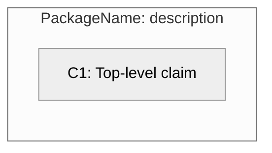

No close alternative — `subgraph` is Mermaid's only grouping construct.

### C.2 ArgumentPackageInterface

**SACM §11.6 (p. 37)**: "ArgumentPackageInterface is a kind of
ArgumentPackage that defines an interface that may be exchanged
between users." It declares which ArgumentAssets inside a package
are visible to other packages. Distinguished from ArgumentPackageBinding
(C.3), which joins packages together using those interfaces.

**Annex C notation**: Like ArgumentPackage but with a lollipop (○—)
symbol in the side panel, indicating an interface through which the
package exposes elements to other packages.

**Mermaid**: Use `subgraph` with a `⊙` prefix in the label
to suggest the lollipop symbol:

```
subgraph pi1["⊙ InterfaceName: description"]
    C1["Exposed claim"]
end
```

Rendered:

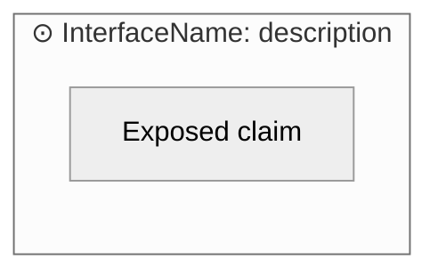

**Alternative**: When showing the interface only as an external
connection point (not its contents), use a standalone circle node:
`pi1(("InterfaceName"))`.

### C.3 ArgumentPackageBinding

**SACM §11.5 (p. 36)**: "ArgumentPackageBindings can be used to map
resolved dependencies between the Claims of two or more
ArgumentPackages." A binding is itself an ArgumentPackage and links
elements of participant packages via citation. Distinguished from
ArgumentPackageInterface (C.2), which exposes elements; a binding
connects two or more packages using those interfaces.

**Annex C notation**: Like ArgumentPackage but with two overlapping
circles in the side panel, indicating a binding between two packages.

**Mermaid**: Use `subgraph` with a `⊗` prefix
(or `⊕`, or another compound-circle character):

```
subgraph pb1["⊗ BindingName: description"]
end
```

Rendered:

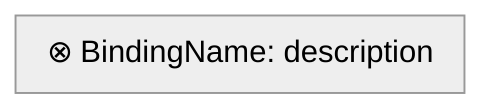

**Alternative**: When the binding is better expressed as an explicit
connection between two packages, connect two subgraphs with a labeled
edge: `pkg1 -- "binds" --- pkg2`.

### C.4 ArtifactReference

**SACM §11.9 (p. 38)**: "ArtifactReference enables the citation of
an artifact as information that relates to the structured argument."
The spec elaborates: "It is necessary to be able to cite artifacts
that provide supporting evidence, context, or additional description
within an argument structure. ArtifactReferences allow there to be
an objectified citation of this information within the structured
argument, thereby allowing the relationship between this artifact and
the argument to also be explicitly declared." Note: ArtifactReference
is the citation within the argument; the actual evidentiary object
(test report, specification, etc.) is described in the Artifact
Metamodel (§12.7).

**Annex C notation**: A multi-page shape (stacked offset rectangles)
with an upward-right arrow (↗) in the
fold, indicating a reference to an external artifact or evidence.

**Mermaid**: No document shape is available in GitHub's Mermaid
renderer. In particular, nothing is like the multi-page document shape
(LibreOffice can do this easily with shadows,
but we don't have that option here).
Use a cylinder/database shape `[(...)]` to hint at "stored evidence" and
append `↗` to the name to preserving the "external reference" arrow
cue from the spec notation:

```
AR1[("EvidenceName ↗<br/>Description of artifact")]
```

Rendered:

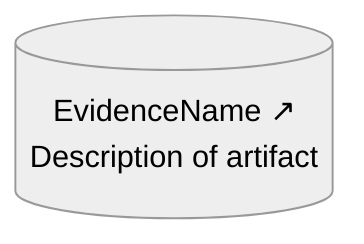

The cylinder is more visually distinct from Claims (rectangles and
rounded rectangles) than a stadium/pill would be, reducing the risk of
misreading a diagram at a glance. The ↗ icon is retained from the spec
to indicate that this is a reference to external information
(the ↗ icon is unrelated to the spec's stacked rectangles; the
stacked rectangles indicates a document that is likely to
have multiple pages).

Previously, the recommended shape was a stadium/pill `(["…"])`. The
switch to cylinder was made because the cylinder better hints at
"stored evidence" (an organized collection of data supporting the
argument) and is more visually distinct from Claim nodes.

**Alternative A** — plain rectangle with `↗`:

```
AR1["EvidenceName ↗<br/>Description"]
```

Less visually distinct from a Claim but simpler.

**Alternative B** — circle `(("EvidenceName ↗"))`:
maximally distinct from Claims, but harder to fit multi-line text.

**If expanded shapes were supported**: The `docs` shape would better
render the spec's document symbol, eliminating the cylinder
workaround and matching the source notation much more closely
Syntax: `AR1@{ shape: doc, label: "Name ↗<br/>Description" }`.
The ↗ can be kept for continuity with the spec's corner arrow.

### C.5 +metaClaim reference

**SACM §11.10 (p. 39)**: The +metaClaim is an association on
Assertion: "metaClaim:Claim[0..*] — references Claims concerning
(i.e., about) the Assertion (e.g., regarding the confidence in the
Assertion)." It allows any Assertion (a Claim or a relationship)
to have Claims attached to it as commentary or meta-level observation.

**Annex C notation**: A horizontal line with an open left-pointing
arrowhead (`——<`), used to attach a Claim that comments on an
Assertion (e.g., expressing confidence in the assertion itself).

**Mermaid**: A dashed labeled edge, visually distinct from
regular inference arrows:

```
MC1 -. "+metaClaim" .-> C1
```

Rendered:

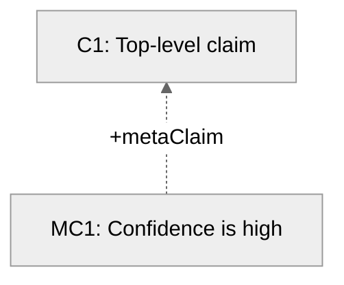

### C.6 Claim

**SACM §11.11 (p. 39)**: "Claims are used to record the propositions
of any structured argument contained in an ArgumentPackage.
Propositions are instances of statements that could be true or false,
but cannot be true and false simultaneously." The spec adds: "The
core of any argument is a series of claims (premises) that are
asserted to provide sufficient reasoning to support a (higher-level)
claim (a conclusion)." The assertionDeclaration attribute (§11.8,
p. 38) governs the seven assertion-state variants below.

**Annex C notation**: A rectangle. Seven assertion-state variants are
indicated by decorations (bracket feet, dots, double lines, X,
dashes, corner notches) that Mermaid cannot render.
Use text and shape conventions to distinguish them instead.

#### Asserted (default)

The normal, fully-supported state. Plain rectangle:

```
C1["C1: Claim statement"]
```

Rendered:

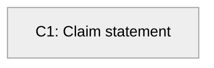

#### Assumed

Declared without any supporting evidence or argumentation.

**Recommended** — stadium/pill shape with a required `~` suffix
(space then tilde after the statement):

```
C1(["C1: Assumed statement ~"])
```

Rendered:

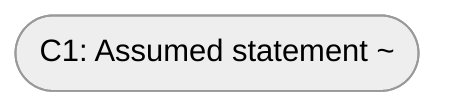

The rounded rectangle `("…")` is not visually distinctive enough —
it resembles a plain rectangle at a glance. The stadium (rounded on
both ends) is more visually distinct, and the mandatory `~` suffix
reinforces the assumed status even when shape rendering is subtle.
The original SACM symbol is visually very different from a normal claim.
Together, shape plus suffix make assumed Claims unambiguous.

**Alternative** — normal rectangle or rounded rectangle with `~` suffix,
if stadium is unavailable or unwanted:

```
C1("C1: Assumed statement ~")
```

#### NeedsSupport

Declared as requiring further evidence or argumentation.
Append `...` to signal incompleteness, echoing the three dots
shown below the rectangle in the spec. These could be
forced (with a break) to be below.

```
C1["C1: Claim statement ..."]
```

Rendered:

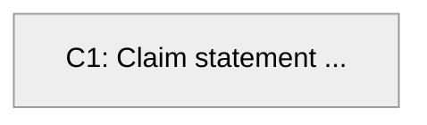

We could use the suffix `⋯` but that's more complex to type, and not as
obvious; using 3 full dots is easier to write and more obvious.
Note that the GSN notation for needs support (incomplete) is a diamond,
not 3 dots.

#### Axiomatic

Intentionally declared as axiomatically true; no further
support needed or expected.

Plain rectangle with `===` suffix, typically on its own line via
`<br/>` to echo the spec's double bottom line:

```
C1["C1: Axiomatic statement<br/>==="]
```

Rendered:

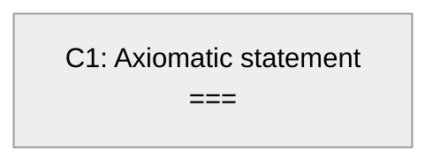

The `===` suffix may also appear inline if the label is short:

```
C1["C1: Short claim ==="]
```

#### Defeated

Defeated by counter-evidence. Append ` ✗` as a suffix
(Mermaid cannot render the spec's crossed-out rectangle):

```
C1["C1: Defeated statement ✗"]
```

Rendered:

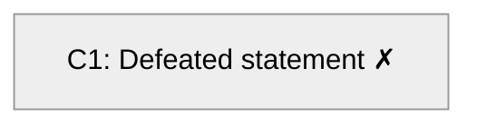

#### AsCited

Cites a claim from another package. Include the citation in the
label, mirroring the spec's "Cited Pkg [Cited name]" notation:

```
C1["C1 [PkgName::CitedName]<br/>Statement"]
```

Rendered:

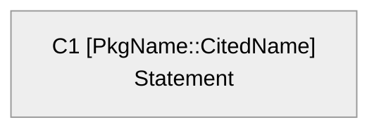

**If expanded shapes were supported**: The `notch-rect` (card) shape
has corner notches that directly match the spec's asCited notation,
removing the need to embed the citation only in the label text.
Syntax: `C1@{ shape: notch-rect, label: "C1 [Pkg::Name]<br/>Statement" }`.

#### Abstract

Part of a pattern or template, not a concrete instance.
The spec uses a dashed rectangle (not available in Mermaid).
Use angle brackets around the name:

```
C1["〈C1〉: Abstract statement"]
```

Rendered:

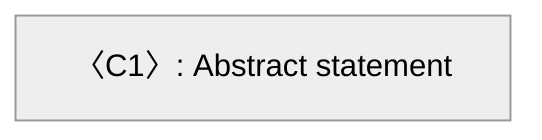

**Alternative** — `{abstract}` prefix:

```
C1["{abstract} C1: Statement"]
```

### C.7 ArgumentReasoning

**SACM §11.12 (p. 40)**: "ArgumentReasoning can be used to provide
additional description or explanation of the asserted relationship.
For example, it can be used to provide description of an
AssertedInference that connects one or more Claims (premises) to
another Claim (conclusion)." The spec adds: "The AssertedRelationship
that relates one or more Claims (premises) to another Claim
(conclusion) ... may not always be obvious. In such cases
ArgumentReasoning can be used to provide further description of the
reasoning involved." Analogous to a "Strategy" node in GSN.

**Annex C notation**: An open-left-bracket shape — only the right
vertical side and two short horizontal lines are drawn, forming a
`]` bracket — containing name and statement.

**Mermaid**: The parallelogram `[/..../]` is the closest available
shape — visually non-rectangular and conventionally used for
strategy/reasoning in GSN-influenced notations:

```
AR1[/"AR1: Reasoning statement"/]
```

Rendered:

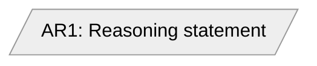

**Alternative** — trapezoid `[/....\]` for a slightly different
silhouette:

```
AR1[/"AR1: Reasoning statement"\]
```

### Assertion states for relationships (C.8–C.12)

Each of C.8–C.12 is a reified relationship: the relationship instance
is a dot node, sources connect to it with plain lines, and the dot
connects to the target with a decorated edge that encodes the assertion
state. Full form with dot:

```
Src --- Dot((" ")) --> Tgt
```

When there is only a single source and the dot need not be referenced
(no +metaClaim attached), the dot may be omitted and the same edge
style applied directly:

```
Src --> Tgt
```

The assertion state is always encoded on the **Dot→Tgt edge** (or the
direct Src→Tgt edge when the dot is omitted). There are two base
arrow families across the five relationship types:

**Note on orthogonality**: Relationship assertion states (C.8–C.12)
and Claim assertion states (C.6) are entirely independent. Both
inherit `assertionDeclaration` from the abstract `Assertion` class
(§11.10, p. 39), but they are encoded differently and do not
interfere. A Claim node can carry `assumed` (stadium shape + `~`
prefix) while the relationship pointing to it simultaneously carries
`defeated` (`Dot --x Tgt`). The visual motifs reuse similar symbols
(bracket feet, three dots) in both contexts, but they apply to
different objects.

**Inferential** (`-->` base) — used by C.8 AssertedInference,
C.9 AssertedEvidence, and C.11 AssertedArtifactSupport:

| Assertion state | Dot→Tgt edge | Notes |
|---|---|---|
| asserted (default) | `Dot --> Tgt` | Solid arrow |
| assumed | `Dot -. "assumed" .-> Tgt` | Dashed with label |
| needsSupport | `Dot -- "..." --> Tgt` | Label signals incompleteness |
| axiomatic | `Dot ==> Tgt` | Thick arrow |
| defeated | `Dot -- "defeated" --x Tgt` | Label distinguishes from counter |
| asCited | `Dot -- "cited: Pkg::Name" --> Tgt` | Include citation in label |
| abstract | `Dot -.-> Tgt` | Dashed, no label |
| counter | `Dot -- "counter" --x Tgt` | Label distinguishes from defeated |

Visual examples of each inferential assertion state (all include
the reification dot):

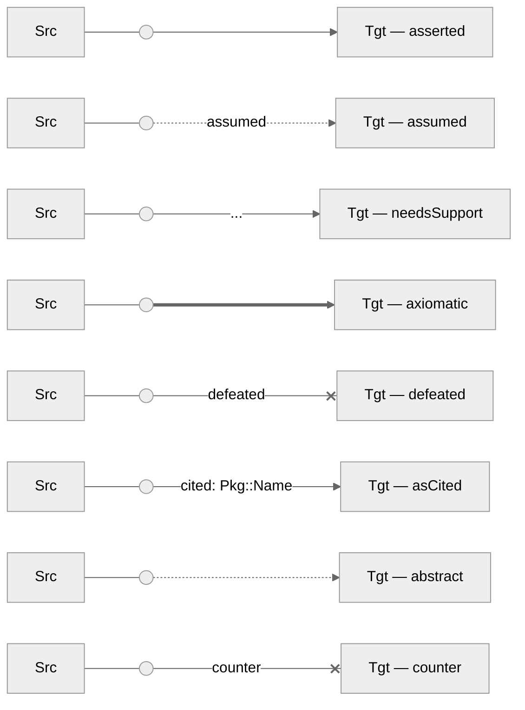

**Context** (`--o` base) — used by C.10 AssertedContext and
C.12 AssertedArtifactContext. The `ctx` suffix on labels distinguishes
context edges from inferential edges when both appear in a diagram:

| Assertion state | Dot→Tgt edge | Notes |
|---|---|---|
| asserted (default) | `Dot --o Tgt` | Circle (○) approximates spec's filled square (■) |
| assumed | `Dot -. "assumed ctx" .-> Tgt` | Dashed+circle unsupported; use dashed+label |
| needsSupport | `Dot -- "... ctx" --o Tgt` | Labeled circle end |
| axiomatic | `Dot == "axiomatic ctx" ==> Tgt` | Labeled thick arrow |
| defeated | `Dot -- "defeated ctx" --x Tgt` | `ctx` label distinguishes from inferential |
| asCited | `Dot -- "cited ctx: Pkg::Name" --o Tgt` | Labeled circle end |
| abstract | `Dot -. "ctx" .-> Tgt` | Dashed+circle unsupported; use dashed+label |
| counter | `Dot -- "counter ctx" --x Tgt` | X end; `ctx` label distinguishes |

Visual examples of each context assertion state (all include
the reification dot):

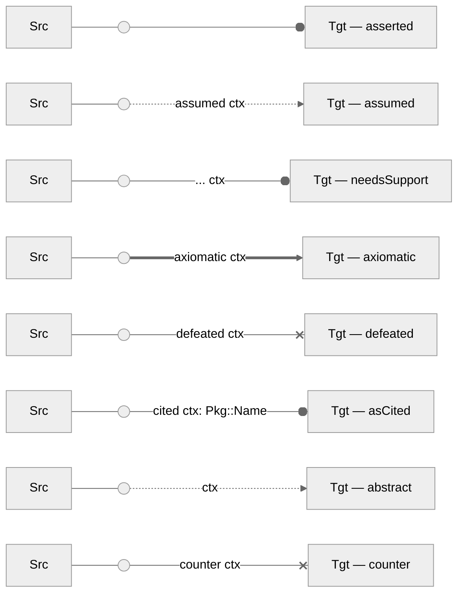

When both "defeated" and "counter" appear in the same diagram, always
label the `--x` edge to disambiguate them.

**If expanded shapes were supported**: Use `f-circ` (the filled/junction
circle) instead of `((" "))` — the filled circle matches the spec's
solid filled dot more closely than an open circle.
Syntax: `Dot@{ shape: f-circ }`.

### C.8 AssertedInference

**SACM §11.14 (p. 40)**: "AssertedInference association records the
inference that a user declares to exist between one or more Assertion
(premise) and another Assertion (conclusion). It is important to note
that such a declaration is itself an assertion on behalf of the user."
The spec explains: "An AssertedInference between two claims
(A – the source – and B – the target) denotes that the truth of
Claim A is said to infer the truth of Claim B." Distinguished from
AssertedEvidence (C.9), where the source must be an ArtifactReference
rather than a Claim or ArgumentReasoning.

**Annex C notation**: Reified relationship. Source is a Claim or
ArgumentReasoning; target is a Claim.

**Mermaid**: Use a reification dot when there are multiple sources, to
show they jointly constitute one `AssertedInference` rather than
independent inferences. In `flowchart BT`, sub-claims and
ArgumentReasoning nodes appear below the Claim they support:

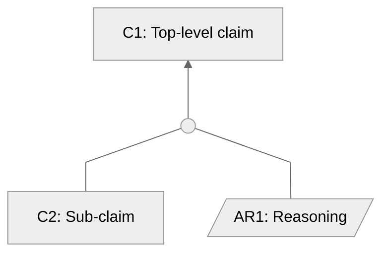

When there is only a single source, the dot may be omitted and a
direct arrow used instead (`C2 --> C1`), since there is no ambiguity
about joint vs. independent support.

**Assertion states**: use the **Inferential** table above.

### C.9 AssertedEvidence

**SACM §11.15 (p. 41)**: "AssertedEvidence association records the
declaration that one or more artifacts of Evidence (cited by
ArtifactReference) provide information that helps establish the
truth of a Claim." The spec constrains: "The source of
AssertedEvidence relationships must be ArtifactReference."
Distinguished from AssertedInference (C.8), where the source is a
Claim or ArgumentReasoning rather than an ArtifactReference.

**Annex C notation**: Same reified notation as AssertedInference,
but the source is an ArtifactReference and the target is a Claim.

**Mermaid**: Same arrow style as C.8. The relationship type is implied
by the source node's shape (cylinder + ↗):

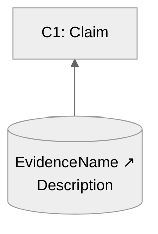

**Assertion states**: use the **Inferential** table above.

### C.10 AssertedContext

**SACM §11.16 (p. 41)**: "AssertedContext can be used to declare that
the artifact cited by an ArtifactReference(s) provides the context
for the interpretation and scoping of a Claim or ArgumentReasoning
element. In addition, the AssertedContext can be used to declare a
Claim asserted as necessary context (i.e. a precondition) for another
Assertion or ArgumentReasoning." Distinguished from AssertedInference
(C.8) — context establishes interpretation scope or preconditions,
not inferential support for the truth of a claim.

**Annex C notation**: Same reified notation but the target endpoint
is a filled square (■) rather than a filled arrowhead, indicating the
source provides context to the target rather than inferential support.
The counter variant uses an open square (□).

**Mermaid**: Use `--o` (circle at target end) as the closest
approximation to the spec's filled-square endpoint:

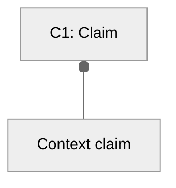

Dashed-line-with-circle is not supported in GitHub's Mermaid, so
`assumed` and `abstract` variants fall back to dashed arrows with
a `ctx` label to preserve the context meaning.

**Assertion states**: use the **Context** table above.

### C.11 AssertedArtifactSupport

**SACM §11.17 (p. 41)**: "AssertedArtifactSupport records the
assertion that one or more artifacts support another artifact."
The spec constrains: "The source and target of
AssertedArtifactSupport must be of type ArtifactReference." The spec
cautions this "can be an ambiguous relationship if the nature of
these Assertions is unclear. In such cases, it would be clearer to
declare explicit AssertedInferences between Claims drawn out from the
ArtifactReference." Distinguished from AssertedInference (C.8) and
AssertedEvidence (C.9) — both source and target must be
ArtifactReferences.

**Annex C notation**: Same reified notation as AssertedInference,
but both source and target are ArtifactReferences.

**Mermaid**: Same arrow style as C.8. Both source and target are
ArtifactReferences (cylinders + ↗), which distinguishes this from
AssertedInference (whose nodes are Claims or ArgumentReasoning):

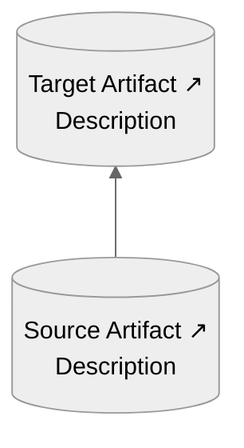

**Assertion states**: use the **Inferential** table above.

### C.12 AssertedArtifactContext

**SACM §11.18 (p. 41)**: "AssertedArtifactContext records the
assertion that one or more artifacts provide context for another
artifact." The spec constrains: "The source and target of
AssertedArtifactContext must be of type ArtifactReference."
Distinguished from AssertedContext (C.10), where the source or
target may be a Claim rather than an ArtifactReference.

**Annex C notation**: Same reified notation as AssertedContext,
but both source and target are ArtifactReferences.

**Mermaid**: Same `--o` base style as C.10. Both source and target are
ArtifactReferences (cylinders + ↗), which distinguishes this from
AssertedContext (whose nodes may be Claims):

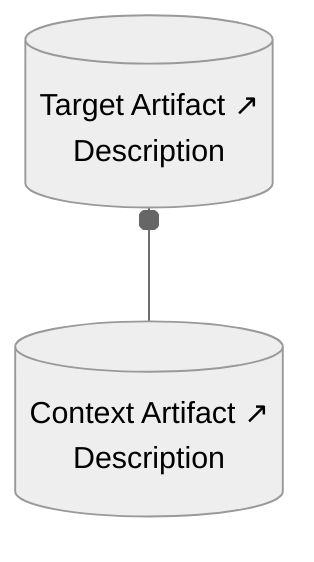

**Assertion states**: use the **Context** table above.

## Demonstrations

The following subsections implement selected figures from Annex D (informative)
of the SACM v2.3 specification (OMG Formal/23-05-08, October 2023) using the
Mermaid mapping established above. Each subsection names the source figure and
reproduces the spec's prose description, then shows the Mermaid equivalent.

### Figure D1 — Example of Claim Assumptions

**Source**: Figure D1, SACM v2.3 Annex D (informative), p. 67.

**Spec description**: Claims G2 and G3 are asserted to support Claim G1 via an
AssertedInference. An assumed Claim A1 is declared to explicitly describe the
assumption being made to support that AssertedInference. The assumed assertion
state on A1 signals that A1 is not itself argued; it is taken as a given in
order to justify the inference from G2 and G3 to G1.

**Mapping notes**:

- G1, G2, G3 are asserted Claims → rectangle `["…"]`
- A1 is an assumed Claim → stadium `(["… ~"])` with `~` suffix
  (spec uses bracket-feet notation; Mermaid has no direct equivalent)
- The AssertedInference reification dot is rendered as a small circle node
  `((" "))`, matching the spec's filled dot that sits at the centre of the
  relationship
- Plain (undirected) lines `---` connect each asserted source to the dot,
  matching the spec's plain lines from sources to the dot
- A dashed directed line `-. "assumed" .->` connects A1 to the dot,
  encoding the assumed assertion state on that source and preserving
  the directionality of the source-to-dot connection in the spec
- A solid arrow `-->` leads from the dot to the target Claim G1, matching
  the spec's filled arrowhead pointing at the supported claim

Here's the text for the mermaid chart (not including the standard
Mermaid Frontmatter described earlier).

```
flowchart BT
    G2["G2: Sub-claim A"]
    G3["G3: Sub-claim B"]
    A1(["A1: Assumed condition ~"])
    Inf1((" "))
    G1["G1: Top-level claim"]

    A1 -. "assumed" .-> Inf1
    G2 --- Inf1
    G3 --- Inf1
    Inf1 --> G1
```

Rendered:

```mermaid
---
config:
  theme: neutral
  flowchart:
    curve: linear
    htmlLabels: true
    rankSpacing: 60
    nodeSpacing: 45
    padding: 15
---
flowchart BT
    G2["G2: Sub-claim A"]
    G3["G3: Sub-claim B"]
    A1(["A1: Assumed condition ~"])
    Inf1((" "))
    G1["G1: Top-level claim"]

    A1 -. "assumed" .-> Inf1
    G2 --- Inf1
    G3 --- Inf1
    Inf1 --> G1
```

### Figure D9 — ArtifactReference Citation via AssertedEvidence

**Source**: Figure D9, SACM v2.3 Annex D (informative), p. 74.

**Spec description**: Claim G4 is supported by evidence cited via an
ArtifactReference E1. The support relationship is modeled as AssertedEvidence,
connecting the ArtifactReference (source) to the Claim (target). This pattern
is the standard way to ground a claim in a concrete artifact (a document,
test result, measurement, etc.) without embedding the artifact itself in the
assurance case.

**Mapping notes**:

- G4 is an asserted Claim → rectangle `["…"]`
- E1 is an ArtifactReference → cylinder/database shape `[("… ↗")]` with
  the ↗ icon retained from the spec's corner notation
- The AssertedEvidence reification dot may be dropped; in this case
  E1 gets a direct arrow to G4

```
flowchart BT
    E1[("E1 ↗<br/>Evidence artifact")]
    G4["G4: Top-level claim"]

    E1 --> G4
```

Rendered:

```mermaid
---
config:
  theme: neutral
  flowchart:
    curve: linear
    htmlLabels: true
    rankSpacing: 60
    nodeSpacing: 45
    padding: 15
---
flowchart BT
    E1[("E1 ↗<br/>Evidence artifact")]
    G4["G4: Top-level claim"]

    E1 --> G4
```

### Figure 8 Example of NeedsSupport

**Source**: Figure 8, Selviandro et al., "A Visual Notation for the
Representation of Assurance Cases using SACM 2.x", p. 12.

**Paper description**: An example showing the NeedsSupportClaim.
The 'Ambiguous Regions' Claim, which contributes to 'Segmentation
Outcome Performance', is defined as a NeedsSupportClaim, meaning it
needs further argumentation or evidence to be provided.
This richer example combines ArtifactReferences (context and evidence),
ArgumentReasoning nodes, and multiple Claims at different levels,
demonstrating SACM's reified relationships in a realistic setting.

**Mapping notes**:

- SOP is the top-level asserted Claim → plain rectangle `["…"]`
- CS (Clinical Setting) is an ArtifactReference providing context for SOP
  → cylinder `[("…↗")]`, connected with `--o` (AssertedContext)
- DTS and OS are ArgumentReasoning nodes → parallelogram `[/…/]`
- DI and UR are asserted Claims → plain rectangle `["…"]`
- AR (Ambiguous Regions) is a NeedsSupport Claim → plain rectangle with
  `...` suffix, indicating it requires further evidence or argumentation
- DIE and ASD are ArtifactReferences → cylinder `[("…↗")]`
- Two AssertedInference relationships, each reified with a dot:
  - Inf1 gathers {DI, DTS} and infers SOP
  - Inf2 gathers {UR, AR, OS} and infers SOP
- DIE provides evidence for DI (AssertedEvidence, direct arrow)
- ASD provides evidence for both UR and AR (two direct AssertedEvidence arrows)

```
flowchart BT
    SOP["Segmentation Outcome Performance<br/>Segmentation network produces device-independent<br/>tissue-segmentation maps"]
    CS[("Clinical Setting ↗<br/>Triage in an ophthalmology referral pathway at<br/>Moorfields Eye Hospital, with more than 50 common diagnoses")]
    DTS[/"Device Training Strategy<br/>Argument by training segmentation network on<br/>scans from 2 different devices"/]
    OS[/"Output Strategy<br/>Argument over ambiguous and unambiguous regions"/]
    DI["Device Independence<br/>AUC of 99.21 and 99.93 achieved for the 1st and<br/>2nd device considering urgent referral"]
    UR["Unambiguous Regions<br/>Tissue-segmentation map obtained by network is<br/>consistent with manual segmentation map"]
    AR["Ambiguous Regions<br/>The ambiguous regions in OCT scans are addressed<br/>by training multiple instances of the network<br/>..."]
    DIE[("Device Independence Evidence ↗<br/>Performance results")]
    ASD[("Automated Segmentation Device ↗<br/>Results of Segmentation Network")]
    Inf1((" "))
    Inf2((" "))

    CS --o SOP
    DI --- Inf1
    DTS --- Inf1
    Inf1 --> SOP
    UR --- Inf2
    AR --- Inf2
    OS --- Inf2
    Inf2 --> SOP
    DIE --> DI
    ASD --> UR
    ASD --> AR
```

Rendered:

```mermaid
---
config:
  theme: neutral
  flowchart:
    curve: linear
    htmlLabels: true
    rankSpacing: 60
    nodeSpacing: 45
    padding: 15
---
flowchart BT
    SOP["Segmentation Outcome Performance<br/>Segmentation network produces device-independent<br/>tissue-segmentation maps"]
    CS[("Clinical Setting ↗<br/>Triage in an ophthalmology referral pathway at<br/>Moorfields Eye Hospital, with more than 50 common diagnoses")]
    DTS[/"Device Training Strategy<br/>Argument by training segmentation network on<br/>scans from 2 different devices"/]
    OS[/"Output Strategy<br/>Argument over ambiguous and unambiguous regions"/]
    DI["Device Independence<br/>AUC of 99.21 and 99.93 achieved for the 1st and<br/>2nd device considering urgent referral"]
    UR["Unambiguous Regions<br/>Tissue-segmentation map obtained by network is<br/>consistent with manual segmentation map"]
    AR["Ambiguous Regions<br/>The ambiguous regions in OCT scans are addressed<br/>by training multiple instances of the network<br/>..."]
    DIE[("Device Independence Evidence ↗<br/>Performance results")]
    ASD[("Automated Segmentation Device ↗<br/>Results of Segmentation Network")]
    Inf1((" "))
    Inf2((" "))

    CS --o SOP
    DI --- Inf1
    DTS --- Inf1
    Inf1 --> SOP
    UR --- Inf2
    AR --- Inf2
    OS --- Inf2
    Inf2 --> SOP
    DIE --> DI
    ASD --> UR
    ASD --> AR
```

## High-level justification for mapping

The SACM Annex C graphical constructs are:

* Node types (shapes): ArgumentPackage, ArgumentPackageInterface,
  ArgumentPackageBinding, ArtifactReference (arrow with stack of
  papers), and Claim with
  7 variants (asserted=plain rect, assumed=bracket feet, needsSupport=dots
  below, axiomatic=double bottom line, defeated=crossed-out, asCited=corner
  notches, abstract=dashed rect), plus ArgumentReasoning (open-left bracket
  shape).
* Edge types: AssertedInference, AssertedEvidence, AssertedContext,
  AssertedArtifactSupport, AssertedArtifactContext — each with the same 7
  assertion-state variants. The key visual distinction: these are reified
  relationships — a dot in the middle with a plain line to source and a
  decorated arrow to target. The decoration on the target end encodes assertion
  state (filled arrowhead=asserted, open arrowhead=counter, filled
  square=context, X=defeated, three dots=needsSupport, etc.).

Among the mermaid diagram types, "flowchart TD" is the only viable choice.
It supports many shapes, edge styles, edge labels, and subgraphs.

Among the alternatives:

* classDiagram - its only shapes are UML class boxes, its only edges
  are UML relation types
* mindmap - only a few fixed shapes, parent-child edges only
* stateDiagram-v2 - only state box shapes, only edge transitions
* erDiagram - only entity box shapes, with ER relation styles
* graph - legacy type, more limited capabilities compared to flowchart

The three decisive reasons flowchart wins are:

1. Shape variety: It has the most node shapes GitHub supports — rectangle [],
   stadium ([]), cylinder [()], parallelogram [//], circle (()), rounded
   rectangle (), asymmetric >] — enough to meaningfully distinguish Claim,
   assumed Claim, ArtifactReference, and ArgumentReasoning from each other.

2. Edge variety: --> (solid), -.-> (dashed), ==> (thick), --o (circle
   endpoint), --x (X endpoint), plus labeled edges — enough to encode assertion
   states and distinguish inference from context from counter relationships.

3. Subgraphs: subgraph blocks naturally represent ArgumentPackage grouping.

One challenge is that SACM's relationships are reified, in particular,
the dot in the middle is a first-class element.
Mermaid can't express that directly.
The practical workaround is to represent the relationship instance
as a tiny node (e.g., a circle) with two edges or to drop the
reification and use a direct labeled edge. The latter loses fidelity but stays
readable.

There is an exception: classDiagram is worth considering only for
package-structure diagrams. Its built-in lollipop interface notation happens
to visually echo the ArgumentPackageInterface lollipop symbol (C.2), and its
compartmented class boxes vaguely resemble the ArgumentPackage shape. But for
actual argument diagrams with Claims, reasoning, and evidence, classDiagram is
a poor fit.

## Source documents

* OMG, [Structured Assurance Case Metamodel (SACM)](https://www.omg.org/spec/SACM) version 2.3.
* [Mermaid Flowchart syntax](https://mermaid.ai/open-source/syntax/flowchart.html)
* GitHub, [Creating Diagrams (Creating Mermaid Diagrams)](https://docs.github.com/en/get-started/writing-on-github/working-with-advanced-formatting/creating-diagrams#creating-mermaid-diagrams)
