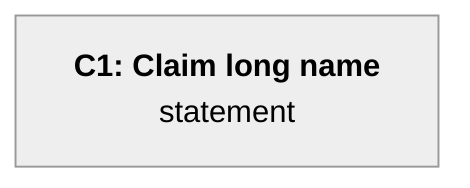
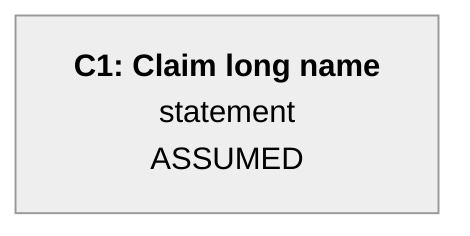
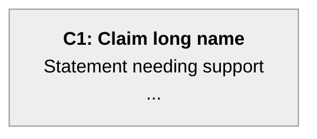
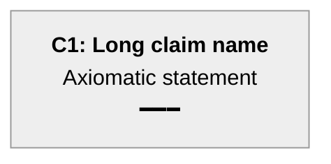
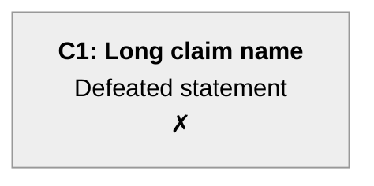
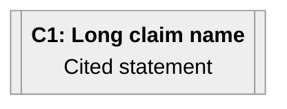
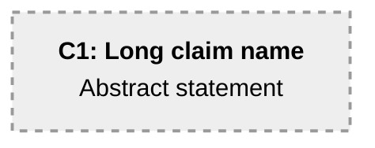
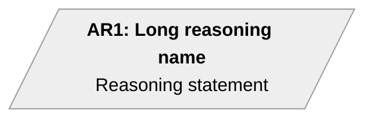
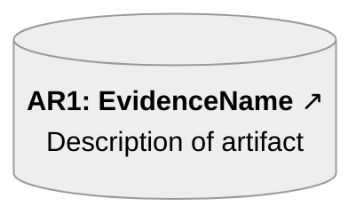
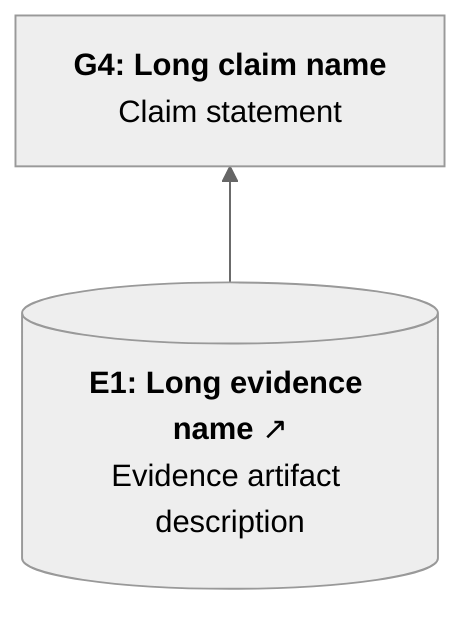

# SACM in mermaid

This document explains our approach to implementing the
[Structured Assurance Case Metamodel (SACM)](https://www.omg.org/spec/SACM)
graphical notation using the mermaid implementation
currently available on GitHub while making the
mermaid diagrams part of a markdown document.

## Introduction

The Object Management Group (OMG) has defined
[Structured Assurance Case Metamodel (SACM)](https://www.omg.org/spec/SACM),
version 2.3 at time of writing.
SACM "defines a metamodel for representing structured assurance cases. An
Assurance Case is a set of auditable claims, arguments, and evidence
created to support the claim that a defined system/service will satisfy
the particular requirements [and] facilitates information exchange
between various system stakeholder[s]...".
In particular, the SACM specification
defines an XML-based scheme for exchanging detailed
data between tools specialized to support an assurance case.

We *instead* want to be able to edit and view an assurance case
as a simple editable document
using simple widely-available and widely-used open source software tools.
The OMG SACM specification was not designed for this use case;
the specification instead focuses on transfer of complex XML structures.

Thankfully, newer versions of SACM also include a recommended graphical
notation defined in Annex C
("Concrete Syntax (Graphical Notations) for the Argumentation Metamodel").
This graphical notation *can* be used in simple documents.

In the best practices badge project we have traditionally used diagrams
edited with LibreOffice, connected together and provided detail in
markdown format. This is flexible, and LibreOffice is
quite capable. For a while we used the simpler claims, arguments, and
evidence (CAE) notation.
More recently, we started using LibreOffice to create SACM
diagrams. The resulting images look quite close to annex C notation,
and generally look good.

However, the approach to editing graphics with LibreOffice
creates significant effort when editing the graphics,
because of the manual placement and regeneration
of images after editing it requires.
It also doesn't integrate well with version control, as the graphic
information is essentially opaque complex structures.
It's also not easy to add hyperlinks from the images to the document
sections that provide detail.

More recent markdown implementations, including GitHub's, include
support for mermaid diagrams (such as mermaid flowcharts).
Mermaid, especially its older subset,
cannot exactly implement the SACM graphical notation.
Indeed, Mermaid is *much* less capable, graphically, than what LibreOffice
can generate.
Mermaid it doesn't let you "place" symbols at all!
Its placement algorithm is quite naive (less capable than graphviz),
as it really only understands ranks and graphs become harder if they
are more than six across.
The GitHub mermaid implementation also *requires* the user to run
client-side JavaScript, which some may prefer to disable, and
that esxecution imposes a small display delay.

Nevertheless, the ability to *easily* integrate SACM diagrams into the
markdown format is compelling.
This would let us easily edit markdown files to update both the
text and graphical representation, easy to keep the graphics and text
in sync, and make it easy to add hyperlinks from the figures to their
corresponding text.
A mermaid representation doesn't need to look *exactly* like the SACM spec -
it simply needs to be adequate to be clear represent constructs
to stakeholder readers.

## Document structure

We presume that there is a single assurance case document.
This document is overall in Commonmark markdown (.md) format,
interspersed with mermaid diagrams used to represent SACM
(as well as possibly other materials such as images).

The document will have various headings and sub-headings.
Many of the headings will have the name of some node in a SACM diagram.

SACM permits many structures, but we will intentionally limit SACM use
to cases where there is a "topmost claim" for a given diagram.
The diagram will introduce a heading with the name of the topmost claim.
Each of the nodes will have hyperlinks from their names with GitHub
style links, so that clicking on the name will navigate to *that*
part of the document.

## Mermaid approach to SACM

Mermaid's syntax is described in
[its reference](https://mermaid.ai/open-source/intro/syntax-reference.html).

GitHub's markdown implementation is even more limited than the
current version of mermaid.
For example, through testing
we've determined that GitHub's implementation currently doesn't
support expanded node shapes in Mermaid flowcharts (available in v11.3.0+).
For our purposes we must stick to what GitHub supports.

### Mermaid Embedding

To embed a mermaid diagram in markdown use this format.
This indicates
that it's a mermaid diagram, uses mermaid frontmatter to configure
its appearance, and sets some styles if desired.
Then replace
`INSERT-FIGURE-HERE`:

`````

```mermaid
---
config:
  theme: neutral
  flowchart:
    curve: linear
    htmlLabels: true
    rankSpacing: 60
    nodeSpacing: 45
    padding: 15
---
flowchart BT
    classDef sacmDot fill:#000,stroke:#000
    %% If used:
    classDef abstractClaim stroke-width:2px,stroke-dasharray: 5 5;
    INSERT-FIGURE-HERE
```
`````

Reasons:

* theme: neutral: This removes the vibrant colors of the "default" theme and uses a grayscale/white-and-black palette that matches more formal safety case documentation.
* curve: linear: Use (more) straight lines; they don't exactly match the SACM conventions but they're close.
* htmlLabels: true: This allows you to use standard HTML inside your nodes.
* rankSpacing: Assurance cases can get "crowded." Increasing rank spacing helps prevent the nodes from overlapping vertically and keeps the hierarchical levels distinct.
* nodeSpacing: Assurance cases can get "crowded." This helps us have slightly more horizontal nodes.
* padding: Reducing padding inside a node gives a little more space for multiple nodes on a line.

As discussed later,
a `sacmDot` is the default way to represent an AssertedRelationship, and
(if used) `abstractClaim` will help represent a Claim that is abstract.

### Layout and direction

We use `flowchart BT` (bottom-to-top) as the recommended layout.
In this layout sub-claims and evidence appear at the bottom,
the top-level claim appears at the top,
and edges point upward from supporting elements to the claim they support.
This matches the SACM arrow direction and produces an intuitive hierarchy.

### Name, gid (id), and description

In SACM, model node elements like Claim have possibly 3 related values:

* `gid` String[0..1]:
  an optional identifier that is unique within the scope of the model instance.
  This is from §8.2 SACMElement
  (the root abstract class everything inherits from).
  This is not normally directly displayed in the SACM graphical notation.
* `name`: LangString[1]: the (human-readable) name of the ModelElement.
  Examples show this may be several words. This is from §8.6 ModelElement.
* `description` Description[0..1]: the description of the ModelElement.
  This is also from §8.6 ModelElement.
  Section §8.9 Description says
  "In many cases Description is used to provide the 'content' of a SACM element.
  For example, it would be used to provide the text of a Claim."
  So a claim "statement" is simply the claim's description
  (it's not a different field).

Mermaid diagrams need *short* names to identify nodes.
It's *possible* to use long names, but it'd be painful.
These short names, more useful when defining nodes with connections,
are roughly analogous to the `gid` of SACM.
SACM does not require that the displayed `name` include the `gid` anywhere.
However, in practice it's helpful to display a unique short name for reference.
It would also be more difficult to edit diagrams if the displayed name
didn't include the short names we'd use to identify the nodes in a diagram.

We can resolve this by having a naming convention.
By convention, the name we use for a node (aka its "full name")
will normally have the following structure, in order:

1. short name (generally starting with a capital letter), an
   identifier that is unique across the entire assurance case
2. colon-space (: ), and
3. long name (typically 1-3 words).

In some cases the short name can serve as the full name.
In this case, only part 1 (the short name) is used as the name.
Note that all displayed names are unique, since they always include
a unique short name.

When displayed, the name (aka full name) will be bolded, following
the example of
[Selviandro et al.], followed by a line break &lt;br/&gt;, followed
by the description of the node.
As a special case, ArtifactRefence (e.g., for evidence) will have
a non-breaking space and an unbolded northeast arrow (↗) after the full name
just before this line break; this attempts to emulate its appearance
in SACM and remind readers that we're referencing external materials.

When used in an assurance case, we expect that bolded name
would be turned into a hyperlink (using `click`).
That link would go to the corresponding heading (if present) with
the same name that would provide more detail.
This makes it easy to learn more detail.

We *could* left-align the name, and center the description, as this is the
SACM convention.
However, this would require a lot of extra ceremony in each
node, making each node harder to edit.
It also risks getting stripped out by GitHub.
So we'll just use bold text instead to clearly differentiate
the name. This is still clear, using bold is common anyway,
and this is much easier to read and edit later.

### SACM Packages

SACM supports dividing assurance cases into a variety of "packages".
We're just drawing diagrams, but it'd be good to have conventions that
matched the SACM metamodel.

We will pretend that every diagram represents a small package
named "Package NAME" where "NAME" is the primary ArgumentAsset node
(in practice a Claim). Claims that are defined further elsewhere
would be shown as asCited claims, with their own main package.

Our packages will be smaller than typical, because mermaid's
automatic layouts algorithm is limited and we're presenting
information in portrait (not landscape). That's not necessarily
bad; each diagram will be easier to follow.

### Hyperlinks

One *great* thing about this approach is that it's easy to enable
hyperlinks from a diagram node to its contents (and defining
package if there is one).
GitHub supports both mermaid `click` and HTML `a href`, but
`click` is easier to read and lets users click on the *entire*
icon (not just the name), so we'll use `click`.
Unfortunately, mermaid diagrams are rendered
in an iframe, so relative fragment URLs
like `#name` won't work; you must use the absolute URL (`https:...`).
This means you'll always refer to a specific branch (normally the main branch,
not the current branch).
So after every node with a header that can jumped to, add:

```
click ID "ABSOLUTE_URL#NAME_AS_FRAGMENT"
```

In each node, after the mermaid assurance diagram if there is one, add this:

```
Referenced by: [Package NAME](#NAME_AS_FRAGMENT)
```

In the "Referenced by" don't include NAME itself; if there's more than one,
use a comma-separated list. While it's unfortunate these have to be
created and maintained by hand, it's not that hard, and it means readers
can easily move around the document.

The `NAME_AS_FRAGMENT` is simply the header converted into a fragment id
using GitHub's usual algorithm:

1. Convert all characters to lowercase.
2. Remove everything except Unicode alphanumerics, hyphens, and spaces.
3. Convert spaces to hyphens.
4. Collapse multiple adjacent hyphens into one hyphen.
4. Remove leading and trailing hyphens.

## Mapping SACM diagram symbols to mermaid

For each SACM graphical element identified in Annex C, here is our
recommended Mermaid representation.

This section doesn't follow the *order* of Annex C.
We instead will focus on the most important mappings first, starting
with Claim.
However, in this section we do discuss every graphical notation
defined in the SACM specification Annex C.

### Claim (C.6)

**SACM §11.11 (p. 39)**: "Claims are used to record the propositions
of any structured argument contained in an ArgumentPackage.
Propositions are instances of statements that could be true or false,
but cannot be true and false simultaneously." The spec adds: "The
core of any argument is a series of claims (premises) that are
asserted to provide sufficient reasoning to support a (higher-level)
claim (a conclusion)." The assertionDeclaration attribute (§11.8,
p. 38) governs the seven assertion-state variants below.

**Annex C notation**: A rectangle. Seven assertion-state variants are
indicated by decorations (bracket feet, dots, double lines, X,
dashes, corner notches) that Mermaid cannot render.
We'll use text and shape conventions to distinguish them instead.

For a Claim, the "statement" is the field "description"
(similarly, for ArgumentReasoning, the "reasoning" is the "description").
So "statement" and "description" are not different fields, a
"statement" is simply a description with a specific semantic role.
Since annex C says "statement" here, we will too.

#### Asserted (default)

This normal, fully-supported state. Plain rectangle:

```
C1["<b>C1: Claim long name</b><br>statement"]
```

Rendered:


```mermaid
---
config:
  theme: neutral
  flowchart:
    curve: linear
    htmlLabels: true
    rankSpacing: 60
    nodeSpacing: 45
    padding: 15
---
flowchart BT
    C1["<b>C1: Claim long name</b><br>statement"]
```

#### Assumed

Declared without any supporting evidence or argumentation.
Mermaid cannot render the SACM spec's notation at all.
So we instead add the word `ASSUMED`, which is at least clear.

**Approach** — a required `ASSUMED` suffix on its own line:

```
C1["<b>C1: Claim long name</b><br>Assumed statement<br>ASSUMED"]
```

Rendered:


```mermaid
---
config:
  theme: neutral
  flowchart:
    curve: linear
    htmlLabels: true
    rankSpacing: 60
    nodeSpacing: 45
    padding: 15
---
flowchart BT
    C1["<b>C1: Claim long name</b><br>statement<br>ASSUMED"]
```

**Alternative** — we originally had
rounded rectangles or pills, to make it obvious that this was different
from other claims, and we used a small suffix indicator `~`.
However, if we use a "normal" rectangle for all other claims, and
use a special shape for AsCited, it's a simpler and clearer mapping.
The `~` symbol isn't obvious nor clear, so a simple English keyword
ASSUMED is used instead.

#### NeedsSupport

Declared as requiring further evidence or argumentation.
Append `...` to signal incompleteness, echoing the three dots
shown below the rectangle in the spec. This marking would typically be
forced (with a break) to be below the other text.
Mermaid cannot render the spec's dots as part of bottom rectangle line,
but what is *can* show is close enough.

```
C1["<b>C1: Claim long name</b><br>Statement needing support<br>..."]
```

Rendered:


```mermaid
---
config:
  theme: neutral
  flowchart:
    curve: linear
    htmlLabels: true
    rankSpacing: 60
    nodeSpacing: 45
    padding: 15
---
flowchart BT
    C1["<b>C1: Claim long name</b><br>Statement needing support<br>..."]
```

We could use the Unicode character suffix `⋯`
but that's more complex to type, and since it's smaller it's not as obvious.
Using 3 full dots is easier to write and more obvious when reading.
Note that the GSN notation for needs support (incomplete) is a diamond,
not 3 dots, but this is SACM.

#### Axiomatic

Intentionally declared as axiomatically true; no further
support needed or expected.

In SACM this is an extra line under the rectangle; we'll simulate that
by adding a text suffix on its own line of three "━" characters
(U+2501, Box Drawings Heavy Horizontal).

```
C1["<b>C1: Long claim name</b><br>Axiomatic statement<br>━━━"]
```

Rendered:


```mermaid
---
config:
  theme: neutral
  flowchart:
    curve: linear
    htmlLabels: true
    rankSpacing: 60
    nodeSpacing: 45
    padding: 15
---
flowchart BT
    C1["<b>C1: Long claim name</b><br>Axiomatic statement<br>━━━"]
```

#### Defeated

Defeated by counter-evidence. Append `✗` as a suffix
(Mermaid cannot render the spec's crossed-out rectangle, and the
distinctive appearance of this symbol makes it clear
this is something special and not simply part of the statement text):

```
C1["<b>C1: Long claim name</b><br>Defeated statement<br>✗"]
```

Rendered:


```mermaid
---
config:
  theme: neutral
  flowchart:
    curve: linear
    htmlLabels: true
    rankSpacing: 60
    nodeSpacing: 45
    padding: 15
---
flowchart BT
    C1["<b>C1: Long claim name</b><br>Defeated statement<br>✗"]
```

#### AsCited

Cites a claim from another package.
The SACM notation is complex with a name, Cited Pkg [Cited name], and
as usual a statement.

Here we'll opt for simplicity, and simply use the name as usual
without the package references (our document isn't that complicated).
The idea is that this is a reference, and the claim
is more fully justified elsewhere.

The mermaid symbol that looks closest to this is the subroutine, so
we'll use that:

```
C1[["<b>C1: Long claim name</b><br>Cited statement"]]
```

Rendered:


```mermaid
---
config:
  theme: neutral
  flowchart:
    curve: linear
    htmlLabels: true
    rankSpacing: 60
    nodeSpacing: 45
    padding: 15
---
flowchart BT
    C1[["<b>C1: Long claim name</b><br>Cited statement"]]
```

If space is tight, the cited statement could be omitted.

#### Abstract

An abstract claim is
part of a pattern or template, and not a concrete instance.
The spec uses a dashed rectangle for abstract claims,
and this notation is directly available in Mermaid through styles.

```
    C1["<b>C1: Long claim name</b><br>Abstract statement"]:::abstractClaim

```

Rendered:


```mermaid
---
config:
  theme: neutral
  flowchart:
    curve: linear
    htmlLabels: true
    rankSpacing: 60
    nodeSpacing: 45
    padding: 15
---
flowchart BT
    classDef abstractClaim stroke-width:2px,stroke-dasharray: 5 5;
    C1["<b>C1: Long claim name</b><br>Abstract statement"]:::abstractClaim
```

### ArgumentReasoning (C.7)

**SACM §11.12 (p. 40)**: "ArgumentReasoning can be used to provide
additional description or explanation of the asserted relationship.
For example, it can be used to provide description of an
AssertedInference that connects one or more Claims (premises) to
another Claim (conclusion)." The spec adds: "The AssertedRelationship
that relates one or more Claims (premises) to another Claim
(conclusion) ... may not always be obvious. In such cases
ArgumentReasoning can be used to provide further description of the
reasoning involved." Analogous to a "Strategy" node in GSN.

**Annex C notation**: An open-left-bracket shape — only the right
vertical side and two short horizontal lines are drawn, forming a
`]` bracket — containing name and statement.

**Mermaid**: Mermaid has nothing like this shape available.
So we will use a parallelogram `[/..../]`. This is a somewhat similar shape,
and clearly distinct from the rectangle.
In addition, this is conventionally used for
strategy/reasoning in GSN-influenced notations, so many readers will
immediately know what the shape means:

```
AR1[/"<b>AR1: Long reasoning name</b><br>Reasoning statement"/]
```

Rendered:


```mermaid
---
config:
  theme: neutral
  flowchart:
    curve: linear
    htmlLabels: true
    rankSpacing: 60
    nodeSpacing: 45
    padding: 15
---
flowchart BT
    AR1[/"<b>AR1: Long reasoning name</b><br>Reasoning statement"/]
```

If we fully controlled the generated HTML or CSS, we *could* create
this shape by using a rectangle and selectively showing borders.
However, this won't work on GitHub; for security reasons they
disable inline styles and such for the default renderer.
Using HTML to do this on each one would also be annoying.
For completeness, here's what that would look like:

```
graph TD
    %% Disable the node's actual border and fill
    %% Then we draw the 'Half Box' using an HTML div
    A[Claim] --> B["<div style='border-left:2px solid #333;
                             border-top:2px solid #333;
                             border-bottom:2px solid #333;
                             padding:10px;'>Argument Reasoning</div>"]
    style B fill:none,stroke-width:0px
```

### ArtifactReference (C.4)

**SACM §11.9 (p. 38)**: "ArtifactReference enables the citation of
an artifact as information that relates to the structured argument."
The spec elaborates: "It is necessary to be able to cite artifacts
that provide supporting evidence, context, or additional description
within an argument structure. ArtifactReferences allow there to be
an objectified citation of this information within the structured
argument, thereby allowing the relationship between this artifact and
the argument to also be explicitly declared." Note: ArtifactReference
is the citation within the argument; the actual evidentiary object
(test report, specification, etc.) is described in the Artifact
Metamodel (§12.7).

We will tend to use this to point to evidence, if we want to do that
in the diagram. However, as this is embedded in a larger document,
most of the arguments and pointers to evidence will be within the
document, and not represented in the diagram itself.

**Annex C notation**: A multi-page shape (stacked offset rectangles)
with an upward-right arrow (↗) in the
fold, indicating a reference to an external artifact or evidence.

**Mermaid**: No document shape is available in the *current*
version of GitHub's Mermaid
renderer. In particular, nothing is like the multi-page document shape
(LibreOffice can do this easily with shadows,
but we don't have that option here).
So we will
use a cylinder/database shape `[(...)]` to hint at "stored evidence" and
append `↗` to the name to preserving the "external reference" arrow
cue from the spec notation:

```
AR1[("<b>AR1: EvidenceName</b>&amp;nbsp;↗<br>Description of artifact")]
```

Rendered:


```mermaid
---
config:
  theme: neutral
  flowchart:
    curve: linear
    htmlLabels: true
    rankSpacing: 60
    nodeSpacing: 45
    padding: 15
---
flowchart BT
    AR1[("<b>AR1: EvidenceName</b>&nbsp;↗<br>Description of artifact")]
```

The cylinder is more visually distinct from Claims (rectangles and
rounded rectangles) than a stadium/pill would be, reducing the risk of
misreading a diagram at a glance. The ↗ icon is retained from the spec
to indicate that this is a reference to external information.
We put a non-breaking space before ↗ because otherwise the ↗ could
end up on a line of its own.

**If expanded shapes were supported**: The Mermaid
`docs` shape would better
render the spec's document symbol, eliminating the cylinder
workaround and matching the source notation much more closely.
GitHub doesn't yet support this, but they probably will eventually,
so we could switch to this once it becomes available:

Syntax:

~~~~
`AR1@{ shape: docs,
       label: "<b>AR1: EvidenceName</b>&amp;nbsp;↗<br>Description of artifact"
 }`
~~~~

Note that we would use `docs` not `doc` because `docs` has multiple
rectangles representing pages, making it closer to the SACM symbol.
The ↗ icon is unrelated to the spec's stacked rectangles;
it represents externality, while the stacked rectangles indicates a
document that is likely to have multiple pages.
Thus, we would retain the ↗ icon.

### AssertedRelationship (C.8–C.12)

An AssertedRelation shows the relationship between
ArgumentAssets (such as Claims).

Two AssertedRelationships are especially common:

* Default AssertedInference (11.14, C.8). This
  asserts that a set of +source ArgumentEvidence
  (Claims, AssertedRelationship, or ArgumentReasoning)
  infer (justify) a +target Claim.
  The spec isn't clear that ArgumentReasoning is allowed as a source, but
  I believe that's the intent.
  In annex C this is shown with a filled dot
  (representing the asserted relationship)
  and an arrow pointing to the inferred target (representing the inference).
  In mermaid we'll represent this case with the format
  `SRC --- sacmDot --> TGT`.
* Default AssertedContext (11.16, C.10). This asserts that the
  +source ArtifactReference(s) provide the context for the interpretation
  and scope of a Claim or ArgumentReasoning.
  In annex C this is shown with a filled dot
  (representing the asserted relationship)
  and an square head pointing to the inferred target
  (representing the target controlled by the context).
  In mermaid we'll represent this with the circle head `--o`.
  This unfortunately looks a lot like the sacmDot, but the only
  alternateive is the cross head `--x` which looks ike
  "forbidden". Thus the format is
  `SRC --- sacmDot --o TGT`.

Here's an example of an AssertedInference:


```mermaid
---
config:
  theme: neutral
  flowchart:
    curve: linear
    htmlLabels: true
    rankSpacing: 60
    nodeSpacing: 45
    padding: 15
---
flowchart BT
    classDef sacmDot fill:#000,stroke:#000
    C2["C2: Sub-claim"]
    AR1[/"AR1: Reasoning"/]
    Inf1((" ")):::sacmDot
    C1["C1: Top-level claim"]
    E1[("<b>E1: Evidence</b>&nbsp;↗<br>Some evidence for context")]

    C2 --- Inf1
    AR1 --- Inf1
    E1 --o Inf1
    Inf1 --> C1
```

You can generate lots of SACM models with just these two forms.
However, the SACM notation supports many more options.
In this section, we'll discuss the full generality.

#### AssertedRelationship in full generality

According to the SACM specification §11.13 (p. 40),
AssertedRelationship is the abstract superclass
for all asserted associations between ArgumentAssets (such as Claims).
An AssertedRelationship declares that a
connection exists between one or more +source ArgumentAssets and a single
+target ArgumentAsset. Among its attributes are:

* `assertionDeclaration` attribute (default: asserted). This can be
   asserted, needsSupport, assumed, axiomatic, defeated, or asCited.
* `+isCounter` flag (default false). If true, the relationship
  counters its declared purpose. Counter-evidence doesn't always lead
  to the defeat of a claim, but it might.
* `+isAbstract` flag (default false); if true, this is abstract
  (this is defined by SACMElement)
* `+metaClaim` (optional).

**Annex C notation**: The relationship instance is
rendered as:

* +source edge(s) without arrowheads
* entity encoding the assertionDeclartion
  (by default a filled dot meaning "asserted")
* a single +target edge

Let's look at the options for each.

#### +source edge(s)

A source edge is an undirected solid line if `isAbstract` is
false, else it's a undirected dashed line.

For mermaid that is `---` for an undirected solid line, and
`-.-` for an undirected dashed line.

#### entity encoding assertionDeclation

The entity depends on assertionDeclation of the relationship;
here is the annex C notation and our mermaid representation:

* asserted (default): Solid dot for non-abstract,
  no symbol (hidden) for abstract.
  In mermaid we will represent this as `Inf1((" ")):::sacmDot`.
  David A. Wheeler thinks the hidden symbol used for
  *abstract* asserted relationship is a mistake, because
  it lacks clarity. We *could* have a hidden image, but for the moment,
  we'll just use the same representation when it's abstract.
  We'll discuss the solid dot more later.
* needsSupport: 3 dots. In mermaid
  we'll represent this as `.&nbsp;.&nbsp;.`.
* assumed: gap with lines on each end. In mermaid we'll use the text
  `ASSUMED`.
  Since lines tend to be vertical, we could instead use
  use `〓` (Geta mark U+3013 &amp;#x3013;) or `===` or
  `═══` (a sequence of Box Drawings Double Horizontal (U+2550,
  &amp;#x2550;)). However, we worry these aren't distinctive enough
  from axiomatic.
* axiomatic: single line across main line.
  In mermaid we'll use 3 Unicode Heavy Line
  characters, `━━━` (&amp;#x2501;&amp;#x2501;&amp;#x2501;).
* defeated: a large "X" across the line.
  In mermaid we will represent this with "✗"
  (Ballot X &amp;#x2717;) the same symbol defeated as a Claim.
  We could use the letter "X" or
  `✕` multiplication X, U+2715, &amp;#x2715;.
  However, we want to use the same symbol as Claim,
  and it's important that the Claim symbol be distinctive from
  text in the Claim.
* asCited: brackets around the line.
  In mermaid we will represent this as `[]`.

#### +target edge

In annex C, the target edge appearance depends on:

* Is this an inferential ("arrow") or context ("boxed rectangle") relationship?
  The inferential relationships AssertedInference (C.8),
  AssertedEvidence (C.9), and AssertedArtifactSupport (C.11).
  The context relationships are AssertedContext (C.10) and
  AssertedArtifactContext (C.12).
  In my diagrams, inference ("arrow") is more common.
  Mermaid provides an arrow, so we use that.
  Mermaid doesn't support a box as an endpoint head, so the mermaid
  representation uses a filled circle head.
* `+isCounter` flag (default false). If true, the relationship
  counters its declared purpose. Counter-evidence doesn't always lead
  to the defeat of a claim, but it might.
  In annex C a "counter" relationship is
  represented as "open" versions of the endpoints.
  Mermaid can't do that, and it's a terrible representation anyway
  (it's too easily missed). So instead we'll decorate the +target edge
  with Circled minus ⊖ Unicode U+2296 &amp;#x2296;.
* `+isAbstract` flag (default false); if true, this is abstract
  (this is defined by SACMElement).
  If false, we use a solid line, if true, we use a dashed line.

For non-abstract relationships (isAbstract is false),
here are the mermaid representations (these use solid lines):

| Type | Not Counter | Is Counter |
|---|---|---|
| Inferential | <tt>--&gt;</tt> | <tt>--&gt;&#x7c;⊖&#x7c;</tt> |
| Context | `--o` | <tt>--o&#x7c;⊖&#x7c;</tt> |

For abstract relationships (isAbstract is true),
here are the mermaid representations (these use dashed lines):

| Type | Not Counter (Abstract) | Is Counter (Abstract) |
|---|---|---|
| Inferential | <tt>-.-&gt;</tt> | <tt>-.-&gt;&#x7c;⊖&#x7c;</tt> |
| Context | `-.-o` | <tt>-.-o&#x7c;⊖&#x7c;</tt> |

Mermaid also has a cross arrow head `--x`, but while that would
look good for *counter*, we'd still need to distinguish between
inferential and contxt, and mermaid doens't have 4 arrow head types.
Counter is less used anyway, so it made more sense to consistently
use the same heads everywhere, and add a special marker for
when the assertion is a counter assertion.

#### Subclass determination of AssertedRelationship

The five concrete subclasses of AssertedRelationship
are AssertedInference (C.8), AssertedEvidence
(C.9), AssertedContext (C.10), AssertedArtifactSupport (C.11), and
AssertedArtifactContext (C.12).
They all look identical in the SACM graphical notation.
The subclass is implied entirely by the types of the
+source and +target nodes and the arrow-head style on the +target edge.

In short, you can simply draw the relationship, and the correct one
will be automatically determined.
However, for precision, here is how they are determined:

| Subclass | Source type | Target type | Arrow style | SACM ref |
|---|---|---|---|---|
| AssertedInference | Assertion (Claim or AssertedRelationship); we believe ArgumentReasoning also expected | Assertion | `-->` inferential | §11.14 |
| AssertedEvidence | ArtifactReference | Claim | `-->` inferential | §11.15 |
| AssertedArtifactSupport | ArtifactReference | ArtifactReference | `-->` inferential | §11.17 |
| AssertedContext | Claim or ArtifactReference | Claim, Assertion, or ArgumentReasoning | `--o` context | §11.16 |
| AssertedArtifactContext | ArtifactReference | ArtifactReference | `--o` context | §11.18 |

If you point to the target with
a normal arrow `-->` that's a normal (non-context) relationship;
if you use context arrow `--o` that means you're defining context.
By default they are *asserted*, in which case
the relation is represented by a filled black dot.

#### Solid dot (reified form)

In SACM an AssertedRelationship is "reified", that is, it has
its own symbol on the diagram.
By default an AssertedRelationship has the `assertedDeclaration` value
of `asserted`, and this is represented by a small black dot
(aka "reification dot" or "sacmDot").
This symbol is almost all SACM diagrams, so it's important to do this well.

To represent the AssertedRelationship default `asserted` state
we use a mermaid class definition `classDef sacmDot fill:#000,stroke:#000` to
create a solid black dot appearance.
For each dot's text, we prefer to use a hair space
(U+200A, UTF-8 e2 80 8a) as the dot's textual contents.
We have a script `script/fix_reification_spaces.sh` that automatically converts
any one character (such as a space) within the phrase
<tt>&#x28;("&nbsp;"))</tt> into a hair space.
Thus, each dot looks like this: `Inf1((" ")):::sacmDot`.

A hair space is the thinnest visible space.
The mermaid processor
doesn't permit an empty string, and a zero-width character in file like this
can lead to other problems.
We could use a period or centered period, and set the background and
font text to black, something like this:
`classDef sacmDot fill:#000,stroke:#000,width:8px,height:8px,color:#000,font-size:1px`.
However, this doesn't work well; mermaid determines the item size too early.

**If expanded shapes were supported**: We might someday
use `f-circ` (the filled/junction
circle) instead of `((" ")):::sacmDot` for the sacmDot,
as it's a filled circle without any special styling.

Syntax: `Dot@{ shape: f-circ }`.

#### Our extension: Unreified (single-source) form

We add an extension to SACM graphical notation, that is
not in the original spec,
as a concession to mermaid's limited graphical capabilities.

Normally an AssertedRelationship is represented by its own symbol,
by default a black filled dot.

However, when an AssertedRelationship has only a single source and is
a "simple" case, we'll also allow a direct edge a sacmDot.
The "simple" case means:

* it is `asserted` (the default), which would be normally be
  represented as a sacmDot
* there's no graphical need for the sacmDot.
  That is, there's only 1 source and there's
  no +metaClaim attached to the relationship
* it is not abstract. In Annex C abstract relationships are shown with
  dashed lines and without a sacmDot, and we don't want to be ambiguous.

Thus you're allowed to simply these connectsions to:

* `Src --> Tgt` - inferential:
  AssertedInference, AssertedEvidence, AssertedArtifactSupport
* `Src --o Tgt` - context: AssertedContext, AssertedArtifactContext

Note that the same assertion-state
edge decorations apply to the direct Src→Tgt edge
as to the Dot→Tgt edge in the reified form.

### +metaClaim reference (C.5)

**SACM §11.10 (p. 39)**: The +metaClaim is an association on
Assertion: "metaClaim:Claim[0..*] — references Claims concerning
(i.e., about) the Assertion (e.g., regarding the confidence in the
Assertion)." It allows any Assertion (a Claim or a relationship)
to have Claims attached to it as commentary or meta-level observation.

**Annex C notation**: A horizontal line with an open left-pointing
arrowhead (`——<`), used to attach a Claim that comments on an
Assertion (e.g., expressing confidence in the assertion itself).

**Mermaid**: A directed edge labelled `+metaClaim`, as this is clear
and mermaid doesn't support a better mapping:

```
MC1 --- "+metaClaim" --> C1
```

Rendered:

```mermaid
---
config:
  theme: neutral
  flowchart:
    curve: linear
    htmlLabels: true
    rankSpacing: 60
    nodeSpacing: 45
    padding: 15
---
flowchart BT
    C1["<b>C1: Top-level claim<b>"]
    MC1["<b>MC1: Confidence is high<b>"]
    MC1 --- "+metaClaim" --> C1
```

### Unmapped constructs

Annex C has some constructs we've chosen to not map.
We don't really need them, and it's hard to represent them visually
with Mermaid anyway. We could try using subgraphs, but they're
messy and not worth it.

Here are the sections and constructs:

#### ArgumentPackage (C.1)

**SACM §11.4 (p. 36)**: "ArgumentPackage is the containing element
for a structured argument represented using the SACM Argumentation
Metamodel." ArgumentPackages contain structured arguments composed of
ArgumentAssets and can be nested.

**Annex C notation**: A bordered rectangular container with a tab
header and a side panel — a named grouping of argument elements.

#### ArgumentPackageInterface (C.2)

**SACM §11.6 (p. 37)**: "ArgumentPackageInterface is a kind of
ArgumentPackage that defines an interface that may be exchanged
between users." It declares which ArgumentAssets inside a package
are visible to other packages. Distinguished from ArgumentPackageBinding
(C.3), which joins packages together using those interfaces.

**Annex C notation**: Like ArgumentPackage but with a lollipop (○—)
symbol in the side panel, indicating an interface through which the
package exposes elements to other packages.

#### ArgumentPackageBinding (C.3)

**SACM §11.5 (p. 36)**: "ArgumentPackageBindings can be used to map
resolved dependencies between the Claims of two or more
ArgumentPackages." A binding is itself an ArgumentPackage and links
elements of participant packages via citation. Distinguished from
ArgumentPackageInterface (C.2), which exposes elements; a binding
connects two or more packages using those interfaces.

**Annex C notation**: Like ArgumentPackage but with two overlapping
circles in the side panel, indicating a binding between two packages.

## Demonstrations

The following subsections implement selected figures from Annex D (informative)
of the SACM v2.3 specification (OMG Formal/23-05-08, October 2023) using the
Mermaid mapping established above. Each subsection names the source figure and
reproduces the spec's prose description, then shows the Mermaid equivalent.

### Figure D1 — Example of Claim Assumptions

**Source**: Figure D1, SACM v2.3 Annex D (informative), p. 67.

**Spec description**: Claims G2 and G3 are asserted to support Claim G1 via an
AssertedInference. An assumed Claim A1 is declared to explicitly describe the
assumption being made to support that AssertedInference. The assumed assertion
state on A1 signals that A1 is not itself argued; it is taken as a given in
order to justify the inference from G2 and G3 to G1.

**Mapping notes**:

- G1, G2, G3 are asserted Claims → rectangle `["…"]`
- A1 is an assumed Claim → stadium `(["… ASSUMED"])` with `ASSUMED` suffix
  (spec uses bracket-feet notation; Mermaid has no direct equivalent)
- The AssertedInference reification dot is rendered as a small circle node
  `((" ")):::sacmDot`, matching the spec's filled dot that sits at the centre of the
  relationship
- Plain (undirected) lines `---` connect each asserted source to the dot,
  matching the spec's plain lines from sources to the dot
- A dashed directed line `-. "assumed" .->` connects A1 to the dot,
  encoding the assumed assertion state on that source and preserving
  the directionality of the source-to-dot connection in the spec
- A solid arrow `-->` leads from the dot to the target Claim G1, matching
  the spec's filled arrowhead pointing at the supported claim

Here's the text for the mermaid chart (not including the standard
Mermaid Frontmatter described earlier).

```
flowchart BT
    G2["<b>G2</b><br>Sub-claim A"]
    G3["<b>G3</b><br>Sub-claim B"]
    A1(["<b>A1</b><br>Assumed condition</b><br>ASSUMED"])
    Inf1((" ")):::sacmDot
    G1["<b>G1</b><br>Top-level claim"]

    A1 --- "assumed" --> Inf1
    G2 --- Inf1
    G3 --- Inf1
    Inf1 --> G1
```

Rendered:

```mermaid
---
config:
  theme: neutral
  flowchart:
    curve: linear
    htmlLabels: true
    rankSpacing: 60
    nodeSpacing: 45
    padding: 15
---
flowchart BT
    classDef sacmDot fill:#000,stroke:#000
    G2["<b>G2</b><br>Sub-claim A"]
    G3["<b>G3</b><br>Sub-claim B"]
    A1(["<b>A1</b><br>Assumed condition</b><br>ASSUMED"])
    Inf1((" ")):::sacmDot
    G1["<b>G1</b><br>Top-level claim"]

    A1 --- "assumed" --> Inf1
    G2 --- Inf1
    G3 --- Inf1
    Inf1 --> G1
```

### Figure D9 — ArtifactReference Citation via AssertedEvidence

**Source**: Figure D9, SACM v2.3 Annex D (informative), p. 74.

**Spec description**: Claim G4 is supported by evidence cited via an
ArtifactReference E1. The support relationship is modeled as AssertedEvidence,
connecting the ArtifactReference (source) to the Claim (target). This pattern
is the standard way to ground a claim in a concrete artifact (a document,
test result, measurement, etc.) without embedding the artifact itself in the
assurance case.

I've embellished the information in each node to make it clearer
that both a name and a description are supported.

**Mapping notes**:

- G4 is an asserted Claim → rectangle `["…"]`
- E1 is an ArtifactReference → cylinder/database shape `[("… ↗")]` with
  the ↗ icon retained from the spec's corner notation
- The AssertedEvidence reification dot may be dropped; in this case
  E1 gets a direct arrow to G4

```
flowchart BT
    E1[("<b>E1: Long evidence name</b>&amp;nbsp;↗<br>Evidence artifact description")]
    G4["<b>G4: Long claim name</b><br>Claim statement"]

    E1 --> G4
```

Rendered:


```mermaid
---
config:
  theme: neutral
  flowchart:
    curve: linear
    htmlLabels: true
    rankSpacing: 60
    nodeSpacing: 45
    padding: 15
---
flowchart BT
    E1[("<b>E1: Long evidence name</b>&nbsp;↗<br>Evidence artifact description")]
    G4["<b>G4: Long claim name</b><br>Claim statement"]

    E1 --> G4
```

### Figure 8 Example of NeedsSupport

**Source**: Figure 8, Selviandro et al., "A Visual Notation for the
Representation of Assurance Cases using SACM 2.x", p. 12.

**Paper description**: An example showing the NeedsSupportClaim.
The 'Ambiguous Regions' Claim, which contributes to 'Segmentation
Outcome Performance', is defined as a NeedsSupportClaim, meaning it
needs further argumentation or evidence to be provided.
This richer example combines ArtifactReferences (context and evidence),
ArgumentReasoning nodes, and multiple Claims at different levels,
demonstrating SACM's reified relationships in a realistic setting.

**Mapping notes**:

- Node labels follow the `<b>ShortID: Long name</b><br>description` convention
- SOP is the top-level asserted Claim → plain rectangle
- CS is an ArtifactReference providing context for SOP
  → cylinder with `<b>name</b>&amp;nbsp;↗<br>description`, connected with `--o` (AssertedContext)
- DTS and OS are ArgumentReasoning nodes → parallelogram `[/…/]`
- DI and UR are asserted Claims → plain rectangle
- AR (Ambiguous Regions) is a NeedsSupport Claim → plain rectangle with
  `<br>...` suffix on its own line
- DIE and ASD are ArtifactReferences → cylinder with `<b>name</b>&amp;nbsp;↗<br>description`
- Two AssertedInference relationships, each reified with a dot:
  - Inf1 gathers {DI, DTS} and infers SOP
  - Inf2 gathers {UR, AR, OS} and infers SOP
- DIE provides evidence for DI (AssertedEvidence, direct arrow)
- ASD provides evidence for both UR and AR (two direct AssertedEvidence arrows)

```
flowchart BT
    classDef sacmDot fill:#000,stroke:#000
    SOP["<b>SOP: Segmentation Outcome Performance</b><br>Segmentation network produces device-independent tissue-segmentation maps"]
    CS[("<b>CS: Clinical Setting</b>&amp;nbsp;↗<br>Triage in an ophthalmology referral pathway at Moorfields Eye Hospital, with more than 50 common diagnoses")]
    DTS[/"<b>DTS: Device Training Strategy</b><br>Argument by training segmentation network on scans from 2 different devices"/]
    OS[/"<b>OS: Output Strategy</b><br>Argument over ambiguous and unambiguous regions"/]
    DI["<b>DI: Device Independence</b><br>AUC of 99.21 and 99.93 achieved for the 1st and 2nd device considering urgent referral"]
    UR["<b>UR: Unambiguous Regions</b><br>Tissue-segmentation map obtained by network is consistent with manual segmentation map"]
    AR["<b>AR: Ambiguous Regions</b><br>The ambiguous regions in OCT scans are addressed by training multiple instances of the network<br>..."]
    DIE[("<b>DIE: Device Independence Evidence</b>&amp;nbsp;↗<br>Performance results")]
    ASD[("<b>ASD: Automated Segmentation Device</b>&amp;nbsp;↗<br>Results of Segmentation Network")]
    Inf1((" ")):::sacmDot
    Inf2((" ")):::sacmDot

    CS --o SOP
    DI --- Inf1
    DTS --- Inf1
    Inf1 --> SOP
    UR --- Inf2
    AR --- Inf2
    OS --- Inf2
    Inf2 --> SOP
    DIE --> DI
    ASD --> UR
```

Rendered:


```mermaid
---
config:
  theme: neutral
  flowchart:
    curve: linear
    htmlLabels: true
    rankSpacing: 60
    nodeSpacing: 45
    padding: 15
---
flowchart BT
    classDef sacmDot fill:#000,stroke:#000
    SOP["<b>SOP: Segmentation Outcome Performance</b><br>Segmentation network produces device-independent tissue-segmentation maps"]
    CS[("<b>CS: Clinical Setting</b>&nbsp;↗<br>Triage in an ophthalmology referral pathway at Moorfields Eye Hospital, with more than 50 common diagnoses")]
    DTS[/"<b>DTS: Device Training Strategy</b><br>Argument by training segmentation network on scans from 2 different devices"/]
    OS[/"<b>OS: Output Strategy</b><br>Argument over ambiguous and unambiguous regions"/]
    DI["<b>DI: Device Independence</b><br>AUC of 99.21 and 99.93 achieved for the 1st and 2nd device considering urgent referral"]
    UR["<b>UR: Unambiguous Regions</b><br>Tissue-segmentation map obtained by network is consistent with manual segmentation map"]
    AR["<b>AR: Ambiguous Regions</b><br>The ambiguous regions in OCT scans are addressed by training multiple instances of the network<br>..."]
    DIE[("<b>DIE: Device Independence Evidence</b>&nbsp;↗<br>Performance results")]
    ASD[("<b>ASD: Automated Segmentation Device</b>&nbsp;↗<br>Results of Segmentation Network")]
    Inf1((" ")):::sacmDot
    Inf2((" ")):::sacmDot

    CS --o SOP
    DI --- Inf1
    DTS --- Inf1
    Inf1 --> SOP
    UR --- Inf2
    AR --- Inf2
    OS --- Inf2
    Inf2 --> SOP
    DIE --> DI
    ASD --> UR
```

### BP Badge Top-Level Assurance Case (assurance-case-toplevel-sacm.odg)

**Source**: `docs/assurance-case-toplevel-sacm.odg` in this repository
(LibreOffice Draw file).

**Description**: The top-level assurance case for the OpenSSF Best Practices
Badge project. The top claim is that the system is adequately secure against
moderate threats. Three sub-claims support this via an AssertedInference:
Technical lifecycle processes implement security, Non-Technical lifecycle
processes implement security, and Certifications & Controls provide confidence
in operating results. Six lifecycle-phase claims (Requirements, Design,
Implementation, Integration & Verification, Transition & Operation, and
Maintenance) support the Technical sub-claim via a second AssertedInference.
An ArgumentReasoning ("Process organization") explains why dividing the
argument into Technical, Non-Technical, and Certifications & Controls is
an appropriate strategy — the system is organized by lifecycle processes.

**Mapping notes**:

- TC and Technical are asserted Claims → rectangle `["…"]`
- The eight leaf claims (Non-Technical, C and C, Requirements, Design,
  Implementation, I&V, Deployment, Maintenance) are AsCited Claims →
  double rectangle `[["…"]]`, indicating they are fully described elsewhere
- PO (Process organization) is an ArgumentReasoning explaining why the
  Technical / Non-Technical / C and C division is appropriate →
  trapezoid `[/"…"/]`, feeding into Inf1 with a plain `---` line
- Inf1 is the reification dot for the AssertedInference from
  {Technical, Non-Technical, C and C} → TC
- Inf2 is the reification dot for the AssertedInference from
  {Requirements, Design, Implementation, I&V, Deployment, Maintenance} → Technical
- Nodes whose ODG label shows `Name [gid]` use that bracketed text as the gid;
  nodes without brackets (TC, PO, Technical) are assigned short gids
- The ArgumentPackage "Top level" wrapper is omitted; Mermaid subgraphs are
  reserved for when the grouping is essential to the argument structure

Here is the text of the mermaid diagram (not including the standard
Mermaid Frontmatter described earlier):

```
flowchart BT
    classDef sacmDot fill:#000,stroke:#000
    TC["<b>TC: Top claim</b><br>System is adequately secure against moderate threats"]
    PO[/"<b>PO: Process organization</b><br>Organized by lifecycle processes (though we do not use a waterfall approach)"/]
    Tech["<b>Technical</b><br>Technical lifecycle processes implement security"]
    NonTech[["<b>Non-Technical: Non-Technical Processes</b><br>Non-Technical lifecycle processes implement security"]]
    CC[["<b>C and C: Security Certifications & Controls</b><br>Certifications & Controls provide confidence in operating results"]]
    Req[["<b>Requirements: Security in Requirements</b><br>Security requirements identified and met by functionality"]]
    Des[["<b>Design: Security in Design</b><br>Design has security built in"]]
    Impl[["<b>Implementation: Security in Implementation</b><br>Implementation process maintains security"]]
    IV[["<b>I&V: Security in Integration & Verification</b><br>Integration & verification confirm security"]]
    Dep[["<b>Deployment: Security in Transition & Operation</b><br>Deployment maintains security"]]
    Maint[["<b>Maintenance: Security in Maintenance</b><br>Maintenance process maintains security"]]
    Inf1((" ")):::sacmDot
    Inf2((" ")):::sacmDot

    PO --- Inf1
In SACM, the `AssertedInference` link *points* to the `ArgumentReasoning` to explain why the inference is valid.    Tech --- Inf1
    NonTech --- Inf1
    CC --- Inf1
    Inf1 --> TC
    Req --- Inf2
    Des --- Inf2
    Impl --- Inf2
    IV --- Inf2
    Dep --- Inf2
    Maint --- Inf2
    Inf2 --> Tech
```

Rendered:


```mermaid
---
config:
  theme: neutral
  flowchart:
    curve: linear
    htmlLabels: true
    rankSpacing: 60
    nodeSpacing: 45
    padding: 15
---
flowchart BT
    classDef sacmDot fill:#000,stroke:#000
    TC["<b>TC: Top claim</b><br>System is adequately secure against moderate threats"]
    PO[/"<b>PO: Process organization</b><br>Organized by lifecycle processes (though we do not use a waterfall approach)"/]
    Tech["<b>Technical</b><br>Technical lifecycle processes implement security"]
    NonTech[["<b>Non-Technical: Non-Technical Processes</b><br>Non-Technical lifecycle processes implement security"]]
    CC[["<b>C and C: Security Certifications & Controls</b><br>Certifications & Controls provide confidence in operating results"]]
    Req[["<b>Requirements: Security in Requirements</b><br>Security requirements identified and met by functionality"]]
    Des[["<b>Design: Security in Design</b><br>Design has security built in"]]
    Impl[["<b>Implementation: Security in Implementation</b><br>Implementation process maintains security"]]
    IV[["<b>I&V: Security in Integration & Verification</b><br>Integration & verification confirm security"]]
    Dep[["<b>Deployment: Security in Transition & Operation</b><br>Deployment maintains security"]]
    Maint[["<b>Maintenance: Security in Maintenance</b><br>Maintenance process maintains security"]]
    Inf1((" ")):::sacmDot
    Inf2((" ")):::sacmDot

    PO --- Inf1
    Tech --- Inf1
    NonTech --- Inf1
    CC --- Inf1
    Inf1 --> TC
    Req --- Inf2
    Des --- Inf2
    Impl --- Inf2
    IV --- Inf2
    Dep --- Inf2
    Maint --- Inf2
    Inf2 --> Tech
```

### Continuations to grow diagrams vertically

Portrait pages can only handle a few nodes across (I try to stay around 6).
To handle this horizontal crowding issue in Mermaid,
we can use a hierarchical decomposition (aka a "link-out" pattern)
with one or more continuation claims,
effectively paging out the argument by
allowing the diagram to grow vertically instead of horizontally.
Here is an example.

```
flowchart BT
    classDef sacmDot fill:#000,stroke:#000

    %% --- Top Level Section ---
    C_High["<b>C: Higher level</b><br>The system meets all<br>specified security requirements"]

    %% Junction for the first set of claims
    Inf1((" ")):::sacmDot
    Arg1[/"<b>Arg: Argument A</b><br>Direct evidence from<br>primary subsystems"/]

    %% Supporting Claims
    C1["<b>C1</b>"]
    C2["<b>C2</b>"]
    C3["<b>C3</b>"]
    C4["<b>C4</b>"]
    C5["<b>C5</b>"]
    C_Cont["<b>C: Continued</b>"]

    %% Connections
    C1 --- Inf1
    C2 --- Inf1
    C3 --- Inf1
    C4 --- Inf1
    C5 --- Inf1
    C_Cont --- Inf1

    Arg1 -.-> Inf1
    Inf1 --> C_High

    %% --- Second Level Section ---
    %% Junction for the continued claims
    Inf2((" "))::::sacmDot

    %% Supporting Claims 6-10
    C6["<b>C6</b>"]
    C7["<b>C7</b>"]
    C8["<b>C8</b>"]
    C9["<b>C9</b>"]
    C10["<b>C10</b>"]

    %% Connections
    C6 --- Inf2
    C7 --- Inf2
    C8 --- Inf2
    C9 --- Inf2
    C10 --- Inf2
    Inf2 --> C_Cont
```


```mermaid
---
config:
  theme: neutral
  flowchart:
    curve: linear
    htmlLabels: true
    rankSpacing: 60
    nodeSpacing: 45
    padding: 15
---
flowchart BT
    classDef sacmDot fill:#000,stroke:#000

    %% --- Top Level Section ---
    C_High["<b>C: Higher level</b><br>The system meets all<br>specified security requirements"]

    %% Junction for the first set of claims
    Inf1((" ")):::sacmDot
    Arg1[/"<b>Arg: Argument A</b><br>Direct evidence from<br>primary subsystems"/]

    %% Supporting Claims
    C1["<b>C1</b>"]
    C2["<b>C2</b>"]
    C3["<b>C3</b>"]
    C4["<b>C4</b>"]
    C5["<b>C5</b>"]
    C_Cont["<b>C: Continued</b>"]

    %% Connections
    C1 --- Inf1
    C2 --- Inf1
    C3 --- Inf1
    C4 --- Inf1
    C5 --- Inf1
    C_Cont --- Inf1

    Arg1 --> Inf1
    Inf1 --> C_High

    %% --- Second Level Section ---
    %% Junction for the continued claims
    Inf2((" ")):::sacmDot

    %% Supporting Claims 6-10
    C6["<b>C6</b>"]
    C7["<b>C7</b>"]
    C8["<b>C8</b>"]
    C9["<b>C9</b>"]
    C10["<b>C10</b>"]

    %% Connections
    C6 --- Inf2
    C7 --- Inf2
    C8 --- Inf2
    C9 --- Inf2
    C10 --- Inf2
    Inf2 --> C_Cont
```

### Test mermaid figure

Here is a further test:


```mermaid
---
config:
  theme: neutral
  flowchart:
    curve: linear
    htmlLabels: true
    rankSpacing: 60
    nodeSpacing: 45
    padding: 15
---
flowchart BT
    classDef sacmDot fill:#000,stroke:#000

    %% --- Top Level Section ---
    %% A fragment URL "#..." does not work, because it's in an iframe
    %% so the relative jump is inside a sandbox dedicated to only the image.
    C_High["<b>C: Higher level</b><br>The system meets all<br>specified security requirements"]
    click C_High "https://github.com/coreinfrastructure/best-practices-badge/blob/main/docs/sacm-mermaid.md#Introduction"

    Inf1((" ")):::sacmDot
    C1["<b>C1</b>"]
    click C1 "https://github.com/coreinfrastructure/best-practices-badge/blob/main/docs/sacm-mermaid.md#Introduction"

    C1 --- Inf1
    Inf1 --> C_High
```

## High-level justification for mapping

The SACM Annex C graphical constructs are:

* Node types (shapes): ArgumentPackage, ArgumentPackageInterface,
  ArgumentPackageBinding, ArtifactReference (arrow with stack of
  papers), and Claim with
  7 variants (asserted=plain rect, assumed=bracket feet, needsSupport=dots
  below, axiomatic=extra bottom line, defeated=crossed-out rectangle,
  asCited=boxed rectangle,
  abstract=no symbol), plus ArgumentReasoning (open-left bracket
  shape).
* Edge types: AssertedInference, AssertedEvidence, AssertedContext,
  AssertedArtifactSupport, AssertedArtifactContext — each with the same 7
  assertion-state variants.
  relationships. The default `asserted` is a filled dot.
  The decoration on the target end encodes assertion
  state (filled arrowhead=asserted, open arrowhead=counter, filled
  square=context, X=defeated, three dots=needsSupport, etc.).

Among the mermaid diagram types, "flowchart TD" is the only viable choice.
It supports many shapes, edge styles, edge labels, and subgraphs.

Among the alternatives:

* classDiagram - its only shapes are UML class boxes, its only edges
  are UML relation types
* mindmap - only a few fixed shapes, parent-child edges only
* stateDiagram-v2 - only state box shapes, only edge transitions
* erDiagram - only entity box shapes, with ER relation styles
* graph - legacy type, more limited capabilities compared to flowchart

Flowchart is the most flexible for our purposes:

1. Shape variety: It has the most node shapes GitHub supports — rectangle [],
   stadium ([]), cylinder [()], parallelogram [//], circle (()), rounded
   rectangle (), asymmetric >].

2. Edge variety: --> (solid), -.-> (dashed), ==> (thick), --o (circle
   endpoint), --x (X endpoint), plus labeled edges.

3. Subgraphs: subgraph blocks naturally represent ArgumentPackage grouping.

## Source documents

* GitHub, [Creating Diagrams (Creating Mermaid Diagrams)](https://docs.github.com/en/get-started/writing-on-github/working-with-advanced-formatting/creating-diagrams#creating-mermaid-diagrams)
* OMG, [Structured Assurance Case Metamodel (SACM)](https://www.omg.org/spec/SACM) version 2.3.
* [Mermaid Flowchart syntax](https://mermaid.ai/open-source/syntax/flowchart.html)
* Selviandro et al., "A Visual Notation for the
  Representation of Assurance Cases using SACM 2.x"
